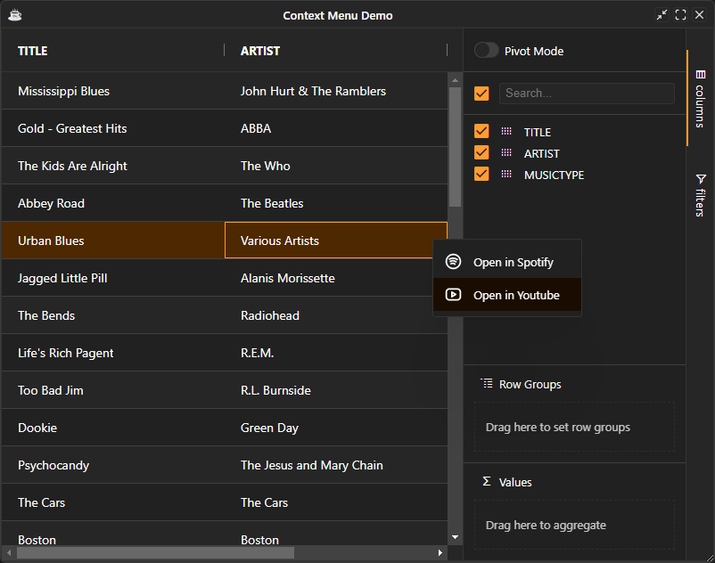
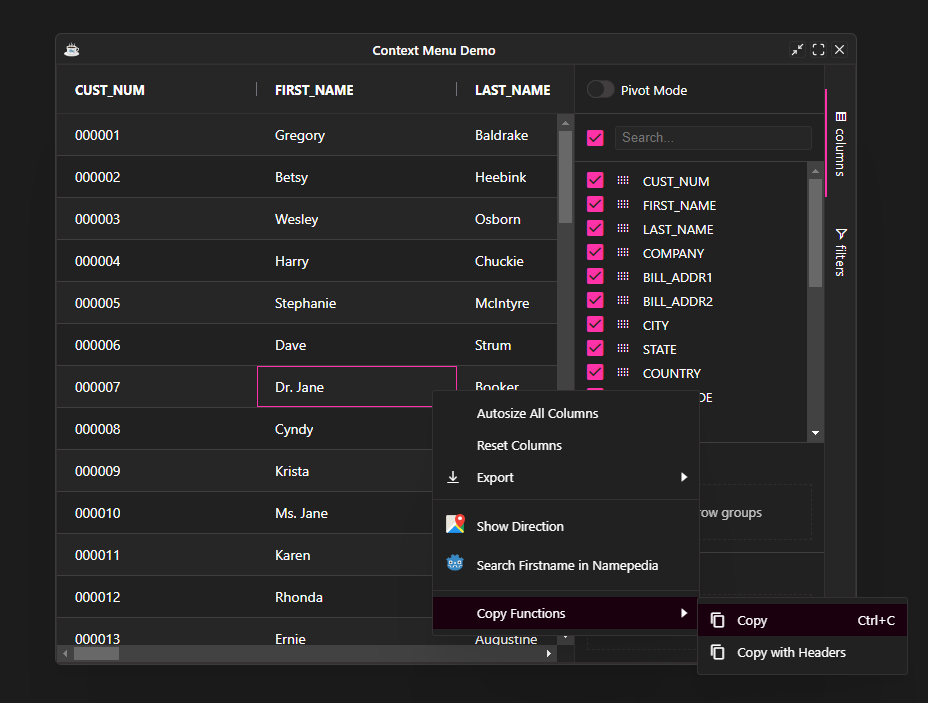

The user can bring up the context menu by right clicking on a cell. By default, the context menu provides `copy` and `export`. `Copy` will copy the selected cells or rows to the clipboard.

## Configuring the Context Menu

You can configure the context menu by modifying the the grid's [default context menu](https://bbj-plugins.github.io/BBjGridExWidget/javadoc/GxContextMenu/GxDefaultContextMenu.html) or by providing a new [`GxContextMenu`](https://bbj-plugins.github.io/BBjGridExWidget/javadoc/GxContextMenu/GxContextMenu.html)

If you want to turn off the context menu completely, set the grid option `SuppressContextMenu=true`.

```BBj
grid!.getOptions().setSuppressContextMenu(1)
```

## Sample: Custom Context Menu

The following sample shows how to build a custom context menu. 

The following can be noted:

* We override the default context menu by providing a new context menu object
* Any custom menu item requires two params
  - ID (used for handling events) 
  - Label
* We are using the DWC [`bbj-icon`](https://basishub.github.io/basis-next/#/dwc/bbj-icon) component to set the items icons

```BBj showLineNumbers
use ::BBjGridExWidget/BBjGridExWidget.bbj::BBjGridExWidget
use ::BBjGridExWidget/GxContextMenu.bbj::GxContextMenu
use ::BBjGridExWidget/GxContextMenu.bbj::GxContextMenuItem
use ::BBjGridExWidget/Demo/assets/Utilities.bbj::GxDemoUtilities
use com.basiscomponents.db.ResultSet
use com.basiscomponents.bc.SqlQueryBC

declare auto BBjTopLevelWindow wnd!

wnd! = BBjAPI().openSysGui("X0").addWindow(10,10,800,600,"Context Menu Demo")
wnd!.setCallback(BBjAPI.ON_CLOSE,"byebye")
wnd!.setCallback(BBjAPI.ON_RESIZE,"resize")

gosub main
process_events

main:
  declare SqlQueryBC sbc!
  declare ResultSet rs!
  declare BBjGridExWidget grid!

  sbc! = new SqlQueryBC(BBjAPI().getJDBCConnection("CDStore"))
  rs! = sbc!.retrieve("SELECT TITLE, ARTIST, MUSICTYPE FROM CDINVENTORY")

  menu! = new GxContextMenu()

  youtube! = new GxContextMenuItem(6001,"Open in Youtube")
  youtube!.setIcon("<bbj-icon name='brand-youtube'></bbj-icon>")
  youtube!.setTooltip("Listen to this song on Youtube")
  menu!.addItem(youtube!)
  
  spotify! = new GxContextMenuItem(6000,"Open in Spotify")
  spotify!.setIcon("<bbj-icon name='brand-spotify'></bbj-icon>")
  spotify!.setTooltip("Listen to this song on Spotify")
  menu!.addItem(spotify!)

  grid! = new BBjGridExWidget(wnd!,100,0,0,800,600)
  grid!.getOptions().setContextMenu(menu!)
  grid!.setData(rs!)
  grid!.setFitToGrid()
  grid!.setCallback(6000,"onSpotify")
  grid!.setCallback(6001,"onYoutube")
return

onSpotify:
  ev! = BBjAPI().getLastEvent()
  ev! = ev!.getObject()

  row! = ev!.getRow().asDataRow()

  title$ = row!.getFieldAsString("TITLE").trim()
  artist$ = row!.getFieldAsString("ARTIST").trim()
  query$ = java.net.URLEncoder.encode(title$ + " by " + artist$)
  url$ = "https://open.spotify.com/search/" + query$

  BBjAPI().getThinClient().browse(url$)
return

onYoutube:
  ev! = BBjAPI().getLastEvent()
  ev! = ev!.getObject()

  row! = ev!.getRow().asDataRow()

  title$ = row!.getFieldAsString("TITLE").trim()
  artist$ = row!.getFieldAsString("ARTIST").trim()
  query$ = java.net.URLEncoder.encode(title$ + " by " + artist$)
  url$ = "https://www.youtube.com/results?search_query=" + query$

  BBjAPI().getThinClient().browse(url$)
return

resize:
  ev! = BBjAPI().getLastEvent()
  w = ev!.getWidth()
  h = ev!.getHeight()

  grid!.setSize(w,h)
return

byebye:
bye
```



## Built In Menu Items

The BBjGridExWidget also provides a list of predefined menu items for some advanced features. 
The following is a list of all the default built in menu items with the rules about when they are shown.

* **AUTO_SIZE_ALL**: Auto-size all columns. Not shown by default.
* **EXPAND_ALL**: When set, it's only shown if grouping by at least one column. Not shown by default.
* **CONTRACT_ALL**: Collapse all groups. When set, it's only shown if grouping by at least one column. Not shown by default.
* **COPY**: Copy selected value to clipboard. Shown by default.
* **COPY_WITH_HEADERS**: Copy selected value to clipboard with headers. Shown by default.
* ** COPY_WITH_GROUP_HEADERS**: Copy selected value to clipboard with headers and header groups. Shown by default.
* **RESET_COLUMNS**: Reset all columns. Not shown by default.
* **EXPORT**: Export sub menu (containing CSV_EXPORT and EXCEL_EXPORT). Shown by default.
* **CSV_EXPORT**: Export to CSV using all default export values. Shown by default.
* **EXCEL_EXPORT**: Export to Excel (.xlsx) using all default export values. Shown by default.
* **CHART_RANGE**: Chart a range of selected cells. Only shown if charting is enabled.


### How to use builtin menu items ?

Like any other menu items, you cun add some or all of the builtin items to your menu using the `GxContextMenu::addItem` method 

```BBj
menu!.addItem(GxContextMenuItem.AUTO_SIZE_ALL())
menu!.addItem(GxContextMenuItem.RESET_COLUMNS())
menu!.addItem(GxContextMenuItem.EXPORT())
menu!.addItem(GxContextMenuItem.SEPARATOR())
``` 

## Nested Context Menus

You can nest context menus using the `BBjGridExWidget::setSubMenu` method.

```BBj
copy! = new GxContextMenuItem(6002,"Copy Functions")
  submenu! = new GxContextMenu()
  submenu!.addItem(GxContextMenuItem.COPY())
  submenu!.addItem(GxContextMenuItem.COPY_WITH_HEADERS())
copy!.setSubMenu(submenu!)
menu!.addItem(copy!)
```

## Example: Putting it together

```BBj showLineNumbers
use ::BBjGridExWidget/BBjGridExWidget.bbj::BBjGridExWidget
use ::BBjGridExWidget/GxContextMenu.bbj::GxContextMenu
use ::BBjGridExWidget/GxContextMenu.bbj::GxContextMenuItem
use ::BBjGridExWidget/Demo/assets/Utilities.bbj::GxDemoUtilities
use com.basiscomponents.db.ResultSet
use com.basiscomponents.bc.SqlQueryBC


declare auto BBjTopLevelWindow wnd!

wnd! = BBjAPI().openSysGui("X0").addWindow(10,10,800,600,"Context Menu Demo")
wnd!.setCallback(BBjAPI.ON_CLOSE,"byebye")
wnd!.setCallback(BBjAPI.ON_RESIZE,"resize")

gosub main
process_events

main:
  declare SqlQueryBC sbc!
  declare ResultSet rs!
  declare BBjGridExWidget grid!

  sbc! = new SqlQueryBC(BBjAPI().getJDBCConnection("ChileCompany"))
  rs! = sbc!.retrieve("SELECT * FROM CUSTOMER")

  rem /**
  rem  * Create a new context menu to attach to the grid
  rem  */
  menu! = new GxContextMenu()

  rem /**
  rem  * Add some predefined items with their actions to the menu
  rem  */
  menu!.addItem(GxContextMenuItem.AUTO_SIZE_ALL())
  menu!.addItem(GxContextMenuItem.RESET_COLUMNS())
  menu!.addItem(GxContextMenuItem.EXPORT())
  menu!.addItem(GxContextMenuItem.SEPARATOR())

  rem /**
  rem  * Create custom menu items
  rem  *
  rem  * Any custom menu item requires two params , an id (used for handling events) and a label
  rem  * When the item is clicked on the client , the client will notify the grid with an event
  rem  * using the chosen id so you can use the grid's setCallback method to handle the event
  rem  */

  direction! = new GxContextMenuItem(6000,"Show Direction")
  direction!.setIcon("http://icons.iconarchive.com/icons/papirus-team/papirus-apps/256/maps-icon.png" , 20 , 20)
  direction!.setTooltip("Open the location in Google Maps")
  menu!.addItem(direction!)

  namepedia! = new GxContextMenuItem(6001,"Search Firstname in Namepedia")
  namepedia!.setIcon("http://icons.iconarchive.com/icons/papirus-team/papirus-apps/256/godot-icon.png" , 20 , 20)
  namepedia!.setTooltip("Search First Name in Namepedia")
  menu!.addItem(namepedia!)

  menu!.addItem(GxContextMenuItem.SEPARATOR())

  copy! = new GxContextMenuItem(6002,"Copy Functions")
    submenu! = new GxContextMenu()
    submenu!.addItem(GxContextMenuItem.COPY())
    submenu!.addItem(GxContextMenuItem.COPY_WITH_HEADERS())
  copy!.setSubMenu(submenu!)
  menu!.addItem(copy!)

  rem /**
  rem  * init the grid and attach the menu items callbacks
  rem  */
  grid! = new BBjGridExWidget(wnd!,100,0,0,800,600)
  grid!.getOptions().setContextMenu(menu!)
  grid!.setData(rs!)
  grid!.setCallback(6000,"onShowDirection")
  grid!.setCallback(6001,"onShowFirstName")
return

onShowDirection:
  ev! = BBjAPI().getLastEvent()
  ev! = ev!.getObject()
  row! = ev!.getRow().asDataRow()
  query$ = java.net.URLEncoder.encode(row!.getFieldAsString("BILL_ADDR1").trim() + ","  + row!.getFieldAsString("COUNTRY").trim())
  url$ = "https://www.google.com/maps/search/?api=1&query=" + query$
  BBjAPI().getThinClient().browse(url$)
return

onShowFirstName:
  ev! = BBjAPI().getLastEvent()
  ev! = ev!.getObject()
  row! = ev!.getRow().asDataRow()
  query$ = java.net.URLEncoder.encode(row!.getFieldAsString("FIRST_NAME").trim())
  url$ = "http://www.namepedia.org/en/firstname/?q=" + query$
  BBjAPI().getThinClient().browse(url$)
return

resize:
  ev! = BBjAPI().getLastEvent()
  w=ev!.getWidth()
  h=ev!.getHeight()
  grid!.setSize(w,h)
return

byebye:
bye
```

