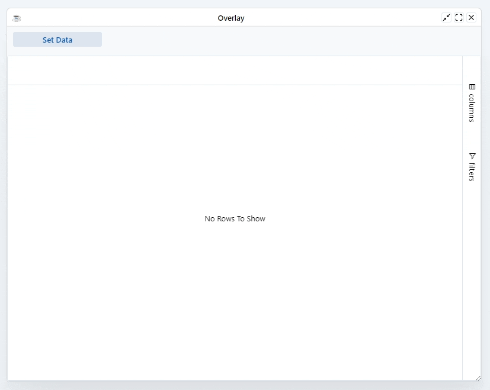
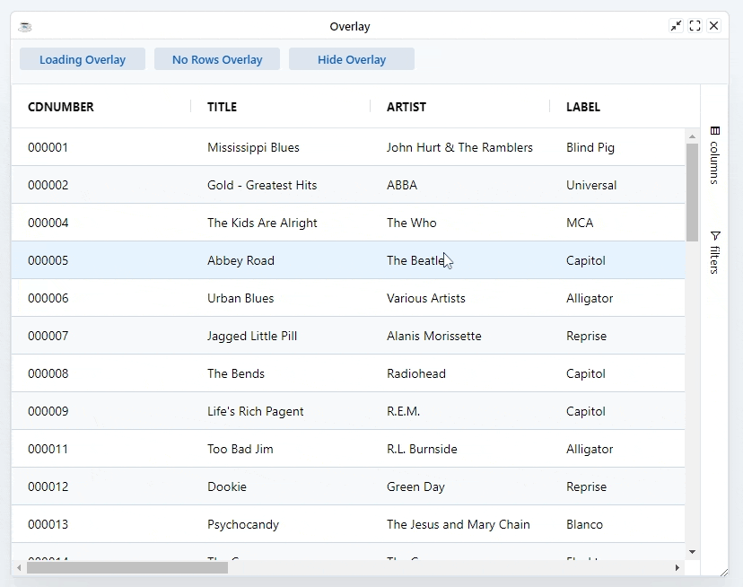

There are two overlays for the grid:

* **Loading**: Gets displayed when the grid is loading data.
* **No Rows**: Gets displayed when loading has complete but no rows to show.

The grid manages showing and hiding of the overlays for you. When the table is first initialized, the loading panel is displayed if ResultSet is not empty. When the API function `setData` or any of the update data API is called, the loading panel is hidden.

## Overlay API

At any point, you can show or hide any of the overlays using the methods below. You may never use these methods, as the grid manages the overlays for you. However you may find some edge cases where you need complete control (such as showing 'loading' if an option outside the grid is changed).

| **Method** 	| **Description**               	|
|--------------------	|-------------------------------	|
| `BBjGridExWidget::showLoadingOverlay` 	| Show the 'loading' overlay.   	|
| `BBjGridExWidget::showNoRowsOverlay`  	| Show the 'no rows' overlay.   	|
| `BBjGridExWidget::hideOverlay`       	| Hides the overlay if showing. 	|

:::caution
The overlays are mutually exclusive, you cannot show more than one overlay at any given time.
:::

## Custom Templates

If you're not happy with the provided overlay templates, you can provide your own. This is done with the grid options `setOverlayLoadingTemplate` and `setOverlayNoRowsTemplate`. These templates should be plain HTML.

## Example

The example below demonstrates how the loading overlay is shown automatically while the data is loading. You can also use the buttons to show / hide the different overlays at your will.

