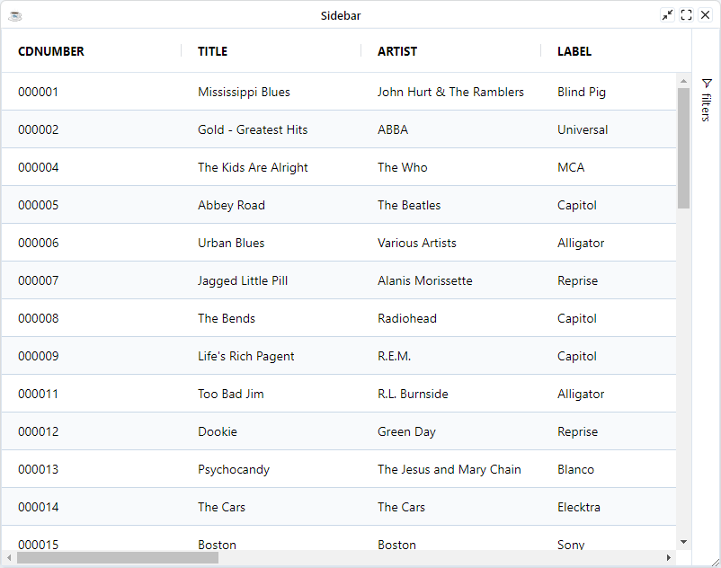

This section covers how to configure and use the Side Bar API. 

The default side bar contains the Columns and Filters tool panels. To get access to the default side bar use 
the `BBjGridExWidget::getSidebar` method. The method will return an instance of [GxDefaultSidebar](https://bbj-plugins.github.io/BBjGridExWidget/javadoc/GxSidebar/GxDefaultSidebar.html) 

```bbj
method public GxSidebar getSidebar()
```

## Access Tool Panels

The default side bar pre-configure two tool panels by default 

* **Columns tool panel**: An instance of the [GxColumnsToolpanel](https://bbj-plugins.github.io/BBjGridExWidget/javadoc/GxSidebar/GxColumnsToolpanel.html)
* **Filters tool panel**: An instance of the [GxFiltersToolpanel](https://bbj-plugins.github.io/BBjGridExWidget/javadoc/GxSidebar/GxFiltersToolpanel.html)

To access a specific tool panel in the sidebar use the tool panel's ID

```bbj
use ::BBjGridExWidget/GxSidebar.bbj::GxSidebar
use ::BBjGridExWidget/GxSidebar.bbj::GxColumnsToolpanel 

declare auto  GxSidebar sidebar!
sidebar! = grid!.getSidebar()

declare auto  GxColumnsToolpanel columnsToolpanel!
columnsToolpanel! = sidebar!.getToolpanels().get(GxColumnsToolpanel.getId())
columnsToolpanel!.setSuppressValues(1)
```

## Hide Side bar

In order to hide the sidebar, you can use the Sidebar method `GxSidebar::setVisible(BBjNumber visible!)` method.
If you want to render the grid initially with a sidebar hidden set the `GxSidebar:HiddenByDefault` property to `true`

```bbj
declare auto  GxSidebar sidebar!

sidebar! = grid!.getSidebar()
sidebar!.setHiddenByDefault(1)
```

## Disable a tool panel

In order to disable or remove a specific panel, remove the the panel using its ID from the `GxSidebar:Toolpanels` map.

The following sample removes the `GxColumnsToolpanel` from the sidebar.

```bbj
use ::BBjGridExWidget/BBjGridExWidget.bbj::BBjGridExWidget
use com.basiscomponents.db.ResultSet
use com.basiscomponents.bc.SqlQueryBC
use ::BBjGridExWidget/GxSidebar.bbj::GxSidebar
use ::BBjGridExWidget/GxSidebar.bbj::GxColumnsToolpanel 

declare auto BBjTopLevelWindow wnd!
wnd! = BBjAPI().openSysGui("X0").addWindow(10, 10, 800, 600, "Sidebar")
wnd!.setCallback(BBjAPI.ON_CLOSE,"byebye")

gosub main
process_events

main:
  declare SqlQueryBC sbc!
  declare ResultSet rs!
  declare BBjGridExWidget grid!
  declare auto  GxSidebar sidebar!
  declare auto  GxColumnsToolpanel columnsToolpanel!
  
  sbc! = new SqlQueryBC(BBjAPI().getJDBCConnection("CDStore"))
  rs! = sbc!.retrieve("SELECT * FROM CDINVENTORY")
  
  grid! = new BBjGridExWidget(wnd!, 100, 0, 0, 800, 600)

  sidebar! = grid!.getSidebar()
  sidebar!.getToolpanels().remove(GxColumnsToolpanel.getId())

  grid!.setData(rs!)
return

byebye:
bye
```




