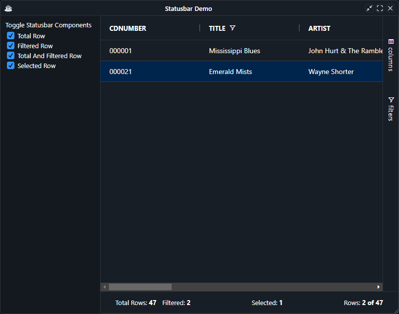
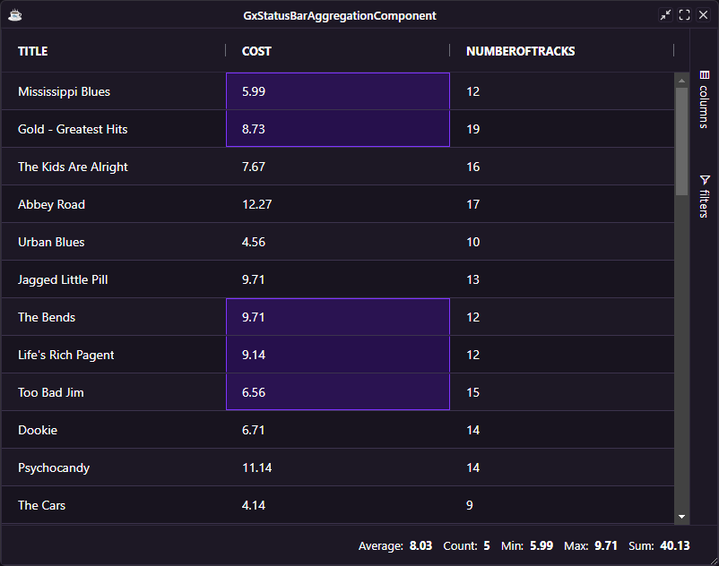
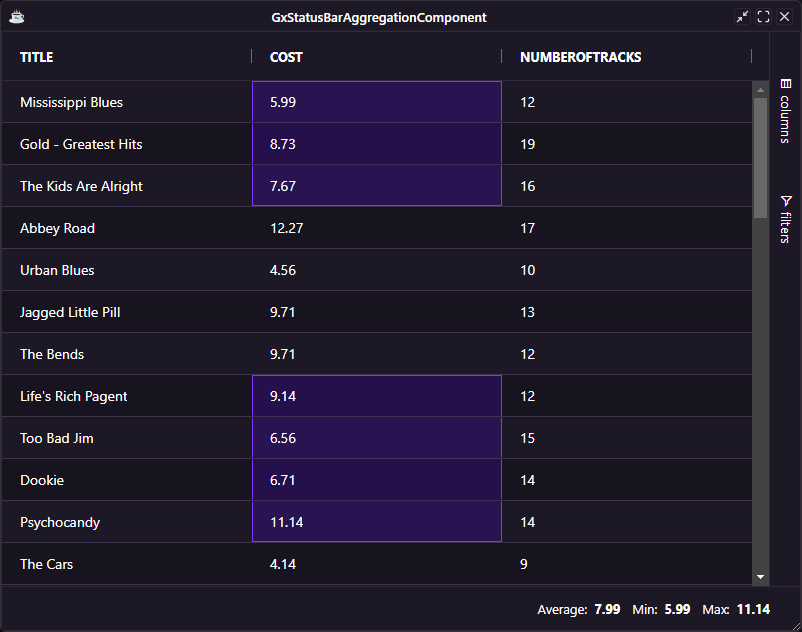

Within the Status Bar you can specify which Status Bar Panels you want to display.

## Grid Provided Status Bar components

The status bar components provided by the grid are as follows:

* [`GxStatusBarTotalRowCountComponent`](https://bbj-plugins.github.io/BBjGridExWidget/javadoc/GxStatusBar/GxStatusBarTotalRowCountComponent.html): Provides the total row count.
* [`GxStatusBarTotalAndFilteredRowCountComponent`](https://bbj-plugins.github.io/BBjGridExWidget/javadoc/GxStatusBar/GxStatusBarTotalAndFilteredRowCountComponent.html): Provides the total and filtered row count.
* [`GxStatusBarFilteredRowCountComponent`](https://bbj-plugins.github.io/BBjGridExWidget/javadoc/GxStatusBar/GxStatusBarFilteredRowCountComponent.html): Provides the filtered row count.
* [`GxStatusBarSelectedRowCountComponent`](https://bbj-plugins.github.io/BBjGridExWidget/javadoc/GxStatusBar/GxStatusBarSelectedRowCountComponent.html): Provides the selected row count.
* [`GxStatusBarAggregationComponent`](https://bbj-plugins.github.io/BBjGridExWidget/javadoc/GxStatusBar/GxStatusBarAggregationComponent.html): Provides aggregations on the selected range.

## Configuring the Status Bar

The status bar is configured using the [`GxStatusBar`](https://bbj-plugins.github.io/BBjGridExWidget/javadoc/GxStatusBar/GxStatusBar.html). The object allows you to add/remove components and configure the alignment and visibility

:::tip
If align is not specified the components will default to being aligned to the right.
:::

The snippet below shows a status bar configured with the grid provided components.

```bbj
use ::BBjGridExWidget/GxStatusBar.bbj::GxStatusBar
use ::BBjGridExWidget/GxStatusBar.bbj::GxStatusBarTotalRowCountComponent
use ::BBjGridExWidget/GxStatusBar.bbj::GxStatusBarTotalAndFilteredRowCountComponent

declare GxStatusBar statusbar!
statusbar! = grid!.getStatusbar()

statusbar!.addComponent(new GxStatusBarTotalRowCountComponent())
statusbar!.addComponent(new GxStatusBarTotalAndFilteredRowCountComponent("right"))
```

## Component Alignment

Components can be aligned either to the `left`, in the `center` of the bar or on the `right` (the default). Components within these alignments will be added in the order specified.

## Labels and Number Formats

Labels within the Status Bar (ie. "Rows", "Total Rows", "Average") and number formatters such as the decimal and thousand separators can be changed by using the Grid's Localization


## Advanced Status Bar Example

```bbj showLineNumbers
use ::BBjGridExWidget/BBjGridExWidget.bbj::BBjGridExWidget
use ::BBjGridExWidget/GxStatusBar.bbj::GxStatusBar
use ::BBjGridExWidget/GxStatusBar.bbj::GxStatusBarTotalRowCountComponent
use ::BBjGridExWidget/GxStatusBar.bbj::GxStatusBarFilteredRowCountComponent
use ::BBjGridExWidget/GxStatusBar.bbj::GxStatusBarTotalAndFilteredRowCountComponent
use ::BBjGridExWidget/GxStatusBar.bbj::GxStatusBarSelectedRowCountComponent
use com.basiscomponents.db.ResultSet
use com.basiscomponents.bc.SqlQueryBC


declare auto BBjTopLevelWindow wnd!

wnd! = BBjAPI().openSysGui("X0").addWindow(10,10,800,600,"Statusbar Demo")
wnd!.setCallback(BBjAPI.ON_CLOSE,"byebye")
wnd!.setCallback(BBjAPI.ON_RESIZE,"resize")

static! = wnd!.addStaticText(202,10,10,200,25,"Toggle Statusbar Components" , $0000$ )
totalRow! = wnd!.addCheckBox(203,10,30,200,22,"Total Row")
totalRow!.setSelected(1)
totalRow!.setName(GxStatusBarTotalRowCountComponent.getId())
totalRow!.setCallback(BBjAPI.ON_CHECK_OFF,"onToggle")
totalRow!.setCallback(BBjAPI.ON_CHECK_ON,"onToggle")

filteredRow! = wnd!.addCheckBox(204,10,50,200,22,"Filtered Row")
filteredRow!.setSelected(1)
filteredRow!.setName(GxStatusBarFilteredRowCountComponent.getId())
filteredRow!.setCallback(BBjAPI.ON_CHECK_OFF,"onToggle")
filteredRow!.setCallback(BBjAPI.ON_CHECK_ON,"onToggle")

totalAndFilteredRow! = wnd!.addCheckBox(205,10,70,200,22,"Total And Filtered Row")
totalAndFilteredRow!.setSelected(1)
totalAndFilteredRow!.setName(GxStatusBarTotalAndFilteredRowCountComponent.getId())
totalAndFilteredRow!.setCallback(BBjAPI.ON_CHECK_OFF,"onToggle")
totalAndFilteredRow!.setCallback(BBjAPI.ON_CHECK_ON,"onToggle")

selectedRow! = wnd!.addCheckBox(206,10,90,200,22,"Selected Row")
selectedRow!.setSelected(1)
selectedRow!.setName(GxStatusBarSelectedRowCountComponent.getId())
selectedRow!.setCallback(BBjAPI.ON_CHECK_OFF,"onToggle")
selectedRow!.setCallback(BBjAPI.ON_CHECK_ON,"onToggle")

gosub main

process_events

main:
  declare SqlQueryBC sbc!
  declare ResultSet rs!
  declare BBjGridExWidget grid!
  declare GxStatusBar statusbar!
  
  sbc! = new SqlQueryBC(BBjAPI().getJDBCConnection("CDStore"))
  rs! = sbc!.retrieve("SELECT * FROM CDINVENTORY")

  grid! = new BBjGridExWidget(wnd!,100,200,0,600,600)
  grid!.getOptions().setMultipleSelection(1)

  statusbar! = grid!.getStatusbar()
  statusbar!.addComponent(new GxStatusBarTotalRowCountComponent())
  statusbar!.addComponent(new GxStatusBarFilteredRowCountComponent())
  statusbar!.addComponent(new GxStatusBarTotalAndFilteredRowCountComponent("right"))
  statusbar!.addComponent(new GxStatusBarSelectedRowCountComponent("center"))

  grid!.setData(rs!)
return

resize:
  ev! = BBjAPI().getLastEvent()
  w=ev!.getWidth()
  h=ev!.getHeight()
  grid!.setSize(w-200,h)
return

onToggle:
  event! = BBjAPI().getLastEvent()
  control! = event!.getControl()
  
  name$ = control!.getName()
  visibility! = iff(control!.isSelected() , 1 ,0)
  
  statusbar! = grid!.getStatusbar()
  statusbar!.setComponentVisibility(name$  , visibility!)
return 

byebye:
bye
```




## Configuring The Aggregation Panel

If you have multiple ranges selected (by holding down <kbd>Ctrl</kbd> while dragging) and a cell is in multiple ranges, the cell will be only included once in the aggregation.

If the cell does not contain a simple number value, then it will not be included in average, min max or sum, however it will still be included in count.

In the grid below, select a range by dragging the mouse over cells and notice the status bar showing the aggregation values as you drag.

```bbj showLineNumbers
use ::BBjGridExWidget/BBjGridExWidget.bbj::BBjGridExWidget
use ::BBjGridExWidget/GxStatusBar.bbj::GxStatusBar
use ::BBjGridExWidget/GxStatusBar.bbj::GxStatusBarAggregationComponent
use com.basiscomponents.db.ResultSet
use com.basiscomponents.bc.SqlQueryBC

declare auto BBjTopLevelWindow wnd!
wnd! = BBjAPI().openSysGui("X0").addWindow(10, 10, 800, 600, "GxStatusBarAggregationComponent")
wnd!.setCallback(BBjAPI.ON_CLOSE,"byebye")

gosub main
process_events

main:
  declare SqlQueryBC sbc!
  declare ResultSet rs!
  declare BBjGridExWidget grid!
  declare GxStatusBar statusbar!

  sbc! = new SqlQueryBC(BBjAPI().getJDBCConnection("CDStore"))
  rs! = sbc!.retrieve("SELECT TITLE, COST , NUMBEROFTRACKS FROM CDINVENTORY")

  grid! = new BBjGridExWidget(wnd!, 100, 0, 0, 800, 600)
  grid!.getOptions().setEnableRangeSelection(1)
  grid!.setFitToGrid()

  statusbar! = grid!.getStatusbar()
  statusbar!.addComponent(new GxStatusBarAggregationComponent("right"))

  grid!.setData(rs!)
return

byebye:
bye
```



By default all of the aggregations available will be displayed but you can configure the aggregation component to only show a subset of the aggregations.

In this code snippet we have configured the aggregation component to only show `min`, `max` and `avg`:

:::info
`GxStatusBarAggregationComponent` supports the following agg functions:  `count`, `sum`, `min`, `max` and `avg`:
:::

```bbj showLineNumbers
use ::BBjGridExWidget/BBjGridExWidget.bbj::BBjGridExWidget
use ::BBjGridExWidget/GxStatusBar.bbj::GxStatusBar
use ::BBjGridExWidget/GxStatusBar.bbj::GxStatusBarAggregationComponent
use com.basiscomponents.db.ResultSet
use com.basiscomponents.bc.SqlQueryBC

declare auto BBjTopLevelWindow wnd!
wnd! = BBjAPI().openSysGui("X0").addWindow(10, 10, 800, 600, "GxStatusBarAggregationComponent")
wnd!.setCallback(BBjAPI.ON_CLOSE,"byebye")

gosub main
process_events

main:
  declare SqlQueryBC sbc!
  declare ResultSet rs!
  declare BBjGridExWidget grid!
  declare GxStatusBar statusbar!

  sbc! = new SqlQueryBC(BBjAPI().getJDBCConnection("CDStore"))
  rs! = sbc!.retrieve("SELECT TITLE, COST , NUMBEROFTRACKS FROM CDINVENTORY")

  grid! = new BBjGridExWidget(wnd!, 100, 0, 0, 800, 600)
  grid!.getOptions().setEnableRangeSelection(1)
  grid!.setFitToGrid()

  comp! = new GxStatusBarAggregationComponent("right")
  aggFuncs! = new java.util.HashSet()
  aggFuncs!.add("min")
  aggFuncs!.add("max")
  aggFuncs!.add("avg")
  comp!.setAggFuncs(aggFuncs!)
  
  statusbar! = grid!.getStatusbar()
  statusbar!.addComponent(comp!)

  grid!.setData(rs!)
return

byebye:
bye
```

