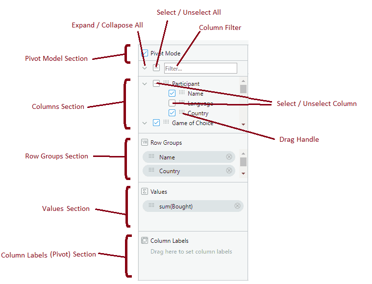
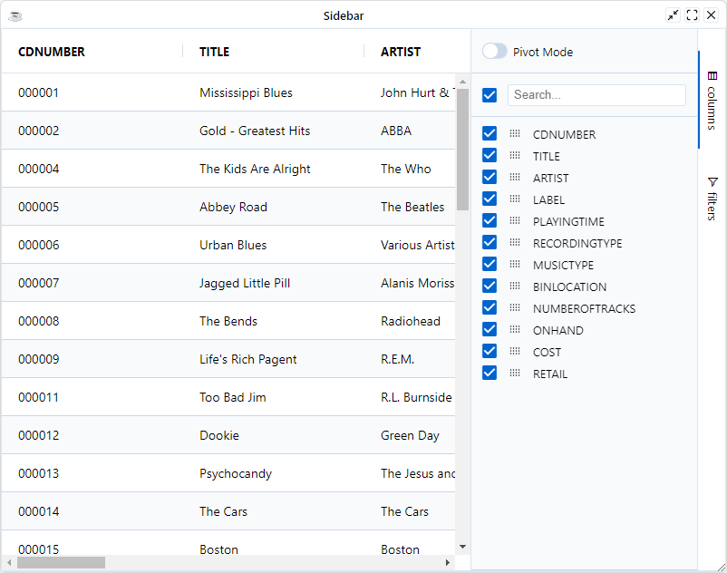

The columns tool panel provides functions for managing the grid's columns and it is split into different sections as follows:

* **Pivot Mode Section**: Check the Pivot Mode checkbox to turn the grid into Pivot Mode. Uncheck to take the grid out of pivot mode.
* **Expand / Collapse All**: Toggle to expand or collapse all column groups.
* **Columns Section**: Display all columns, grouped by column groups, that are available to be displayed in the grid. By default the order of the columns is kept in sync with the order they are shown in the grid.
* **Select / Un-select All**: Toggle to select or un-select all columns in the columns section.
* **Select / Un-Select Column (or Group)**: Each column can be individually selected. What selection means depends on pivot mode.
* **Drag Handle**: Each column can be dragged either with the mouse or via touch on touch devices. The column can then be dragged to one of the following:
    - Row Groups Section
    - Values (Pivot) Section
    - Column Labels Section
    - Onto the grid
    - Inside Columns Section to reorder columns
* **Row Groups Section**: Columns here will form the grid's Row Grouping.
* **Values Section**: Columns here will form the grid's Aggregations. The grid calls this function 'Aggregations', however for the UI we follow the Excel naming convention and call it 'Values'.
* **Column Labels (Pivot) Section**: Columns here will form the grid's Pivot. The grid calls this function 'Pivot', however for the UI we follow the Excel naming convention and call it 'Column Labels'.



## Section Visibility

It is possible to remove items from the tool panel. Items are suppressed by setting one or more of the following too panel options to `true` whenever you are using the [GxColumnsToolpanel](https://bbj-plugins.github.io/BBjGridExWidget/javadoc/GxSidebar/GxColumnsToolpanel.html) component.


| **Property/Field**         	| **Description**                                                                     	|
|----------------------------	|-------------------------------------------------------------------------------------	|
| `SuppressColumnExpandAll`    	| suppress Expand / Collapse all widget.                                              	|
| `SuppressColumnFilter`       	| suppress Column Filter section.                                                     	|
| `SuppressColumnSelectAll`    	| suppress Select / Un-select all widget.                                             	|
| `SuppressPivotMode`          	| suppress Pivot Mode section.                                                        	|
| `SuppressPivots`             	| suppress Column Labels (Pivot) section.                                             	|
| `SuppressRowGroups`          	| Suppress Row Groups section.                                                        	|
| `SuppressValues`             	| suppress Values section                                                             	|
| `SuppressSyncLayoutWithGrid` 	| Suppress updating the layout of columns as they are rearranged in the grid          	|
| `SuppressColumnMove`         	| Suppress Column Move section                                                        	|
| `ContractColumnSelection`    	| By default, column groups start expanded. Pass true to default to contracted groups 	|


```bbj showLineNumbers
use ::BBjGridExWidget/BBjGridExWidget.bbj::BBjGridExWidget
use com.basiscomponents.db.ResultSet
use com.basiscomponents.bc.SqlQueryBC
use ::BBjGridExWidget/GxSidebar.bbj::GxSidebar
use ::BBjGridExWidget/GxSidebar.bbj::GxColumnsToolpanel 

declare auto BBjTopLevelWindow wnd!
wnd! = BBjAPI().openSysGui("X0").addWindow(10, 10, 800, 600, "Sidebar")
wnd!.setCallback(BBjAPI.ON_CLOSE,"byebye")

gosub main
process_events

main:
  declare SqlQueryBC sbc!
  declare ResultSet rs!
  declare BBjGridExWidget grid!
  declare auto  GxSidebar sidebar!
  declare auto  GxColumnsToolpanel columnsToolpanel!
  
  sbc! = new SqlQueryBC(BBjAPI().getJDBCConnection("CDStore"))
  rs! = sbc!.retrieve("SELECT * FROM CDINVENTORY")
  
  grid! = new BBjGridExWidget(wnd!, 100, 0, 0, 800, 600)

  sidebar! = grid!.getSidebar()

  rem Open GxColumnsToolpanel by default
  sidebar!.setDefaultToolpanel(GxColumnsToolpanel.getId())
  
  columnsToolpanel! = sidebar!.getToolpanels().get(GxColumnsToolpanel.getId())
  columnsToolpanel!.setSuppressValues(1)
  columnsToolpanel!.setSuppressRowGroups(1)

  grid!.setData(rs!)
return

byebye:
bye
```

