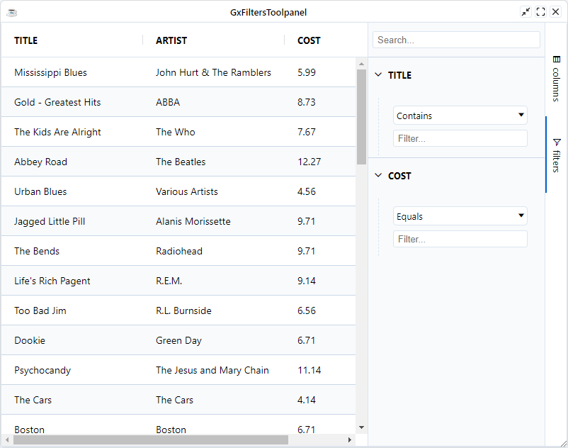
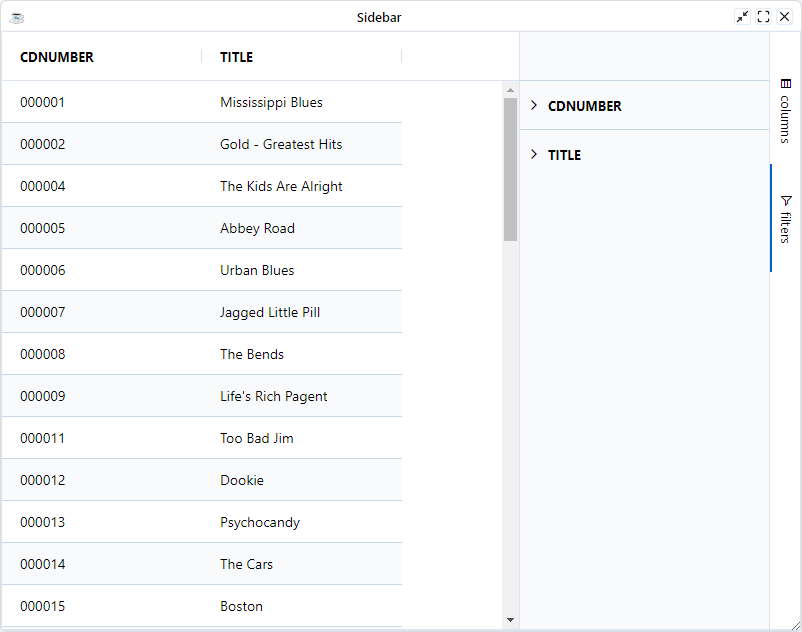

The Filters Tool Panel allows accessing the grid's filters without needing to open up the column menu.

The example below shows the filters tool panel. The following can be noted:

* Columns `TITLE` and `COST` appear in the filter tool panel as they have filters.
* The `ARTIST` column does not appear in the filter tool panel as it does not have a filter.
* Clicking on a column in the filter tool panel will show the filter below the column name. Clicking a second time will hide the filter again.
* Columns with filters active will have the filter icon appear beside the filter name in the tool panel.

```BBj
use ::BBjGridExWidget/BBjGridExWidget.bbj::BBjGridExWidget
use ::BBjGridExWidget/GxSidebar.bbj::GxSidebar
use ::BBjGridExWidget/GxSidebar.bbj::GxFiltersToolpanel 
use com.basiscomponents.db.ResultSet
use com.basiscomponents.bc.SqlQueryBC

declare auto BBjTopLevelWindow wnd!
wnd! = BBjAPI().openSysGui("X0").addWindow(10, 10, 800, 600, "GxFiltersToolpanel")
wnd!.setCallback(BBjAPI.ON_CLOSE,"byebye")

gosub main
process_events

main:
  declare SqlQueryBC sbc!
  declare ResultSet rs!
  declare BBjGridExWidget grid!
  declare GxSidebar sidebar!

  sbc! = new SqlQueryBC(BBjAPI().getJDBCConnection("CDStore"))
  rs! = sbc!.retrieve("SELECT TITLE , ARTIST , COST FROM CDINVENTORY")

  grid! = new BBjGridExWidget(wnd!, 100, 0, 0, 800, 600)

  sidebar! = grid!.getSidebar()
  sidebar!.setDefaultToolpanel(GxFiltersToolpanel.getId())

  grid!.setData(rs!)

  artistColumn! = grid!.getColumn("ARTIST")
  artistColumn!.setFilter(null())
  
return

byebye:
bye
```




## Suppress Options

It is possible to remove items from the tool panel. Items are suppressed by setting one or more of the following too panel options to `true` whenever you are using the [GxFiltersToolpanel](https://bbj-plugins.github.io/BBjGridExWidget/javadoc/GxSidebar/GxFiltersToolpanel.html) component.

| **Property/Field**         	| **Description**                                                            	|
|----------------------------	|----------------------------------------------------------------------------	|
| `SuppressFilterSearch`       	| To suppress the Filter Search                                              	|
| `SuppressSyncLayoutWithGrid` 	| Suppress updating the layout of columns as they are rearranged in the grid 	|
| `suppressExpandAll`           	| To suppress Expand / Collapse All                                         |


```BBj showLineNumbers
use ::BBjGridExWidget/BBjGridExWidget.bbj::BBjGridExWidget
use com.basiscomponents.db.ResultSet
use com.basiscomponents.bc.SqlQueryBC
use ::BBjGridExWidget/GxSidebar.bbj::GxSidebar
use ::BBjGridExWidget/GxSidebar.bbj::GxFiltersToolpanel 

declare auto BBjTopLevelWindow wnd!
wnd! = BBjAPI().openSysGui("X0").addWindow(10, 10, 800, 600, "GxFiltersToolpanel")
wnd!.setCallback(BBjAPI.ON_CLOSE,"byebye")

gosub main
process_events

main:
  declare SqlQueryBC sbc!
  declare ResultSet rs!
  declare BBjGridExWidget grid!
  declare auto  GxSidebar sidebar!
  declare auto  GxFiltersToolpanel filtersToolpanel!
  
  sbc! = new SqlQueryBC(BBjAPI().getJDBCConnection("CDStore"))
  rs! = sbc!.retrieve("SELECT CDNUMBER, TITLE FROM CDINVENTORY")
  
  grid! = new BBjGridExWidget(wnd!, 100, 0, 0, 800, 600)

  sidebar! = grid!.getSidebar()

  rem Open GxFiltersToolpanel by default
  sidebar!.setDefaultToolpanel(GxFiltersToolpanel.getId())
  
  filtersToolpanel! = sidebar!.getToolpanels().get(GxFiltersToolpanel.getId())
  filtersToolpanel!.setSuppressFilterSearch(1)

  grid!.setData(rs!)
return

byebye:
bye
```




:::tip
To remove a particular column / filter from the tool panel, set the column option SuppressFiltersToolPanel to `true`.

```BBj
artistColumn! = grid!.getColumn("ARTIST")
artistColumn!.setSuppressFiltersToolPanel(1)
```
:::