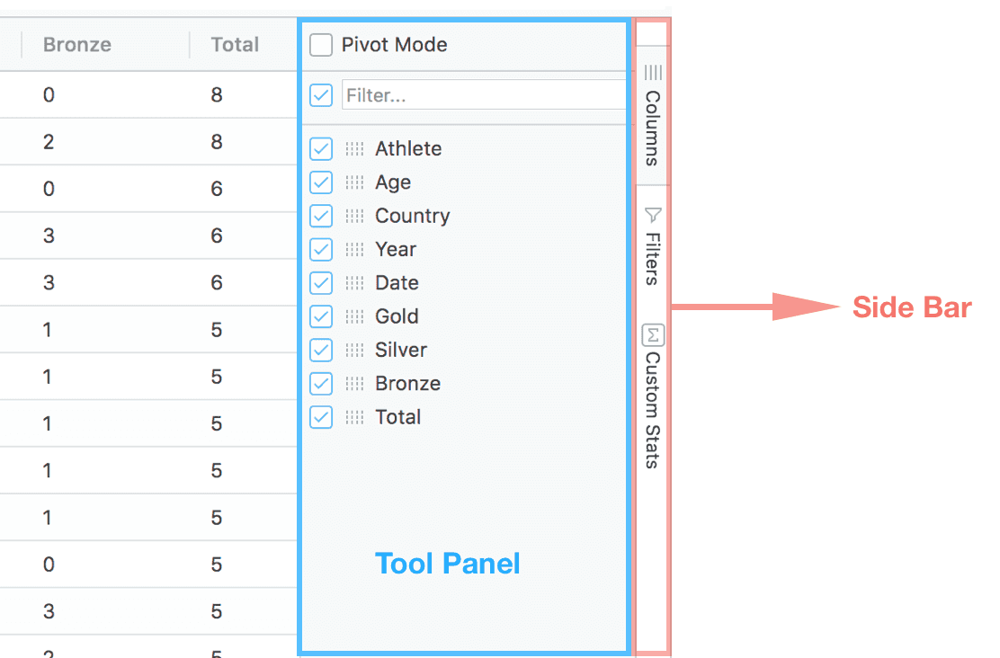

This section covers Tool Panels, available via the grid's Side Bar, which allow for easy access to powerful grid operations such as grouping, pivoting, and filtering.

## Overview

Tool Panels are panels that sit in the Side Bar to the right of the grid. The Side Bar allows access to the tool panels via buttons that work like tabs. The Side Bar and a Tool Panel are highlighted in the screenshot below.

## Provided Tool Panels

The grid provides the following Tool Panels:

* [Columns Tool Panel](./columns-tool-panel.md) - to control aggregations, grouping and pivoting.
* [Filters Tool Panel](./filters-tool-panel.md) - to perform multiple column filters.