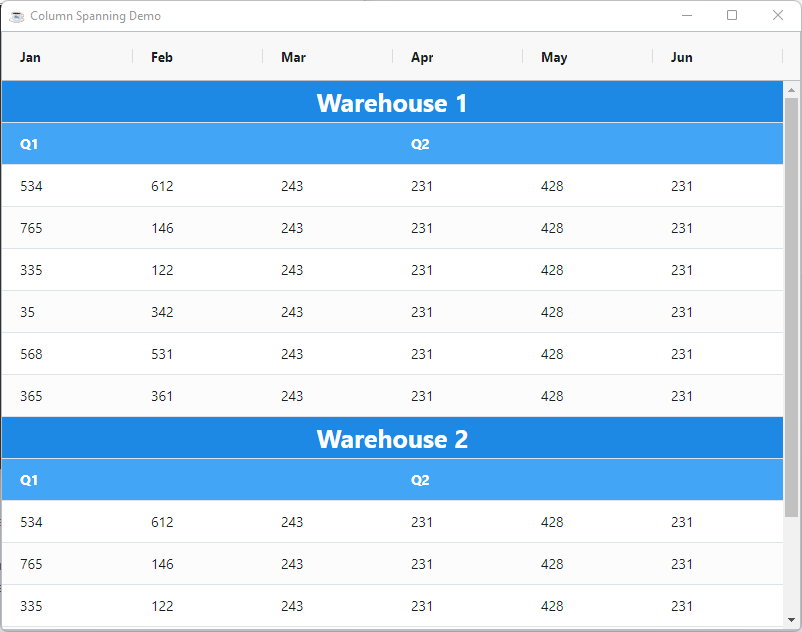

By default, each cell will take up the width of one column. You can change this behaviour to allow cells to span multiple columns. This feature is similar to `cell merging` in Excel or `column spanning` in HTML tables.


## Configuring Column Spanning

Column spanning is configured at the column level. To have a cell span more than one column, you need to set the `ColumnSpanExpression` , the expression must return how many columns to span.

### ColumnSpanExpression

An `ColumnSpanExpression` is arbitrary **JavaScript** code/expression that applies application-defined rules to check how many columns to span. The expression must return a number value to indicate the number of columns to span.

When working with expressions keep the following points in mind:

* If the expression has the word `return` in it, then we will assume it is a multi-line expression and will not wrap it.
* If the expression does not have the word `return` in it, then we will insert the `return` statement and the `;` for you.
* If the expression has many lines, then you will need to provide the `;` at the end of each line and also provide the `return` statement.

Expressions have access to several predefined variables:

| **Variable** 	| **Description**                                               	|
|:--------------:	|:---------------------------------------------------------------	|
|  x           	|  Mapped from cell value                                       	|
|  value       	|  Same as x                                                    	|
|  data        	|  Mapped from the `DataRow`                                      	|
|  column      	|  Current column                                               	|
|  columnGroup 	|  Current column group                                         	|
|  getValue    	|  The value after it is processed by the `ValueGetterExpression` 	|
|  ctx         	|  The grid client context                                      	|

For instance 

```bbj
column!.setColumnSpanExpression("data.COLUMN_NAME === 'Q1' ? 6 : 1)")
```

## Column Spanning Example

Column spanning will typically be used for creating reports with BBjGridExWidget. Below is something that would be more typical of the column spanning feature.

 The following can be noted from the example:

* The data is formatted in a certain way, it is not intended for the user to sort this data or reorder the columns.
* The dataset has meta-data inside it, the `data.section` attribute. This meta-data, provided by the application, is used in the grid configuration in order to set the column spans and the background colors.

import Tabs from '@theme/Tabs';
import TabItem from '@theme/TabItem';

<Tabs>
<TabItem value="bbj" label="column-span.bbj">

```bbj showLineNumbers
use ::BBjGridExWidget/BBjGridExWidget.bbj::BBjGridExWidget
use ::BBjGridExWidget/Demo/assets/Utilities.bbj::GxDemoUtilities
use ::BBjGridExWidget/GxRenderers.bbj::GxRendererCustomHTML
use com.basiscomponents.db.ResultSet
use com.basiscomponents.bc.SqlQueryBC
use com.google.gson.JsonObject

declare auto BBjTopLevelWindow wnd!

wnd! = BBjAPI().openSysGui("X0").addWindow(10,10,800,600,"Column Spanning Demo")
wnd!.setCallback(BBjAPI.ON_CLOSE,"byebye")

gosub main
process_events

main:
  declare ResultSet rs!
  declare BBjGridExWidget grid!

  rs! = ResultSet.fromJson(GxDemoUtilities.readAssetsAsString("data/column-span.json"))

  grid! = new BBjGridExWidget(wnd!,100,0,0,800,600)

  grid!.getSidebar().setHiddenByDefault(1)
  defaultColDef! = grid!.getOptions().getDefaultColumnDefinition()
  defaultColDef!.setSortable(0)
  defaultColDef!.setSuppressMenu(1)

  grid!.setData(rs!)
  grid!.setFitToGrid()

  cellClassRules! = new JsonObject()
  cellClassRules!.addProperty("header-cell","data.Section === 'big-title'")
  cellClassRules!.addProperty("quarters-cell","data.Section === 'quarters'")

  janColumn! = grid!.getColumn("Jan")
  // highlight-next-line
  janColumn!.setColumnSpanExpression("data.Section === 'big-title' ? 6 : (data.Section === 'quarters' ? 3 : 1)")
  janColumn!.setCellClassRules(cellClassRules!)

  aprColumn! = grid!.getColumn("Apr")
  // highlight-next-line
  aprColumn!.setColumnSpanExpression("data.Section === 'quarters' ? 3 : 1")
  aprColumn!.setCellClassRules(cellClassRules!)

  sectionColumn! = grid!.getColumn("Section")
  sectionColumn!.setLockVisible(1)
  sectionColumn!.setHidden(1)

  headerCellStyle! = new JsonObject()
  headerCellStyle!.addProperty("background","#1E88E5")
  headerCellStyle!.addProperty("color","white")
  headerCellStyle!.addProperty("font-size","25px")
  headerCellStyle!.addProperty("font-weight","bold")
  headerCellStyle!.addProperty("display","flex")
  headerCellStyle!.addProperty("justify-content","center")
  grid!.addStyle(".header-cell", headerCellStyle!)

  quartersCellStyle! = new JsonObject()
  quartersCellStyle!.addProperty("background","#42A5F5")
  quartersCellStyle!.addProperty("color","white")
  quartersCellStyle!.addProperty("font-weight","bold")
  grid!.addStyle(".quarters-cell", quartersCellStyle!)
return

byebye:
bye
```

</TabItem>

<TabItem value="data" label="column-span.json">

```json
[
  {
    "Section": "big-title",
    "Jan": "Warehouse 1",
    "Feb": "0",
    "Mar": "0",
    "Apr": "0",
    "May": "0",
    "Jun": "0"
  },
  {
    "Section": "quarters",
    "Jan": "Q1",
    "Feb": "0",
    "Mar": "0",
    "Apr": "Q2",
    "May": "0",
    "Jun": "0"
  },
  {
    "Jan": "534",
    "Feb": "612",
    "Mar": "243",
    "Apr": "231",
    "May": "428",
    "Jun": "231"
  },
  {
    "Jan": "765",
    "Feb": "146",
    "Mar": "243",
    "Apr": "231",
    "May": "428",
    "Jun": "231"
  },
  {
    "Jan": "335",
    "Feb": "122",
    "Mar": "243",
    "Apr": "231",
    "May": "428",
    "Jun": "231"
  },
  {
    "Jan": "35",
    "Feb": "342",
    "Mar": "243",
    "Apr": "231",
    "May": "428",
    "Jun": "231"
  },
  {
    "Jan": "568",
    "Feb": "531",
    "Mar": "243",
    "Apr": "231",
    "May": "428",
    "Jun": "231"
  },
  {
    "Jan": "365",
    "Feb": "361",
    "Mar": "243",
    "Apr": "231",
    "May": "428",
    "Jun": "231"
  },
  {
    "Section": "big-title",
    "Jan": "Warehouse 2",
    "Feb": "0",
    "Mar": "0",
    "Apr": "0",
    "May": "0",
    "Jun": "0"
  },
  {
    "Section": "quarters",
    "Jan": "Q1",
    "Feb": "0",
    "Mar": "0",
    "Apr": "Q2",
    "May": "0",
    "Jun": "0"
  },
  {
    "Jan": "534",
    "Feb": "612",
    "Mar": "243",
    "Apr": "231",
    "May": "428",
    "Jun": "231"
  },
  {
    "Jan": "765",
    "Feb": "146",
    "Mar": "243",
    "Apr": "231",
    "May": "428",
    "Jun": "231"
  },
  {
    "Jan": "335",
    "Feb": "122",
    "Mar": "243",
    "Apr": "231",
    "May": "428",
    "Jun": "231"
  },
  {
    "Jan": "35",
    "Feb": "342",
    "Mar": "243",
    "Apr": "231",
    "May": "428",
    "Jun": "231"
  },
  {
    "Jan": "568",
    "Feb": "531",
    "Mar": "243",
    "Apr": "231",
    "May": "428",
    "Jun": "231"
  },
  {
    "Jan": "365",
    "Feb": "361",
    "Mar": "243",
    "Apr": "231",
    "May": "428",
    "Jun": "231"
  }
  
]
```

</TabItem>
</Tabs>

