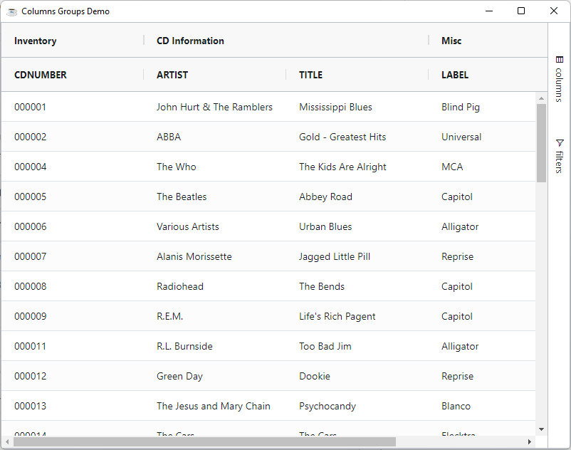
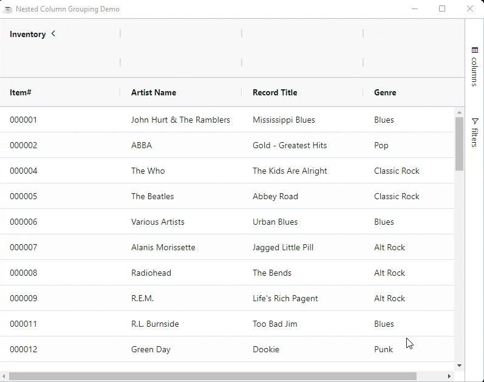
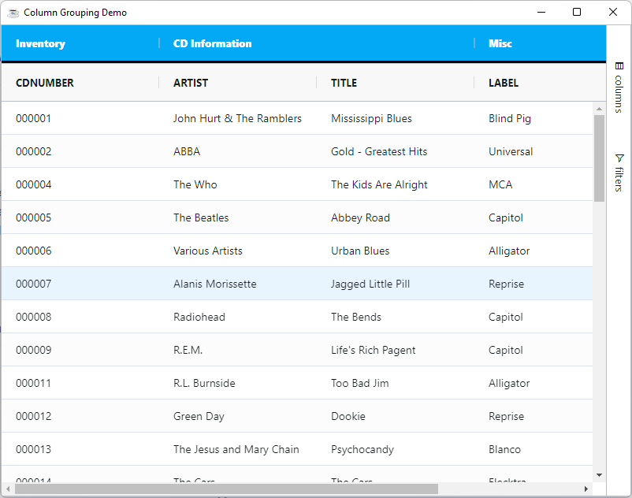
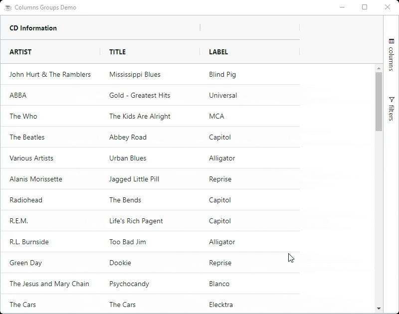

Grouping columns allows you to have multiple levels of columns in your header and the ability, if you want, to 'open and close' column groups to show and hide additional columns.

Grouping columns is done by providing the columns in a tree hierarchy to the grid. There is no limit to the number of levels you can provide.

Here is a code snippet of providing 3 groups of columns.

```BBj showLineNumbers
use ::BBjGridExWidget/BBjGridExWidget.bbj::BBjGridExWidget
use com.basiscomponents.db.ResultSet
use com.basiscomponents.bc.SqlQueryBC
use com.google.gson.JsonObject

declare auto BBjTopLevelWindow wnd!
wnd! = BBjAPI().openSysGui("X0").addWindow(10,10,800,600,"Columns Groups Demo")
wnd!.setCallback(BBjAPI.ON_CLOSE,"byebye")

gosub main
process_events

main:
  declare SqlQueryBC sbc!
  declare ResultSet rs!

  sbc! = new SqlQueryBC(BBjAPI().getJDBCConnection("CDStore"))
  rs! = sbc!.retrieve("SELECT CDNUMBER, ARTIST, TITLE, LABEL, PLAYINGTIME FROM CDINVENTORY")

  REM init the grid
  grid! = new BBjGridExWidget(wnd!,100,0,0,800,600)
  grid!.setData(rs!)

  group! = new BBjVector()
  group!.addItem("CDNUMBER")
  grid!.addColumnGroup("group1" , "Inventory", group!)

  group! = new BBjVector()
  group!.addItem("ARTIST")
  group!.addItem("TITLE")
  grid!.addColumnGroup("group2" , "CD Information", group!)

  group! = new BBjVector()
  group!.addItem("LABEL")
  group!.addItem("PLAYINGTIME")
  grid!.addColumnGroup("group3" , "Misc" , group!)
return

byebye:
bye
```



## Nested Columns Group

The previous demo shows how the `BBjGridExWidget.addColumnGroup` can be used to configure the column groups but this method allows creating only one level of column groups. To create multiple levels of groups you need to use [::BBjGridExWidget/GxColumns.bbj::GxColumnGroup](https://bbj-plugins.github.io/BBjGridExWidget/javadoc/GxColumns/GxColumnGroup.html).


In the sample below notice how we are removing the columns from the grid and adding them again to a column group.
Not doing this will cause the grid to display the same column twice once standalone and once in the group.

```BBj showLineNumbers
use ::BBjGridExWidget/BBjGridExWidget.bbj::BBjGridExWidget
use ::BBjGridExWidget/GxColumns.bbj::GxColumn
use ::BBjGridExWidget/GxColumns.bbj::GxColumnGroup
use com.basiscomponents.db.ResultSet
use com.basiscomponents.bc.SqlQueryBC
use com.google.gson.JsonObject

declare auto BBjTopLevelWindow wnd!

wnd! = BBjAPI().openSysGui("X0").addWindow(10,10,800,600,"Nested Column Grouping Demo")
wnd!.setCallback(BBjAPI.ON_CLOSE,"byebye")
wnd!.setCallback(BBjAPI.ON_RESIZE,"resize")

gosub main
process_events

main:
  declare SqlQueryBC sbc!
  declare ResultSet rs!
  declare BBjGridExWidget grid!

  sbc! = new SqlQueryBC(BBjAPI().getJDBCConnection("CDStore"))
  rs! = sbc!.retrieve("SELECT CDNUMBER, ONHAND, RETAIL, COST, ARTIST, TITLE, MUSICTYPE FROM CDINVENTORY")

  grid! = new BBjGridExWidget(wnd!,100,0,0,800,600)
  grid!.addColumnGroup("Inventory")

  grid!.addColumn("CDNUMBER","Item#")
  grid!.addColumn("ONHAND","On Hand")
  grid!.addColumn("RETAIL","Retail")
  grid!.addColumn("COST","COST")
  grid!.addColumn("ARTIST","Artist Name")
  grid!.addColumn("TITLE","Record Title")
  grid!.addColumn("MUSICTYPE","Genre")

  grid!.setData(rs!)

  declare GxColumnGroup InventoryDetailsGroup!

  InventoryDetailsGroup! = new GxColumnGroup("Details")
  InventoryDetailsGroup!.setColumnGroupShow(GxColumnGroup.COLUMN_GROUP_CLOSED())
  InventoryDetailsGroup!.getHeaderClass().add("sub-group")
  InventoryDetailsGroup!.addColumn(grid!.removeColumn("ONHAND"))
  InventoryDetailsGroup!.addColumn(grid!.removeColumn("RETAIL"))
  InventoryDetailsGroup!.addColumn(grid!.removeColumn("COST"))

  declare GxColumnGroup InventoryGroup!

  InventoryGroup! = grid!.getColumnGroup("Inventory")
  InventoryGroup!.getHeaderClass().add("main-group")
  InventoryGroup!.addColumn(grid!.removeColumn("CDNUMBER"))
  InventoryGroup!.addColumnGroup(InventoryDetailsGroup!)
return

resize:
  ev! = BBjAPI().getLastEvent()
  w = ev!.getWidth()
  h = ev!.getHeight()

  grid!.setSize(w,h)
return

byebye:
bye
```
:::caution
It is important to set the data before we start creating the groups, otherwise the grid will ignore the fetched column types from the ResultSet. If you do not care about the types or if you are setting the types manually then you can call `BBjGridExWidget::setData` at the end.
:::




## Pinning and Groups

Pinned columns break groups. So if you have a group with 10 columns, 4 of which are inside the pinned area, two groups will be created, 
one with 4 (pinned) and one with 6 (not pinned).

## Moving Columns and Groups

If you move columns so that columns in a group are no longer adjacent, then the group will again be broken and displayed as one or more groups in the grid.

## Resizing Groups

If you grab the group resize bar, it resizes each child in the group evenly distributing the new additional width. If you grab the child resize bar, only that one column will be resized.


## Coloring Groups

The grid doesn't color the groups for you. However you can use the column property `HeaderClass` for this purpose. The `HeaderClass` attribute is available on both columns and column groups.

```BBj showLineNumbers
use ::BBjGridExWidget/BBjGridExWidget.bbj::BBjGridExWidget
use com.basiscomponents.db.ResultSet
use com.basiscomponents.bc.SqlQueryBC
use com.google.gson.JsonObject


declare auto BBjTopLevelWindow wnd!

wnd! = BBjAPI().openSysGui("X0").addWindow(10,10,800,600,"Column Grouping Demo")
wnd!.setCallback(BBjAPI.ON_CLOSE,"byebye")

gosub main
process_events

main:
  declare SqlQueryBC sbc!
  declare ResultSet rs!
  declare BBjGridExWidget grid!

  sbc! = new SqlQueryBC(BBjAPI().getJDBCConnection("CDStore"))
  rs! = sbc!.retrieve("SELECT  CDNUMBER , ARTIST, TITLE, LABEL, PLAYINGTIME FROM CDINVENTORY")

  grid! = new BBjGridExWidget(wnd!,100,0,0,800,600)
  grid!.setData(rs!)

  rem setup columns group style
  groupStyle! = new JsonObject()
  groupStyle!.addProperty("background","#03a9f4")
  groupStyle!.addProperty("color","white")
  groupStyle!.addProperty("font-weight","bolder")
  groupStyle!.addProperty("border-bottom","3px solid black")
  grid!.addStyle(".my-group-class", groupStyle!)

  group! = new BBjVector()
  group!.addItem("CDNUMBER")
  grid!.addColumnGroup("group1", "Inventory", group!, 0, "my-group-class")

  group! = new BBjVector()
  group!.addItem("ARTIST")
  group!.addItem("TITLE")
  grid!.addColumnGroup("group2", "CD Information", group!, 0,"my-group-class")

  group! = new BBjVector()
  group!.addItem("LABEL")
  group!.addItem("PLAYINGTIME")
  grid!.addColumnGroup("group3", "Misc", group!, 0 ,"my-group-class")
return

byebye:
bye
```



## Marry Children

Sometimes you want columns of the group to always stick together. To achieve this, set the column group parameter `marryChildren=1`. The example below demonstrates the following:

```BBj showLineNumbers
use ::BBjGridExWidget/BBjGridExWidget.bbj::BBjGridExWidget
use com.basiscomponents.db.ResultSet
use com.basiscomponents.bc.SqlQueryBC

declare auto BBjTopLevelWindow wnd!
wnd! = BBjAPI().openSysGui("X0").addWindow(10,10,800,600,"Columns Groups Demo")
wnd!.setCallback(BBjAPI.ON_CLOSE,"byebye")

gosub main
process_events

main:
  declare SqlQueryBC sbc!
  declare ResultSet rs!
  declare BBjGridExWidget grid!

  sbc! = new SqlQueryBC(BBjAPI().getJDBCConnection("CDStore"))
  rs! = sbc!.retrieve("SELECT ARTIST, TITLE, LABEL FROM CDINVENTORY")

  grid! = new BBjGridExWidget(wnd!,100,0,0,800,600)
  grid!.setData(rs!)
  
  maryChildren! = 1
  group! = new BBjVector()
  group!.addItem("ARTIST")
  group!.addItem("TITLE")
  grid!.addColumnGroup("group2", "CD Information", group!, maryChildren!)
return

byebye:
bye
```

