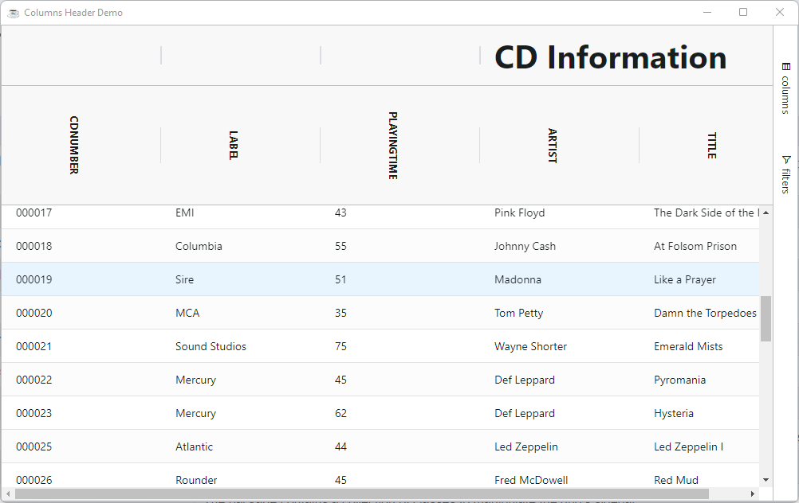

Each column has a header at the top that typically displays the column name and has access to column features, such as sorting, filtering and a column menu. This page explains how you can manage the headers.

## Header Height

These properties can be used to change the different heights used in the headers.

| Options                | Description                                                                                                               |
| ---------------------- | ------------------------------------------------------------------------------------------------------------------------- |
| `HeaderHeight`           | The height for the row containing the column label header\. If not specified the default is 25px\.                        |
| `GroupHeaderHeight`      | The height for the rows containing header column groups\. If not specified, it uses headerHeight\.                        |
| `FloatingFiltersHeight`  | The height for the row containing the floating filters\. If not specified the default is 20px\.                           |
| `PivotHeaderHeight`      | The height for the row containing the columns when in pivot mode\. If not specified, it uses headerHeight\.               |
| `PivotGroupHeaderHeight` | The height for the row containing header column groups when in pivot mode\. If not specified, it uses groupHeaderHeight\. |


## Text Orientation

By default, the text label for the header is display horizontally, ie as normal readable text. To display the text in another orientation you have to provide your own css to change the orientation and also provide the adequate header heights using the appropriate grid property.

### Example - Header Height and Text Orientation

The following example shows how you can provide a unique look & feel to the headers.

```bbj showLineNumbers
use ::BBjGridExWidget/BBjGridExWidget.bbj::BBjGridExWidget
use com.basiscomponents.db.ResultSet
use com.basiscomponents.bc.SqlQueryBC
use com.google.gson.JsonObject

declare auto BBjTopLevelWindow wnd!
wnd! = BBjAPI().openSysGui("X0").addWindow(10,10,1000,600,"Columns Header Demo")
wnd!.setCallback(BBjAPI.ON_CLOSE,"byebye")

gosub main
process_events

main:
  declare SqlQueryBC sbc!
  declare ResultSet rs!

  sbc! = new SqlQueryBC(BBjAPI().getJDBCConnection("CDStore"))
  rs! = sbc!.retrieve("SELECT  CDNUMBER , ARTIST, TITLE, LABEL, PLAYINGTIME FROM CDINVENTORY")

  grid! = new BBjGridExWidget(wnd!,100,0,0,1000,600)
  grid!.setData(rs!)
  
  options! = grid!.getOptions()

  options!.setGroupHeaderHeight(75)
  options!.setHeaderHeight(150)
  options!.setFloatingFiltersHeight(50)
  
  rem setup columns group style
  grid!.addStyle(".my-group-class" , "{""font-size"":""40px""}")
  group! = new BBjVector()
  group!.addItem("ARTIST")
  group!.addItem("TITLE")
  grid!.addColumnGroup("group2" , "CD Information", group! ,  0 , "my-group-class")
  
  headerCellStyle! = new JsonObject()
  headerCellStyle!.addProperty("width","55px")
  headerCellStyle!.addProperty("writing-mode","vertical-lr")
  headerCellStyle!.addProperty("line-height","2em")
  headerCellStyle!.addProperty("margin","60px")
  grid!.addStyle(".ag-header-cell-label .ag-header-cell-text" , headerCellStyle!)
return

byebye:
bye
```



Note That : 

* The header heights have all been changed in the gridOptions

```bbj showLineNumbers
  options! = grid!.getOptions()

  options!.setGroupHeaderHeight(75)
  options!.setHeaderHeight(150)
  options!.setFloatingFiltersHeight(50)
```

* The grouped column header `CD Information` has an specific style applied to it to make it bigger.

```bbj showLineNumbers
  grid!.addStyle(".my-group-class" , "{""font-size"":""50px""}")
```

* The column labels have CSS applied to them so they are displayed vertically

```bbj showLineNumbers
  headerCellStyle! = new JsonObject()
  headerCellStyle!.addProperty("width","55px")
  headerCellStyle!.addProperty("writing-mode","vertical-lr")
  headerCellStyle!.addProperty("line-height","2em")
  headerCellStyle!.addProperty("margin","60px")
  grid!.addStyle(".ag-header-cell-label .ag-header-cell-text" , headerCellStyle!)
```

:::info
You can add and remove style from the grid using the following two methods where the selector can be any valid css selector:

* `BBjGridExWidget.addStyle(BBjString selector$, BBjString rules!)`: To add a new style
* `BBjGridExWidget.removeStyle(BBjString selector$)`: To remove a style
:::

## Header Tooltips

You can provide a tooltip to the header using the column option `HeaderTooltip`

```bbj showLineNumbers
column! = grid!.getColumn("CDNUMBER")
column!.setHeaderTooltip("My Custom Tooltip")
```