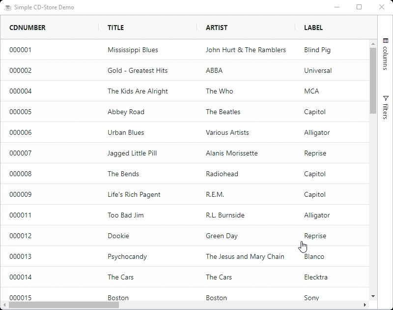

Columns can be moved in the grid in the following ways:

* Dragging the column header with the mouse or through touch.
* Using the grid API `BBjGridExWidget.moveColumn(BBjString columnId$, BBjNumber toIndex!)`

## Moving Animation

Column animations happen when you move a column. The default is for animations to be turned on. It is recommended that you leave the column move animations on unless your target platform (browser and hardware) is to slow to manage the animations. To turn OFF column animations, set the grid option `SuppressColumnMoveAnimation=true`

The move column animation transitions the columns position only. So when you move a column, it animates to the new position. No other attribute apart from position is animated.



## Suppress Hide Leave

The grid option `SuppressDragLeaveHidesColumns` will stop columns getting removed from the grid if they are dragged outside of the grid. This is handy if the user moves a column outside of the grid by accident while moving a column but doesn't intend to make it hidden.

## Suppress Movable

The column option `SuppressMovable` changes whether the column can be dragged. The column header cannot be dragged by the user to move the columns when `SuppressMovable=true`. However the column can be inadvertently moved by placing other columns around it thus only making it practical if all columns have this property.

## Lock Position

The column property `LockPosition` locks columns to the first position in the grid. When `LockPosition=true`, the column will always appear first, cannot be dragged by the user, and can not be moved out of position by dragging other columns.

## Suppress Movable & Lock Position Example

The example below demonstrates these options as follows:

* The column `CDNUMBER` is locked as first column in the scrollable area of the grid. It is not possible to move this column, or have other columns moved over it to impact it's position. As a result the `CDNUMBER` column marks the begging of the scrollable area regardless it's position.
* The column `TITLE` has moving suppressed. It is not possible to move this column, however it is possible to move other columns around it.
* The grid has `SuppressDragLeaveHidesColumns=true` so columns dragged outside of the grid are not hidden (normally dragging a column out of the grid will hide the column).

```bbj showLineNumbers
use ::BBjGridExWidget/BBjGridExWidget.bbj::BBjGridExWidget
use com.basiscomponents.db.ResultSet
use com.basiscomponents.bc.SqlQueryBC

declare auto BBjTopLevelWindow wnd!

wnd! = BBjAPI().openSysGui("X0").addWindow(10,10,800,600,"Simple CD-Store Demo")
wnd!.setCallback(BBjAPI.ON_CLOSE,"byebye")

gosub main
process_events

main:
  declare SqlQueryBC sbc!
  declare ResultSet rs!
  declare BBjGridExWidget grid!

  sbc! = new SqlQueryBC(BBjAPI().getJDBCConnection("CDStore"))
  rs! = sbc!.retrieve("SELECT  * FROM CDINVENTORY")
  
  grid! = new BBjGridExWidget(wnd!,100,0,0,800,600)
  grid!.getOptions().setSuppressDragLeaveHidesColumns(1)
  
  grid!.setData(rs!)
  grid!.getColumn("CDNUMBER").setSuppressMovable(1)
  grid!.getColumn("TITLE").setLockPosition(1)
return

byebye:
bye
```
