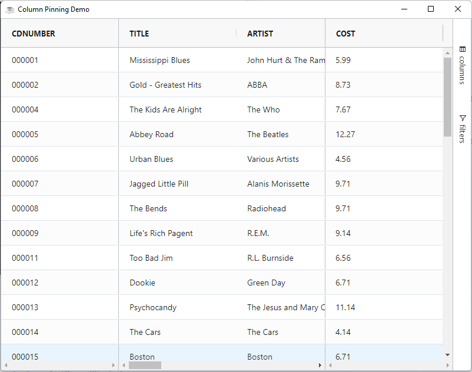
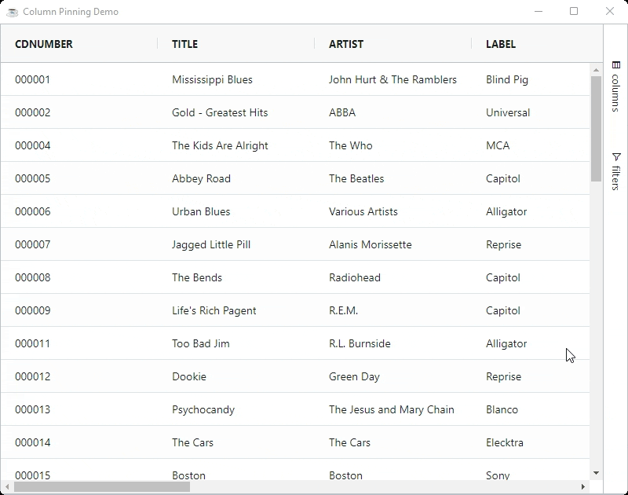

You can pin columns by setting the pinned option on the column object to either `left` or `right`.

Below shows an example with two pinned columns on the left and one pinned columns on the right. The example also demonstrates changing the pinning via the API at runtime.

The grid will reorder the columns so that `left pinned` columns come first and `right pinned` columns come last. In the example below the state of pinned columns impacts the order of the columns.

```BBj showLineNumbers
use ::BBjGridExWidget/BBjGridExWidget.bbj::BBjGridExWidget
use ::BBjGridExWidget/BBjGridExWidgetColumns.bbj::BBjGridExWidgetColumn
use com.basiscomponents.db.ResultSet
use com.basiscomponents.bc.SqlQueryBC

declare auto BBjTopLevelWindow wnd!

wnd! = BBjAPI().openSysGui("X0").addWindow(10,10,800,600,"Column Pinning Demo")
wnd!.setCallback(BBjAPI.ON_CLOSE,"byebye")

gosub main
process_events

main:
  declare SqlQueryBC sbc!
  declare ResultSet rs!
  declare BBjGridExWidget grid!

  sbc! = new SqlQueryBC(BBjAPI().getJDBCConnection("CDStore"))
  rs! = sbc!.retrieve("SELECT * FROM CDINVENTORY")
  
  grid! = new BBjGridExWidget(wnd!,100,0,0,800,600)
  grid!.setData(rs!)
  
  grid!.getColumn("CDNUMBER").setPinned(GxColumn.PINNED_LEFT())
  grid!.getColumn("COST").setPinned(GxColumn.PINNED_RIGHT())
return

byebye:
bye
```



## Pinning via Column Dragging

It is possible to pin a column by moving the column in the following ways:

* When other columns are pinned, drag the column to the existing pinned area.
* When no columns are pinned, drag the column to the edge of the grid and wait for approximately one second. The grid will then assume you want to pin and create a pinned area and place the column into it.



## Lock Pinned

If you do not want the user to be able to pin using the UI, set the column option `LockPinned=true`. This will block the UI in the following way:

* Dragging a column to the pinned section will not pin the column.
* For Enhanced grid, the column menu will not have a pin option.