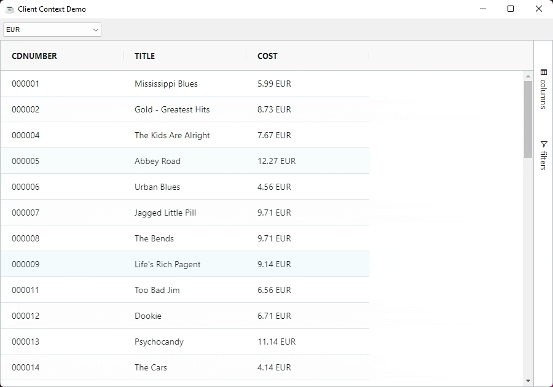

This sections covers how shared contextual information can be passed around the grid.

## Overview

The client context object is a [`com.google.gson.JsonObject`](https://www.javadoc.io/doc/com.google.code.gson/gson/2.8.5/com/google/gson/JsonObject.html) passed to most of the components used in the grid. The purpose of the context object is to allow the client grid to pass details to the components such as the Cell Renderers and Cell Editors.

## Context Object Example

The example below demonstrates how the context object can be used. Note the following:

* Selecting the reporting currency from the drop down places it in the context object.
* When the reporting currency is changed the cell expression uses the currency supplied in the context object to calculate the value using `ctx.currency`

```bbj showLineNumbers
use ::BBjGridExWidget/BBjGridExWidget.bbj::BBjGridExWidget
use ::BBjGridExWidget/GxColumns.bbj::GxColumn
use ::BBjGridExWidget/GxExpressions.bbj::GxExpression
use com.basiscomponents.db.ResultSet
use com.basiscomponents.bc.SqlQueryBC

declare auto BBjTopLevelWindow wnd!
declare auto BBjListButton currencies!

wnd! = BBjAPI().openSysGui("X0").addWindow(10,10,900,600,"Client Context Demo")
wnd!.setCallback(BBjAPI.ON_CLOSE,"byebye")

currencies! = wnd!.addListButton(201,5,6,160,250,"")
currencies!.insertItemAt(0,"EUR")
currencies!.insertItemAt(1,"USD")
currencies!.insertItemAt(2,"GBP")
currencies!.selectIndex(0)
currencies!.setCallback(BBjAPI.ON_LIST_SELECT,"update")

gosub main
process_events

main:
  declare SqlQueryBC sbc!
  declare ResultSet rs!
  declare BBjGridExWidget grid!

  sbc! = new SqlQueryBC(BBjAPI().getJDBCConnection("CDStore"))
  rs! = sbc!.retrieve("SELECT CDNUMBER , TITLE , COST FROM CDINVENTORY")

  grid! = new BBjGridExWidget(wnd!,100,0,35,900,566)
  grid!.setData(rs!)
  
  defaultCurrency$ = str(currencies!.getItemAt(currencies!.getSelectedIndex()))
  grid!.getClientContext().addProperty("currency",defaultCurrency$)
  
  declare GxColumn costColumn!
  costColumn! = grid!.getColumn("COST")
  
  declare GxExpression exp!
  exp! = new GxExpression(" x + ' ' + ctx.currency")
  costColumn!.setValueFormatterExpression(exp!)
return

update:
   currency$ = str(currencies!.getItemAt(currencies!.getSelectedIndex()))
   grid!.getClientContext().addProperty("currency",currency$)
   grid!.updateContext()
   grid!.redrawRows()
return

byebye:
bye
```

