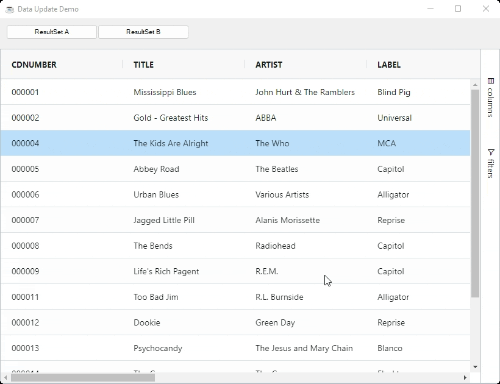

This section of the documentation describes how to work with data.

The grid also allows updating data in the following ways which are explained in other sections of the documentation:

* Using the grid's in-line editing feature, eg double clicking on a cell and editing the value.
* Updating the data directly in your application - which the grid is not aware of the changes and you need to tell the grid to refresh the view.

This section of the documentation is regarding using the grid's API to update data. The grid will then be aware of the change and also update the relevant parts of the UI.

## Bulk Updating

If you want to add, remove or update more than one row at a time, then you have the following options:

### Method 1 - Row Data

To replace all the row data in the grid call `BBjGridExWidget.updateData(ResultSet set!)`. The grid will discard all previous data and create the new data again from scratch. All row and range selections will be lost.

Use this method if you are effectively loading brand new data into the grid, eg loading a new report with a completely different data set to the previous. 

```BBj
declare ResultSet newResultSet!
grid!.updateData(newResultSet!)
```

In the same time if you just want to clear the whole data on the grid , then use the api method `grid!.clearData()`

```BBj
grid!.clearData()
```

The example below shows the data with two ResultSets. Clicking the buttons toggles between the ResultSets. 

:::note
Notice how the grid is able to maintain the selection across data changes. This is because the DataRows have auto-generated IDs based on their content.
:::

```BBj showLineNumbers
use ::BBjGridExWidget/BBjGridExWidget.bbj::BBjGridExWidget
use com.basiscomponents.db.ResultSet
use com.basiscomponents.bc.SqlQueryBC

declare auto BBjTopLevelWindow wnd!

wnd! = BBjAPI().openSysGui("X0").addWindow(10,10,820,600,"Data Update Demo")
wnd!.setCallback(BBjAPI.ON_CLOSE,"byebye")

buttonA! = wnd!.addButton(200,10,10,150,25,"ResultSet A")
buttonA!.setCallback(BBjAPI.ON_BUTTON_PUSH,"handleButtonAClick")

buttonB! = wnd!.addButton(201,160,10,150,25,"ResultSet B")
buttonB!.setCallback(BBjAPI.ON_BUTTON_PUSH,"handleButtonBClick")

gosub main
process_events

main:
  declare BBjGridExWidget grid!
  declare SqlQueryBC sbc!
  declare ResultSet rs!

  sbc! = new SqlQueryBC(BBjAPI().getJDBCConnection("CDStore"))
  rs! = sbc!.retrieve("SELECT TOP 15 * FROM CDINVENTORY")

  grid! = new BBjGridExWidget(wnd!,100, 0,50,820,550)
  grid!.setData(rs!)
return

handleButtonAClick:
  rs! = sbc!.retrieve("SELECT TOP 15 * FROM CDINVENTORY")
  grid!.updateData(rs!)
return

handleButtonBClick:
  rs! = sbc!.retrieve("SELECT TOP 5 * FROM CDINVENTORY")
  grid!.updateData(rs!)
return

byebye:
bye
```



### Method 2 - Transaction

The transaction method is to pass a transaction model to the grid containing rows to `add`, `remove` and `update`. This is done using 
`BBjGridExWidget.executeUpdateTransaction`. The grid will keep all active sorting, grouping and filtering in this case

:::tip
Updating using transactions is the best way to do large updates to the grid, as the grid treats them as delta changes, so the grid only refreshes what is needed giving a performance boost. All row and range selection will be kept.
:::

```BBj
use ::BBjGridExWidget/GxClientModels.bbj::GxClientTransactionModel

transaction! = new GxClientTransactionModel()
transaction!.remove(rowToRemove!)
transaction!.update(rowToUpdate!)

transaction!.add(addFirstRow!)
transaction!.add(addSecondRow!)

rem start adding the rows at index 15
transaction!.setAddIndex(15)

grid!.executeUpdateTransaction(transaction!)
```

:::info
Transaction updates will update the `ResultSet` too. so if you remove a row from the grid the row will be removed too from The ResultSet.
The same applies for `update` and `add` operations
:::


The following example applies transactions in different ways.

```BBj showLineNumbers
use ::BBjGridExWidget/BBjGridExWidget.bbj::BBjGridExWidget
use ::BBjGridExWidget/GxClientModels.bbj::GxClientTransactionModel
use com.basiscomponents.db.ResultSet
use com.basiscomponents.db.DataRow
use com.basiscomponents.bc.SqlQueryBC

declare auto BBjTopLevelWindow wnd!

wnd! = BBjAPI().openSysGui("X0").addWindow(10,10,820,600,"GxClientTransactionModel")
wnd!.setCallback(BBjAPI.ON_CLOSE,"byebye")

addItems! = wnd!.addButton(200,10,10,150,25,"addItems")
addItems!.setCallback(BBjAPI.ON_BUTTON_PUSH,"handleAddItems")

addItemsAtIndex! = wnd!.addButton(201,160,10,150,25,"add items index = 2")
addItemsAtIndex!.setCallback(BBjAPI.ON_BUTTON_PUSH,"handleAddItemsAtIndex")

updateTopTwo! = wnd!.addButton(202,310,10,100,25,"Update Top 2")
updateTopTwo!.setCallback(BBjAPI.ON_BUTTON_PUSH,"handleUpdateTopTwo")

count = 1

gosub main
process_events

main:
  declare BBjGridExWidget grid!
  declare SqlQueryBC sbc!
  declare ResultSet rs!

  sbc! = new SqlQueryBC(BBjAPI().getJDBCConnection("CDStore"))
  rs! = sbc!.retrieve("SELECT TOP 3 LABEL, MUSICTYPE, COST FROM CDINVENTORY")

  grid! = new BBjGridExWidget(wnd!,100, 0,50,820,550)
  grid!.setData(rs!)
return

handleAddItems:
  declare GxClientTransactionModel transaction!
  transaction! = new GxClientTransactionModel()

  max = count + 2
  for i=count to max
    dr! = new DataRow()
    dr!.setFieldValue("LABEL","Appended Label " + str(i))
    dr!.setFieldValue("MUSICTYPE","Appended MusicType " + str(i))
    dr!.setFieldValue("COST", rnd(50))
    transaction!.add(dr!)
  next 
  count = i

  grid!.executeUpdateTransaction(transaction!, err=*return)
return

handleAddItemsAtIndex:
  declare GxClientTransactionModel transaction!
  transaction! = new GxClientTransactionModel()
  transaction!.setAddIndex(2)

  max = count + 2
  for i=count to max
    dr! = new DataRow()
    dr!.setFieldValue("LABEL","Appended Label " + str(i))
    dr!.setFieldValue("MUSICTYPE","Appended MusicType " + str(i))
    dr!.setFieldValue("COST", rnd(50))
    transaction!.add(dr!)
  next 
  count = i

  grid!.executeUpdateTransaction(transaction!, err=*return)
return

handleUpdateTopTwo:
  firstRow! = rs!.getItem(0, err=*return)
  firstRow!.setFieldValue("COST", rnd(50))

  secondRow! = rs!.getItem(1, err=*return)
  secondRow!.setFieldValue("COST", rnd(50))

  declare GxClientTransactionModel transaction!
  transaction! = new GxClientTransactionModel()
  transaction!.update(firstRow!)
  transaction!.update(secondRow!)

  grid!.executeUpdateTransaction(transaction!)
return

byebye:
bye
```


<!-- ### Method 3 - High Frequency / Batch Update

High Frequency (achieved with Async Transactions) is a mechanism of applying many transactions over a small space of time and have the grid apply all the transactions in batches. The high frequency / batch method is for when you need the fastest possible way to process many continuous updates, such as providing a stream of updates to the grid. This is done using the API.

Use Async Transactions for doing add, remove or update operations that are frequent, e.g. for managing streaming updates into the grid of tens, hundreds or thousands of updates a second. -->


## Single Row Or Cell

You can target updates to a single row or cell. Updating a single row means asking the grid to replace the data item for one specific row.

Both single row and single cell updates are done by first getting a reference to the DataRow and then using the relevant grid's API to update the row or cell.

All The following API methods can be used to update the rows and cells in the grid. And all of them uses [`GxClientTransactionModel`](https://bbj-plugins.github.io/BBjGridExWidget/javadoc/GxClientModels/GxClientTransactionModel.html) under the hood.

* `BBjGridExWidget::addRow(BBjNumber index!, DataRow row!)`
* `BBjGridExWidget::addRow(DataRow row!)`
* `BBjGridExWidget::updateRow(DataRow row!)`
* `BBjGridExWidget::removeRow(DataRow row!)`
* `BBjGridExWidget::removeRow(BBjNumber index!)`
* `BBjGridExWidget::removeRow(BBjString key!)`


### Updating Rows / Cells Example

The example below demonstrates the following:

* Set Cost on MCA: The Cost value is updated on the MCA row and the grid refreshes the cell.
* Set Data on MCA: The entire data is set on the MCA row and the grid refreshes the entire row.

```BBj showLineNumbers
use ::BBjGridExWidget/BBjGridExWidget.bbj::BBjGridExWidget
use ::BBjGridExWidget/GxClientModels.bbj::GxClientTransactionModel
use com.basiscomponents.db.ResultSet
use com.basiscomponents.db.DataRow
use com.basiscomponents.bc.SqlQueryBC

declare auto BBjTopLevelWindow wnd!

wnd! = BBjAPI().openSysGui("X0").addWindow(10,10,820,600,"GxClientTransactionModel")
wnd!.setCallback(BBjAPI.ON_CLOSE,"byebye")

updateCost! = wnd!.addButton(200,10,10,150,25,"Set Cost on MCA")
updateCost!.setCallback(BBjAPI.ON_BUTTON_PUSH,"handleUpdateCost")

updateRow! = wnd!.addButton(201,160,10,150,25,"Update Data on MCA")
updateRow!.setCallback(BBjAPI.ON_BUTTON_PUSH,"handleUpdateRow")

gosub main
process_events

main:
  declare BBjGridExWidget grid!
  declare SqlQueryBC sbc!
  declare ResultSet rs!

  sbc! = new SqlQueryBC(BBjAPI().getJDBCConnection("CDStore"))
  rs! = sbc!.retrieve("SELECT TOP 3 LABEL, MUSICTYPE, COST FROM CDINVENTORY")

  grid! = new BBjGridExWidget(wnd!,100, 0,50,820,550)
  grid!.getOptions().getDefaultColumnDefinition().setSortable(0)
  grid!.setData(rs!)
return

handleUpdateCost:
  dr! = rs!.getItem(2)
  dr!.setFieldValue("COST", rnd(50))

  grid!.updateRow(dr!)
return

handleUpdateRow:
  dr! = rs!.getItem(2)
  dr!.setFieldValue("COST", rnd(50))
  dr!.setFieldValue("MUSICTYPE", "T - " + str(rnd(1000)))

  grid!.updateRow(dr!)
return

byebye:
bye
```


### Controlling Row Position

The example below shows controlling the grid rows, including it's order.

```BBj showLineNumbers
use ::BBjGridExWidget/BBjGridExWidget.bbj::BBjGridExWidget
use com.basiscomponents.db.ResultSet
use com.basiscomponents.db.DataRow
use com.basiscomponents.bc.SqlQueryBC

declare auto BBjTopLevelWindow wnd!

wnd! = BBjAPI().openSysGui("X0").addWindow(10,10,450,600,"Data Update Demo")
wnd!.setCallback(BBjAPI.ON_CLOSE,"byebye")

append! = wnd!.addButton(200,10,10,150,25,"Append")
append!.setCallback(BBjAPI.ON_BUTTON_PUSH,"handleAppend")

prepend! = wnd!.addButton(201,180,10,150,25,"Prepend")
prepend!.setCallback(BBjAPI.ON_BUTTON_PUSH,"handlePrepend")

appendCount! = 0
prependCount! = 0

gosub main
process_events

main:
  declare BBjGridExWidget grid!
  declare SqlQueryBC sbc!
  declare ResultSet rs!

  sbc! = new SqlQueryBC(BBjAPI().getJDBCConnection("CDStore"))
  rs! = sbc!.retrieve("SELECT TOP 3 TITLE , ARTIST FROM CDINVENTORY")

  grid! = new BBjGridExWidget(wnd!,100, 0,50,450,550)
  grid!.setData(rs!)
return

handleAppend:
  declare DataRow dr!

  appendCount! = appendCount! + 1
  dr! = new DataRow()
  dr!.setFieldValue("TITLE","Appended Title" + str(appendCount!))
  dr!.setFieldValue("ARTIST","Appended Artist" + str(appendCount!))
  grid!.addRow(rs!.count(), dr!)
return

handlePrepend:
  declare DataRow dr!

  prependCount! = prependCount! + 1
  dr! = new DataRow()
  dr!.setFieldValue("TITLE","Prepend Title" + str(prependCount!))
  dr!.setFieldValue("ARTIST","Prepend Artist" + str(prependCount!))
  grid!.addRow(dr!)
return

byebye:
bye
```

