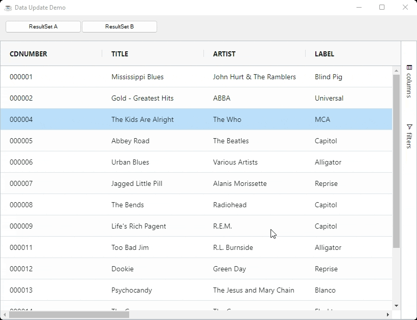

This section explains how to update the grid's data using the grid's API's.

As well as using the grid's API's, the grid also allows updating data in the following other ways which are explained in other sections of the documentation:

* Using the grid's in-line editing feature, eg double clicking on a cell and editing the value.
* Updating the data directly in your application - which the grid is not aware of the changes and you need to tell the grid to refresh the view.

This section of the documentation is regarding using the grid's API to update data. The grid will then be aware of the change and also update the relevant parts of the UI.

## Full CRUD & Bulk Updating

If you want to add, remove or update more than one row at a time, then you have the following options:

### Method 1 - Row Data (Normal)

To replace all the row data in the grid call `BBjGridExWidget.updateData(ResultSet set!)`. The grid will discard all previous data and create the new data again from scratch. All row and range selection will be lost.

Use this method if you are effectively loading brand new data into the grid, eg loading a new report with a completely different data set to the previous. 

```BBj
declare ResultSet newResultSet!
grid!.updateData(newResultSet!)
```

In the same time if you just want to clear the whole data on the grid , then use the api method `grid!.clearData()`

```BBj
grid!.clearData()
```

The example below shows the data with two ResultSets. Clicking the buttons toggles between the ResultSets. 

:::info Note
Notice how the grid is able to maintain the selection across data changes. This is because the DataRows have auto-generated id based on their content.
:::

```BBj showLineNumbers
use ::BBjGridExWidget/BBjGridExWidget.bbj::BBjGridExWidget
use com.basiscomponents.db.ResultSet
use com.basiscomponents.bc.SqlQueryBC

declare auto BBjTopLevelWindow wnd!

wnd! = BBjAPI().openSysGui("X0").addWindow(10,10,820,600,"Data Update Demo")
wnd!.setCallback(BBjAPI.ON_CLOSE,"byebye")

buttonA! = wnd!.addButton(200,10,10,150,25,"ResultSet A")
buttonA!.setCallback(BBjAPI.ON_BUTTON_PUSH,"handleButtonAClick")

buttonB! = wnd!.addButton(201,160,10,150,25,"ResultSet B")
buttonB!.setCallback(BBjAPI.ON_BUTTON_PUSH,"handleButtonBClick")

gosub main
process_events

main:
  declare BBjGridExWidget grid!
  declare SqlQueryBC sbc!
  declare ResultSet rs!

  sbc! = new SqlQueryBC(BBjAPI().getJDBCConnection("CDStore"))
  rs! = sbc!.retrieve("SELECT TOP 15 * FROM CDINVENTORY")

  grid! = new BBjGridExWidget(wnd!,100, 0,50,820,550)
  grid!.setData(rs!)
return

handleButtonAClick:
  rs! = sbc!.retrieve("SELECT TOP 15 * FROM CDINVENTORY")
  grid!.updateData(rs!)
return

handleButtonBClick:
  rs! = sbc!.retrieve("SELECT TOP 5 * FROM CDINVENTORY")
  grid!.updateData(rs!)
return

byebye:
bye
```



### Method 2 - Transaction

The transaction method is to pass a transaction model to the grid containing rows to add, remove and update. This is done using 
`BBjGridExWidget.executeUpdateTransaction(GxClientTransactionModel transaction!)`. The grid keeps all active sorting, grouping and filtering, including updating to reflect the changes in the data should the sorting, grouping or filtering be impacted.

Updating using transactions is the best way to do large updates to the grid, as the grid treats them as delta changes, so the grid only refreshes what is needed giving a performance boost. All row and range selection will be kept.

```BBj
use ::BBjGridExWidget/GxClientModels.bbj::GxClientTransactionModel

transaction! = new GxClientTransactionModel()
transaction!.remove(rowToRemove!)
transaction!.update(rowToUpdate!)

transaction!.add(addFirstRow!)
transaction!.add(addSecondRow!)
transaction!.setAddIndex(15); rem start adding the rows at index 15

grid!.executeUpdateTransaction(transaction!)
```

:::info
Transaction updates will update the `ResultSet` too. so if you remove a row from the grid the row will be removed too from The ResultSet.
The same applies for `update` and `add` operations
:::

All The following update methods can be used to update the data on the grid. and all of them uses [`GxClientTransactionModel`](https://bbj-plugins.github.io/BBjGridExWidget/javadoc/GxClientModels/GxClientTransactionModel.html) under the hood.

* `BBjGridExWidget::addRow(DataRow row!)`
* `BBjGridExWidget::addRow(BBjNumber index!, DataRow row!)`
* `BBjGridExWidget::updateRow(DataRow row!)`
* `BBjGridExWidget::removeRow(DataRow row!)`
* `BBjGridExWidget::removeRow(BBjNumber index!)`
* `BBjGridExWidget::removeRow(BBjString key!)`

### Method 3 - High Frequency / Batch Update

High Frequency (achieved with Async Transactions) is a mechanism of applying many transactions over a small space of time and have the grid apply all the transactions in batches. The high frequency / batch method is for when you need the fastest possible way to process many continuous updates, such as providing a stream of updates to the grid. This is done using the API.

Use Async Transactions for doing add, remove or update operations that are frequent, e.g. for managing streaming updates into the grid of tens, hundreds or thousands of updates a second.


