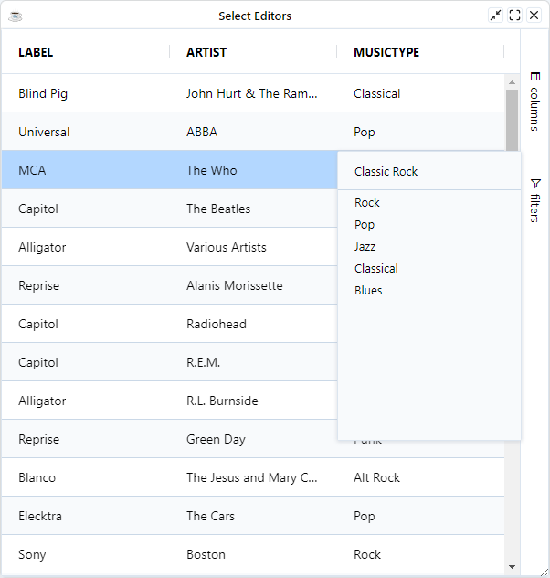

A Cell Editor Component is the UI that appears, normally inside the Cell, that takes care of the Edit operation.

## Configuring Cell Editors 

Cell Editor Components are configured per column by getting the instance of the attached cell editor

```bbj
double! = grid!.getColumn("DOUBLE")
double!.getCellEditor().setStep(.01)
```

The BBjGridExWidget uses the columns's SQL types provided by the ResultSet to auto-attach the correct cell editor component for each column. For instance, When the column's SQL type is `java.sql.Types.NUMERIC`, the grid will attach the `GxCellEditorBasicNumber` component and so on for other types.

### Types - Cell Editor Components Mapping

The following shows which cell editor component is used for each column type:


| **Component**          	| **SQL Type**                	|
|--------------------	|-----------------------------	|
| [`GxCellEditorBasicNumber`](https://bbj-plugins.github.io/BBjGridExWidget/javadoc/GxCellEditors/GxCellEditorBasicNumber.html) 	| `BIGINT`, `TINYINT`, `SMALLINT`, `INTEGER`, `DECIMAL`, `DOUBLE`, `FLOAT`, `REAL`, `NUMERIC` 	|
| [`GxCellEditorBasicDate`](https://bbj-plugins.github.io/BBjGridExWidget/javadoc/GxCellEditors/GxCellEditorBasicDate.html) 	| `DATE`	|
| [`GxCellEditorBasicTime`](https://bbj-plugins.github.io/BBjGridExWidget/javadoc/GxCellEditors/GxCellEditorBasicTime.html) 	| `TIME`, `TIME_WITH_TIMEZONE`	|
| [`GxCellEditorBasicTimestamp`](https://bbj-plugins.github.io/BBjGridExWidget/javadoc/GxCellEditors/GxCellEditorBasicTimestamp.html) 	| `TIMESTAMP`, `TIMESTAMP_WITH_TIMEZONE`	|
| [`GxCellEditorBasicBoolean`](https://bbj-plugins.github.io/BBjGridExWidget/javadoc/GxCellEditors/GxCellEditorBasicBoolean.html) 	| `BOOLEAN`, `BIT`	|
| [`GxCellEditorBasicText`](https://bbj-plugins.github.io/BBjGridExWidget/javadoc/GxCellEditors/GxCellEditorBasicText.html) 	| `CHAR`, `VARCHAR`, `NVARCHAR`, `NCHAR`	|
| [`GxCellEditorLargeText`](https://bbj-plugins.github.io/BBjGridExWidget/javadoc/GxCellEditors/GxCellEditorLargeText.html) 	| `LONGVARCHAR`, `LONGNVARCHAR`	|


:::info
If the grid is not able to detect the type, then the `GxCellEditorBasicText` component will be used by default.
:::

## Additional Cell Editors 

Beside the basic cell editors, BBjGridExWidget provided the following list of editors which
can be attached to any column.


| **Component**          	| **Description**                	|
|--------------------	|-----------------------------	|
| [`GxCellEditorText`](https://bbj-plugins.github.io/BBjGridExWidget/javadoc/GxCellEditors/GxCellEditorText.html) 	| Simple text editors that use the standard HTML `input` tag.	|
| [`GxCellEditorPopupText`](https://bbj-plugins.github.io/BBjGridExWidget/javadoc/GxCellEditors/GxCellEditorPopupText.html) 	|  Same as `GxCellEditorText` but as popup.	|
| [`GxCellEditorSelect`](https://bbj-plugins.github.io/BBjGridExWidget/javadoc/GxCellEditors/GxCellEditorSelect.html) 	|  Simple editors that use the standard HTML select tag.	|
| [`GxCellEditorPopupSelect`](https://bbj-plugins.github.io/BBjGridExWidget/javadoc/GxCellEditors/GxCellEditorPopupSelect.html) 	| Same as `GxCellEditorSelect` but as popup.	|
| [`GxCellEditorRichSelect`](https://bbj-plugins.github.io/BBjGridExWidget/javadoc/GxCellEditors/GxCellEditorRichSelect.html) 	| Available in **Enhanced Grid only**. An alternative to using the browser's select popup for dropdown inside the grid.	|
| [`GxCellEditorBasicBooleanSelect`](https://bbj-plugins.github.io/BBjGridExWidget/javadoc/GxCellEditors/GxCellEditorBasicBooleanSelect.html) 	| A simple boolean editor based on the `GxCellEditorSelect`.	|
| [`GxCellEditorBasicBooleanRichSelect`](https://bbj-plugins.github.io/BBjGridExWidget/javadoc/GxCellEditors/GxCellEditorBasicBooleanRichSelect.html) 	| A simple boolean editor based on the `GxCellEditorRichSelect`.	|
| [`GxCellEditorSuggestion`](https://bbj-plugins.github.io/BBjGridExWidget/javadoc/GxCellEditors/GxCellEditorSuggestion.html) 	|  A Suggestion/autocomplete cell editor.	|


## Popup vs In Cell

An editor can be in a popup or in cell.

### In Cell

In Cell editing means the contents of the cell will be cleared and the editor will 
appear inside the cell. The editor will be constrained to the boundaries of the cell,
so if it is larger than the provided area it will be clipped. When editing is finished,
the editor will be removed and the renderer will be placed back inside the cell again.

### Popup

Some cell editors like the `Select` cell editors appear in a popup. 
The popup will behave like a menu in that any mouse interaction outside of the popup 
will close the popup. The popup will appear over the cell, however it will not 
change the contents of the cell. Behind the popup the cell will 
remain intact until after editing is finished which will result in the cell 
being refreshed.

## Example: Using the Select Editors

In the example below, the following can be noticed:

* All columns are editable by default.
* The `MUSICTYPE` column is configured to use the `GxCellEditorRichSelect` is the grid is licensed. otherwise we fallback to `GxCellEditorSelect`

```bbj showLineNumbers
use ::BBjGridExWidget/BBjGridExWidget.bbj::BBjGridExWidget
use ::BBjGridExWidget/GxColumns.bbj::GxColumn
use ::BBjGridExWidget/GxCellEditors.bbj::GxCellEditorRichSelect
use ::BBjGridExWidget/GxCellEditors.bbj::GxCellEditorSelect
use com.basiscomponents.db.ResultSet
use com.basiscomponents.bc.SqlQueryBC
use com.google.gson.JsonArray

declare auto BBjTopLevelWindow wnd!
wnd! = BBjAPI().openSysGui("X0").addWindow(10, 10, 600, 600, "Select Editors")
wnd!.setCallback(BBjAPI.ON_CLOSE,"byebye")

gosub main
process_events

main:
  declare SqlQueryBC sbc!
  declare ResultSet rs!
  declare BBjGridExWidget grid!
  declare JsonArray values!

  sbc! = new SqlQueryBC(BBjAPI().getJDBCConnection("CDStore"))
  rs! = sbc!.retrieve("SELECT LABEL, ARTIST, MUSICTYPE FROM CDINVENTORY")

  grid! = new BBjGridExWidget(wnd!, 100, 0, 0, 600, 600)
  grid!.getOptions().setEditable(1)
  grid!.setFitToGrid()
  grid!.setData(rs!)

  type! = grid!.getColumn("MUSICTYPE")
  editor! = new GxCellEditorSelect()
  if(grid!.isLicensed())
    editor! = new GxCellEditorRichSelect()
  fi

  values! = new JsonArray()
  values!.add("Rock")
  values!.add("Pop")
  values!.add("Jazz")
  values!.add("Classical")
  values!.add("Blues")

  editor!.setValues(values!)
  type!.setCellEditor(editor!)
return

byebye:
bye
```


