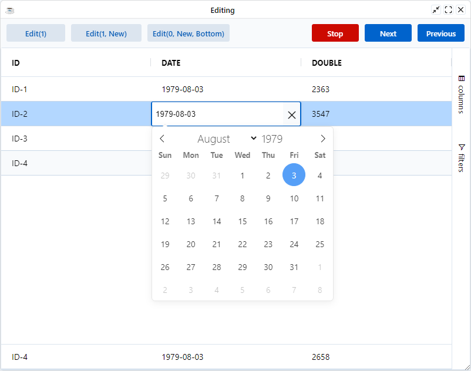

This page discusses the different ways in which Cell Editing can be started and stopped.

## Start Editing

Assuming `Editable=1` is set on the Column, editing will start upon any of the following:

* **Edit Key Pressed**: One of the following is pressed: <kbd>Enter</kbd>, <kbd>F2</kbd>, <kbd>Backspace</kbd>, <kbd>Delete</kbd>. If this happens then params.key will contain the key code of the key that started the edit. The default editor will clear the contents of the cell if Backspace or Delete are pressed.
* **Printable Key Pressed**: Any of the following characters are pressed: `abcdefghijklmnopqrstuvwxyzABCDEFGHIJKLMNOPQRSTUVWXYZ1234567890!"£$%^&amp;*()_+-=[];\'#,./\|<>?:@~{}`.
* **Mouse Double Click**: If the mouse is double-clicked. There is a grid option `SingleClickEdit` that will allow single-click to start editing instead of double-click. Another option `SuppressClickEdit` will prevent both single-click and double-click from starting the edit; use this if you only want to have your own way of starting editing, such as clicking a button in your custom cell renderer.
* **`BBGridExWidget::setStartCellEditing`**: If you call [`setStartCellEditing`](https://bbj-plugins.github.io/BBjGridExWidget/javadoc/BBjGridExWidget/BBjGridExWidget.html#setStartCellEditing) on the grid API

## Stop Editing

The grid will stop editing when any of the following happen:

* **Other Cell Focus**: If focus in the grid goes to another cell, the editing will stop.
* **Enter Key Down**: If the grid receives an <kbd>Enter</kbd> key press event on the cell.
* **Escape Key Down**: Similar to <kbd>Enter</kbd>, if <kbd>Esc</kbd> key is pressed, editing will stop. Unlike <kbd>Enter</kbd>, the <kbd>Esc</kbd> action will discard changes rather than taking the new value.
* **Tab Key Down**: Editing will stop, accepting changes, and editing will move to the next cell, or the previous cell if <kbd>Shift</kbd> is also pressed.
* **Popup Editor Closed**: If using popup editor, the popup is configured to close if you click outside the editor. Closing the popup triggers the grid to stop editing.
* **`BBjGridExWidget::stopEditing`**: If you call [`stopEditing`](https://bbj-plugins.github.io/BBjGridExWidget/javadoc/BBjGridExWidget/BBjGridExWidget.html#stopEditing) on the grid API.

## Tab Navigation

While editing, if you hit <kbd>Tab</kbd>, the editing will stop for the current cell and start on the next cell. If you hold down <kbd>Shift+Tab</kbd>, the same will happen except the previous cell will start editing rather than the next. This is in line with editing data in Excel.

The next and previous cells can also be navigated using the API [`BBjGridExWidget::tabToNextCell`](https://bbj-plugins.github.io/BBjGridExWidget/javadoc/BBjGridExWidget/BBjGridExWidget.html#tabToNextCell) and [`BBjGridExWidget::tabToPreviousCell`](https://bbj-plugins.github.io/BBjGridExWidget/javadoc/BBjGridExWidget/BBjGridExWidget.html#tabToPreviousCell). 


## Editing API

The grid has the following API methods for editing:

| **Event**                                                                                                                               	| **Description**                                                                                                        	|
|-----------------------------------------------------------------------------------------------------------------------------------------	|------------------------------------------------------------------------------------------------------------------------	|
| [`BBjGridExWidget::setStartCellEditing`](https://bbj-plugins.github.io/BBjGridExWidget/javadoc/BBjGridExWidget/BBjGridExWidget.html#setStartCellEditing) 	| Start editing the provided cell.           	|
| [`BBjGridExWidget::stopEditing`](https://bbj-plugins.github.io/BBjGridExWidget/javadoc/BBjGridExWidget/BBjGridExWidget.html#stopEditing)                 	| If a cell is editing, it stops the editing. Pass `true` if you want to cancel the editing (i.e. don't accept changes). 	|


The example below illustrates different parts of the editing API

```bbj showLineNumbers
use ::BBjGridExWidget/BBjGridExWidget.bbj::BBjGridExWidget
use com.basiscomponents.db.ResultSet
use com.basiscomponents.db.DataRow
use java.sql.Types

wnd! = BBjAPI().openSysGui("X0").addWindow(10, 10, 800, 600, "Editing")
wnd!.setCallback(BBjAPI.ON_CLOSE,"byebye")

btn! = wnd!.addButton(101, 10, 10, 100, 30, "Edit(1)")
btn!.setCallback(btn!.ON_BUTTON_PUSH, "handleEdit")

btn! = wnd!.addButton(102, 120, 10, 120, 30, "Edit(1, New)")
btn!.setCallback(btn!.ON_BUTTON_PUSH, "handleEditWidthNewValue")

btn! = wnd!.addButton(103, 250, 10, 140, 30, "Edit(0, New, Bottom)")
btn!.setCallback(btn!.ON_BUTTON_PUSH, "handleEditInPinnedBottom")

btn! = wnd!.addButton(104, 710, 10, 80, 30, "Previous")
btn!.setCallback(btn!.ON_BUTTON_PUSH, "handlePrevious")
btn!.setAttribute("theme","primary")

btn! = wnd!.addButton(105, 620, 10, 80, 30, "Next")
btn!.setCallback(btn!.ON_BUTTON_PUSH, "handleNext")
btn!.setAttribute("theme","primary")

btn! = wnd!.addButton(106, 530, 10, 80, 30, "Stop")
btn!.setCallback(btn!.ON_BUTTON_PUSH, "handleStop")
btn!.setAttribute("theme","danger")

gosub main
process_events

main:
  declare ResultSet data!
  declare ResultSet pinnedData!
  declare BBjGridExWidget grid!

  data! = new ResultSet()
  for i=1 to 4
      dr! = new DataRow()
      dr!.setFieldValue("ID"      , Types.VARCHAR , "ID-" + str(i))
      dr!.setFieldValue("DATE"    , Types.DATE    , "1979-08-03")
      dr!.setFieldValue("DOUBLE"  , Types.DOUBLE  , rnd(5000))
      data!.addItem(dr!)
  next

  pinnedData! = new ResultSet()
  pinnedData!.add(dr!.clone())

  grid! = new BBjGridExWidget(wnd!, 100, 0, 50, 800, 550)
  grid!.getOptions().setEditable(1)
  grid!.setFitToGrid()
  grid!.setData(data!, "ID")
  grid!.setPinnedBottomRows(pinnedData!)
return

handleEdit:
  gosub handleStop
  grid!.focus(1, "ID")
  grid!.setStartCellEditing(1,"ID")
return

handleEditWidthNewValue:
  gosub handleStop
  grid!.focus(1, "ID")
  grid!.setStartCellEditing(1,"ID", "New")
return

handleEditInPinnedBottom:
  gosub handleStop
  grid!.focus(0, "ID", grid!.GRID_FLOATING_BOTTOM())
  grid!.setStartCellEditing(0, "ID", -1 , "New", grid!.GRID_FLOATING_BOTTOM())
return

handleStop:
  grid!.stopEditing()
return

handleNext:
  grid!.tabToNextCell()
return

handlePrevious:
  grid!.tabToPreviousCell()
return

byebye:
bye
```



## Enter Key Navigation

By default pressing <kbd>Enter</kbd> will start editing on a cell, or stop editing on an editing cell. It will not navigate to the cell below.

To allow consistency with Excel the grid has the following options:

* `EnterMovesDown`: Set to true to have Enter key move focus to the cell below if not editing. The default is Enter key starts editing the currently focused cell.
* `EnterMovesDownAfterEdit`: Set to true to have <kbd>Enter</kbd> key move focus to the cell below after <kbd>Enter</kbd> is pressed while editing. The default is editing will stop and focus will remain on the editing cell.

```bbj
grid!.getOptions().setEnterMovesDown(1)
grid!.getOptions().setEnterMovesDownAfterEdit(1)
```

## Single-Click Editing

The default is for the grid to enter editing when you Double-Click on a cell. To change the default so that a single-click starts editing, set the option `SingleClickEdit = true`. This is useful when you want a cell to enter edit mode as soon as you click on it, similar to the experience you get when inside Excel.

```bbj
grid!.getOptions().setSingleClickEdit(1)
```

## No-Click Editing

It is possible to configure the grid so neither Single-Click or Double-Click starts editing. To do this set the property `SuppressClickEdit=true`. This is useful when you want to start the editing in another way.

```bbj
grid!.getOptions().setSuppressClickEdit(1)
```

## Stop Editing When Grid Loses Focus

By default, the grid will not stop editing the currently editing cell when the cell loses focus, unless another cell is clicked on. This means clicking on the grid header, or another part of your application, will not stop editing. This can be bad if, for example, you have a save button, and you need the grid to stop editing before you execute your save function (e.g. you want to make sure the edit is saved into the grid's state).

If you want the grid to stop editing when focus leaves the cell or the grid, set the grid option `StopEditingWhenGridLosesFocus=true`.

```bbj
grid!.getOptions().setStopEditingWhenGridLosesFocus(1)
```