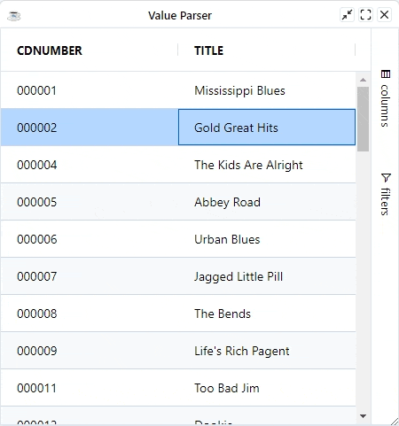

After editing cells in the grid you have the opportunity to parse the value before inserting it into your data. This is done using The Value Parser Expression.

## Configuring Value Parsers

A Value Parser is the inverse of a [Value Formatter](../rendering/value-formatter) and it is arbitrary **JavaScript** code/expression that gets called to parse the value before it is saved.

When working with expressions keep the following points in mind:

* If the expression has the word `return` in it, then we will assume it is a multi-line expression and will not wrap it.
* If the expression does not have the word `return` in it, then we will insert the `return` statement and the `;` for you.
* If the expression has many lines, then you will need to provide the `;` at the end of each line and also provide the `return` statement.

Expressions have access to several predefined variables:

|  Variable |  Description |
| --- | --- |
|  oldValue |  Mapped from the cell's old value, this is mapped in editing |
|  newValue |  Mapped from the cell's new value, this is mapped in editing |
|  data |  Mapped from the DataRow |
|  column |  Current column |
|  getValue |  The value after it is processed by the [ValueGetterExpression](../rendering/value-getters) |
|  ctx |  The grid [client context](../data/client-context) |


```bbj
column!.setValueParserExpression("Number(newValue)')
```

## Example


Below shows an example using value parsers. The following can be noted:

All columns are editable. After any edit, the a message box shows what has been changed.

* Column `CDNUMBER` is a string column. No parser is needed.
* Column `TITLE` has a parser which removes any dashes from the new value

```bbj showLineNumbers
use ::BBjGridExWidget/BBjGridExWidget.bbj::BBjGridExWidget
use com.basiscomponents.db.ResultSet
use com.basiscomponents.bc.SqlQueryBC

wnd! = BBjAPI().openSysGui("X0").addWindow(10, 10, 450, 450, "Value Parser")
wnd!.setCallback(BBjAPI.ON_CLOSE,"byebye")

gosub main
process_events

main:
  declare SqlQueryBC sbc!
  declare ResultSet rs!
  declare BBjGridExWidget grid!

  sbc! = new SqlQueryBC(BBjAPI().getJDBCConnection("CDStore"))
  rs! = sbc!.retrieve("SELECT CDNUMBER, TITLE FROM CDINVENTORY")
  
  grid! = new BBjGridExWidget(wnd!, 100, 0, 0, 450, 450)
  options! = grid!.getOptions()
  options!.setStopEditingWhenGridLosesFocus(1)
  options!.setEditable(1)
  options!.setSingleClickEdit(1)

  grid!.setFitToGrid()
  grid!.setData(rs!)
  grid!.setCallback(grid!.ON_GRID_CELL_VALUE_CHANGED(), "cellEditingChanged")
  
  titleColumn! = grid!.getColumn("TITLE")
  rem The expression will cast the "newValue" to string and replace dashes with empty string
  titleColumn!.setValueParserExpression("String(newValue).replace(/-/g, '')")
return

cellEditingChanged:
  ev! = BBjAPI().getLastEvent()
  ev! = ev!.getObject()
  
  a! = msgbox(String.format("Value changed from (%s) to (%s)", ev!.getOldValue(), ev!.getValue()))
return

byebye:
bye
```

