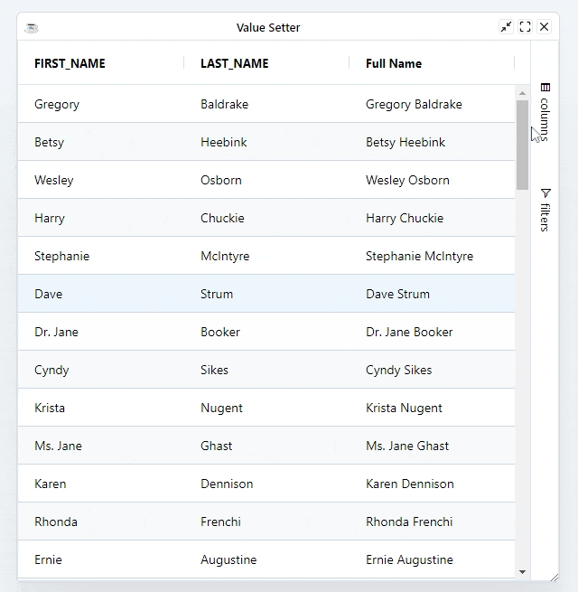

After editing a cell, the grid normally inserts the new value into your data. If it's not possible then you can provide a Value Setter Expression instead.

:::caution
The grid will updates the data only in the client. The ResultSet won't be affected. Updating the ResultSet is left to the developer to handler by listing to the [editing events](./overview#editing-events)
:::

## Configuring Value Setters

A Value Setter is the inverse of a [Value Getter](../rendering/value-getters). Where the value getter allows getting values from your data using an expression rather than a field, the value setter allows you to set values into your data using an expression rather than specifying a field.

A value setter should return `true` if the value was updated successfully and `false` if the value was not updated. When you return `true`, the grid knows it must refresh the cell.

```bbj
column!.setValueSetterExpression("return true")
```

When working with expressions keep the following points in mind:

* If the expression has the word `return` in it, then we will assume it is a multi-line expression and will not wrap it.
* If the expression does not have the word `return` in it, then we will insert the `return` statement and the `;` for you.
* If the expression has many lines, then you will need to provide the `;` at the end of each line and also provide the `return` statement.

Expressions have access to several predefined variables:

|  Variable |  Description |
| --- | --- |
|  oldValue |  Mapped from the cell's old value, this is mapped in editing |
|  newValue |  Mapped from the cell's new value, this is mapped in editing |
|  data |  Mapped from the DataRow |
|  column |  Current column |
|  getValue |  The value after it is processed by the [ValueGetterExpression](../rendering/value-getters) |
|  ctx |  The grid [client context](../data/client-context) |


## Example

Below shows an example using value setters. The following can be noted:

* All Columns are editable 
* Updating `FIRST_NAME` or `LAST_NAME` column will auto update the `FULL_NAME` because of the value getter expression
* Updating the `FULL_NAME` column will auto update the `FIRST_NAME` or `LAST_NAME` columns using the value setter
* We sync data in the client with the `DataRow` in the server

```bbj showLineNumbers
use ::BBjGridExWidget/BBjGridExWidget.bbj::BBjGridExWidget
use ::BBjGridExWidget/GxColumns.bbj::GxColumn
use ::BBjGridExWidget/GxClientEvents.bbj::GxClientEventsCell
use ::BBjGridExWidget/GxClientModels.bbj::GxClientCellModel
use com.basiscomponents.db.DataRow
use com.basiscomponents.db.ResultSet
use com.basiscomponents.bc.SqlQueryBC
use com.google.gson.JsonObject

wnd! = BBjAPI().openSysGui("X0").addWindow(10,10,600,600,"Value Setter")
wnd!.setCallback(BBjAPI.ON_CLOSE,"byebye")

gosub main
process_events

main:
  declare SqlQueryBC sbc!
  declare ResultSet rs!
  declare BBjGridExWidget grid!

  sbc! = new SqlQueryBC(BBjAPI().getJDBCConnection("ChileCompany"))
  rs! = sbc!.retrieve("SELECT FIRST_NAME , LAST_NAME FROM CUSTOMER")
  
  grid! = new BBjGridExWidget(wnd!,100,0,0,600,600)
  grid!.getOptions().setEditable(1)
  grid!.setFitToGrid()
  grid!.setCallback(grid!.ON_GRID_CELL_VALUE_CHANGED(),"cellEditingChanged")
  grid!.setData(rs!)
  
  declare auto GxColumn fullNameColumn!
  fullNameColumn! = grid!.addColumn("FULL_NAME","Full Name")
  fullNameColumn!.setEditable(1)
  fullNameColumn!.setValueGetterExpression("data.FIRST_NAME + ' ' + data.LAST_NAME")
  fullNameColumn!.setValueSetterExpression("var value = newValue.split(' ');"  +
:                                          "data.FIRST_NAME = value[0] || '';" +
:                                          "data.LAST_NAME  = value[1] || '';" +
:                                          "return true;")
return

cellEditingChanged:
  declare auto GxClientEventsCell cellEvent!
  declare auto GxClientCellModel cellModel!
  declare auto DataRow row!
  
  lastEvent! = BBjAPI().getLastEvent() 
  cellEvent! = lastEvent!.getObject()
  cellModel!  = cellEvent!.getCell()
  
  rem sync the new client row values with the ResultSet
  row! = cellModel!.getRow().updateFromClientRow()

  firstName! = row!.getField("FIRST_NAME").getString(err=*next)
  lastName!  = row!.getField("LAST_NAME" ).getString(err=*next)
  
  a! = msgbox(String.format("First Name : (%s) - Last Name : (%s)",firstName!,lastName!))
return

byebye:
bye
```

:::info
[`GxClientRowModel::updateFromClientRow`](https://bbj-plugins.github.io/BBjGridExWidget/javadoc/GxClientModels/GxClientRowModel.html#updateFromClientRow) is a helper method which will merge the data coming from the client with the edited `DataRow`.
:::

