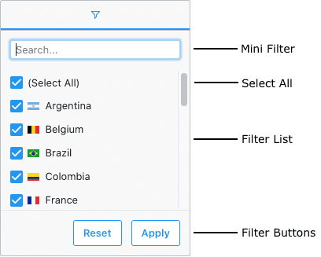
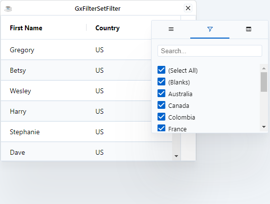

The [`GxFilterSetFilter`](https://bbj-plugins.github.io/BBjGridExWidget/javadoc/GxFilters/GxFilterSetFilter.html) takes inspiration from Excel's AutoFilter and allows filtering on sets of data.




## Set Filter Sections

The Set Filter is comprised of the following sections:

* **Mini Filter**: used to narrow the values available for selection inside the Filter List.
* **Select All**: used to select / deselect all values shown in the Filter List.
* **Filter List**: a list of Set Filter Values which can be selected / deselected to set the filter.
* **Filter Buttons**: Action buttons that can be optionally added to the bottom of the Set Filter.


## Enabling Set Filters

The filer can also be explicitly configured as shown below:

```bbj showLineNumber
use ::BBjGridExWidget/BBjGridExWidget.bbj::BBjGridExWidget
use ::BBjGridExWidget/GxFilters.bbj::GxFilterSetFilter
use com.basiscomponents.db.ResultSet
use com.basiscomponents.bc.SqlQueryBC

declare auto BBjTopLevelWindow wnd!

wnd! = BBjAPI().openSysGui("X0").addWindow(10,10,400,300,"GxFilterSetFilter",$00090002$)
wnd!.setCallback(BBjAPI.ON_CLOSE,"byebye")

gosub main
process_events

main:
  declare SqlQueryBC sbc!
  declare ResultSet rs!
  declare BBjGridExWidget grid!

  sbc! = new SqlQueryBC(BBjAPI().getJDBCConnection("ChileCompany"))
  rs! = sbc!.retrieve("SELECT FIRST_NAME, COUNTRY FROM CUSTOMER")

  grid! = new BBjGridExWidget(wnd!,100,0,0,400,300)
  grid!.setFitToGrid()
  grid!.setData(rs!)
  grid!.getColumn("FIRST_NAME").setLabel("First Name")
  grid!.getColumn("COUNTRY").setLabel("Country")

  rem IMPORTANT: GxFilterSetFilter is part of the Enhanced grid
  rem check for license and (for development purposes) for license-less behavior
  if (grid!.isLicensed() and !grid!.getForceCommunityBuild()) then
    country! = grid!.getColumn("COUNTRY")
    country!.setFilter(new GxFilterSetFilter())
  else
    rem if no license available,
    rem deactivate filter and add a notice as tooltip:
    countryFilter!.setEnabled(0)
    countryFilter!.setToolTipText("Deactivated: Part of the Enhanced Grid")
  endif
return

byebye:
bye
```


