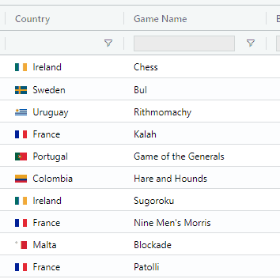
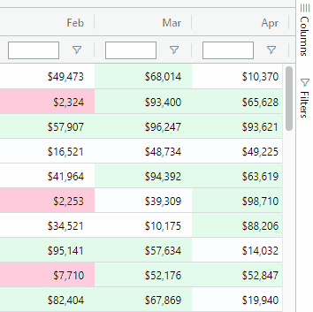
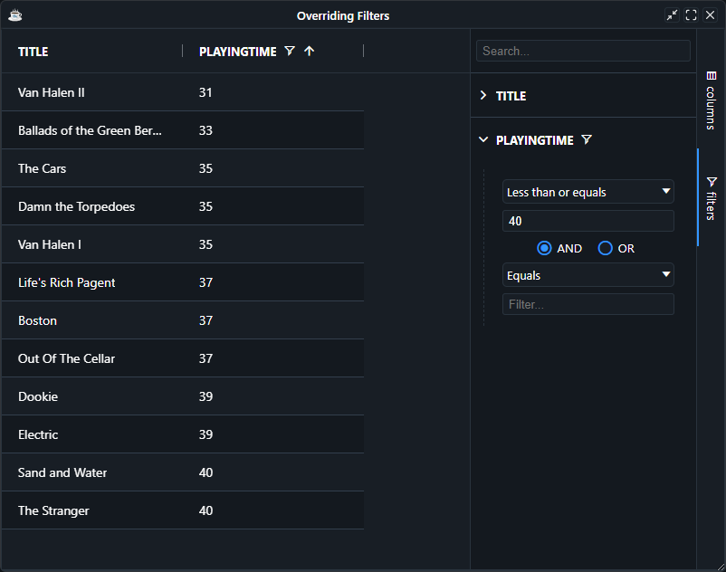

Column filters are filters that are applied to the data at the column level. Many column filters can be active at once (e.g. filters set on different columns) and the grid will display rows that pass every column's filter.

Column filters are accessed in the grid UI either through the [Column Menu](../../accessories/column-menu) or the [Tool Panel](../../accessories/toolpanels/overview).

<div class="inline-images">


*Access via Column Menu*


*Access via Tool Panel*

</div>

## Configuring Filters on Columns

The BBjGridExWidget uses the columns's [SQL types](https://github.com/JetBrains/jdk8u_jdk/blob/master/src/share/classes/java/sql/Types.java) provided by the ResultSet to auto-attach the correct filter component for each column.  For instance, When the column's SQL type is `java.sql.Types.NUMERIC`, the grid will attach the  [`GxFilterNumber`](https://bbj-plugins.github.io/BBjGridExWidget/javadoc/GxFilters/GxFilterNumber.html) filter component and so on for other types. 

### Types - Filter Components Mapping

The following shows which filter component is used for each column type:

| **Component**          	| **SQL Type**                	|
|--------------------	|-----------------------------	|
| [`GxFilterNumber`](https://bbj-plugins.github.io/BBjGridExWidget/javadoc/GxFilters/GxFilterNumber.html) 	| `BIGINT`, `TINYINT`, `SMALLINT`, `INTEGER`, `DECIMAL`, `DOUBLE`, `FLOAT`, `REAL`, `NUMERIC` 	|
| [`GxFilterBasicDate`](https://bbj-plugins.github.io/BBjGridExWidget/javadoc/GxFilters/GxFilterBasicDate.html) 	| `DATE`	|
| [`GxFilterBasicTime`](https://bbj-plugins.github.io/BBjGridExWidget/javadoc/GxFilters/GxFilterBasicTime.html) 	| `TIME`, `TIME_WITH_TIMEZONE`	|
| [`GxFilterBasicTimestamp`](https://bbj-plugins.github.io/BBjGridExWidget/javadoc/GxFilters/GxFilterBasicTimestamp.html) 	| `TIMESTAMP`, `TIMESTAMP_WITH_TIMEZONE`	|
| [`GxFilterBasicBoolean`](https://bbj-plugins.github.io/BBjGridExWidget/javadoc/GxFilters/GxFilterBasicBoolean.html) 	| `BOOLEAN`, `BIT`	|
| [`GxFilterText`](https://bbj-plugins.github.io/BBjGridExWidget/javadoc/GxFilters/GxFilterBasicBoolean.html) 	| `CHAR`, `VARCHAR`, `NVARCHAR`, `NCHAR`, `LONGVARCHAR`, `LONGNVARCHAR`	|

:::info
If the grid is not able to detect the type, then the `GxFilterText` component will be used by default.
:::

### Overriding Filters 

The default attached filter components is all what you need for most of the time, but it is possible to ask the grid to use a different filter component for a specific column. 

In the following sample the following can be noticed:
* The `PLAYINGTIME` SQL type is `VARCHAR`, so the grid attach the `GxFilterText` by default 
* We replace the default attached filter with a `GxFilterNumber`.
* It is important to set the filter after we call `setData`. Otherwise our configurations will be overwritten. For more details see [The BBjGridExWidget::setData method](../../data/overview.md)


```bbj showLineNumbers
use ::BBjGridExWidget/BBjGridExWidget.bbj::BBjGridExWidget
use ::BBjGridExWidget/GxColumns.bbj::GxColumn
use ::BBjGridExWidget/GxFilters.bbj::GxFilterNumber
use com.basiscomponents.db.ResultSet
use com.basiscomponents.bc.SqlQueryBC

declare auto BBjTopLevelWindow wnd!
wnd! = BBjAPI().openSysGui("X0").addWindow(10, 10, 800, 600, "My First Grid")
wnd!.setCallback(BBjAPI.ON_CLOSE,"byebye")

gosub main
process_events

main:
  declare SqlQueryBC sbc!
  declare ResultSet rs!
  declare BBjGridExWidget grid!
  declare GxColumn column!

  sbc! = new SqlQueryBC(BBjAPI().getJDBCConnection("CDStore"))
  rs! = sbc!.retrieve("SELECT TITLE, PLAYINGTIME FROM CDINVENTORY")

  grid! = new BBjGridExWidget(wnd!, 100, 0, 0, 800, 600)
  grid!.setData(rs!)

  column! = grid!.getColumn("PLAYINGTIME")
  column!.setFilter(new GxFilterNumber())

return

byebye:
bye
```



## Filtering Animation

To enable animation of the rows when filtering, set the grid option `AnimateRows=true`.

```bbj
grid!.getOptions().setAnimateRows(1)
```

## Relation to Quick Filter

Column filters work independently of [Quick Filter](../quick-filter). If a quick filter is applied along with a column filter, each filter type is considered and the row will only show if it passes all three types.

Column filters are tied to a specific column. Quick filter is tied to any particular column. This section of the documentation talks about column filters only. For quick filter click the link above to learn more.