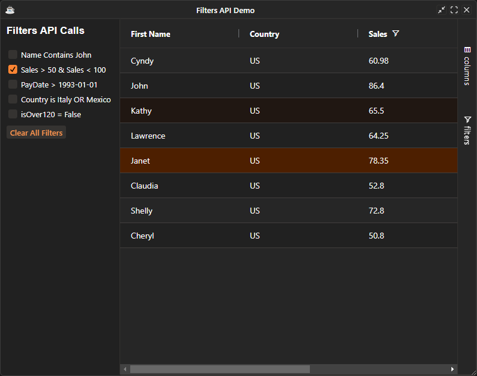

You can access and set the models for filters through the grid API, or access individual filter instances directly for more control. This page details how to do both.

## Get / Set All Filter Models

It is possible to get the state of all filters using the grid API method `BBjGridExWidget::getFilterModel`, and to set the state using `BBjGridExWidget::setFilterModel`. 


| **Method**                                                    	| **Description**                                                                                                                                                                                                                                                                                             	|
|---------------------------------------------------------------	|-------------------------------------------------------------------------------------------------------------------------------------------------------------------------------------------------------------------------------------------------------------------------------------------------------------	|
| [`setFilterModel`](https://bbj-plugins.github.io/BBjGridExWidget/javadoc/BBjGridExWidget/BBjGridExWidget.html#setFilterModel)	| Set and apply filter [`GxClientFilterModel`](https://bbj-plugins.github.io/BBjGridExWidget/javadoc/GxClientModels/GxClientFilterModel.html) for the given column                                                                                                                                                                                                                                                             	|
| [`getFilterModel`](https://bbj-plugins.github.io/BBjGridExWidget/javadoc/BBjGridExWidget/BBjGridExWidget.html#getFilterModel)                             	| This method will return a [`GxClientFilterModel`](https://bbj-plugins.github.io/BBjGridExWidget/javadoc/GxClientModels/GxClientFilterModel.html) for the given column. If the column has already some filter values set through the UI , then the model will contain these changes too. In case the grid is not ready (not renderer yet) then the method will just return any empty filter model for the column. 	|
| [`getFilterAsCombinedModel`](https://bbj-plugins.github.io/BBjGridExWidget/javadoc/BBjGridExWidget/BBjGridExWidget.html#getFilterAsCombinedModel)                 	| Get The filter [`GxClientFilterCombinedModel`](https://bbj-plugins.github.io/BBjGridExWidget/javadoc/GxClientModels/GxClientFilterCombinedModel.html) for the given column. If the column's filter does not support combined models , an `256` error will be thrown                                                                                                                                                                 	|

For instance in the following snippet, we get The filter model for the `FIRST_NAME` column then update the filter type and filter text. At then we call the `update` method to execute the filter

```BBj
use ::BBjGridExWidget/GxClientModels.bbj::GxClientFilterTextModel

declare auto GxClientFilterTextModel model!
model! = grid!.getFilterModel("FIRST_NAME")
model!.setFilter("john")
model!.setType(GxColumnFilterTextFilterOptions.CONTAINS())
model!.update()
```

## Reset All filters

You can reset all filters by doing the following:

```BBj
grid!.clearFilters()
```

## Advanced Example: Get / Set All Filter Models

The example below shows getting and setting all the filter models in action and how to access the filter components directly.

```BBj showLineNumbers
use ::BBjGridExWidget/BBjGridExWidget.bbj::BBjGridExWidget
use ::BBjGridExWidget/GxClientModels.bbj::GxClientFilterCombinedModel
use ::BBjGridExWidget/GxClientModels.bbj::GxClientFilterNumberModel
use ::BBjGridExWidget/GxClientModels.bbj::GxClientFilterTextModel
use ::BBjGridExWidget/GxClientModels.bbj::GxClientFilterBooleanModel
use ::BBjGridExWidget/GxClientModels.bbj::GxClientFilterDateTimeModel
use ::BBjGridExWidget/GxClientModels.bbj::GxClientFilterSetFilterModel
use ::BBjGridExWidget/GxFilters.bbj::GxColumnFilterTextFilterOptions
use ::BBjGridExWidget/GxFilters.bbj::GxColumnFilterDateTimeFilterOptions
use ::BBjGridExWidget/GxFilters.bbj::GxColumnFilterNumberFilterOptions
use ::BBjGridExWidget/GxFilters.bbj::GxFilterSetFilter
use com.basiscomponents.db.ResultSet
use com.basiscomponents.bc.SqlQueryBC

wnd! = BBjAPI().openSysGui("X0").addWindow(10,10,800,600,"Filters API Demo")
wnd!.setCallback(BBjAPI.ON_CLOSE,"byebye")
wnd!.setCallback(BBjAPI.ON_RESIZE,"resize")

SysGui! = BBjAPI().getSysGui()
boldFont! = SysGui!.makeFont("arial",13,BBjFont.FONT_BOLD)

leftPanelTitle! = wnd!.addStaticText(202,10,10,200,25,"Filters API Calls" , $0000$)
leftPanelTitle!.setFont(boldFont!)

nameFilter! = wnd!.addCheckBox(204,10,50,200,22,"Name Contains John")
nameFilter!.setCallback(BBjAPI.ON_CHECK_OFF,"onNameFilterToggle")
nameFilter!.setCallback(BBjAPI.ON_CHECK_ON,"onNameFilterToggle")

salesFilter! = wnd!.addCheckBox(205,10,75,200,22,"Sales > 50 && Sales < 100")
salesFilter!.setCallback(BBjAPI.ON_CHECK_OFF,"onSalesFilterToggle")
salesFilter!.setCallback(BBjAPI.ON_CHECK_ON,"onSalesFilterToggle")

payDataFilter! = wnd!.addCheckBox(206,10,100,200,22,"PayDate > 1993-01-01")
payDataFilter!.setCallback(BBjAPI.ON_CHECK_OFF,"onPayDateFilterToggle")
payDataFilter!.setCallback(BBjAPI.ON_CHECK_ON,"onPayDateFilterToggle")

countryFilter! = wnd!.addCheckBox(207,10,125,200,22,"Country is Italy OR Mexico")
countryFilter!.setCallback(BBjAPI.ON_CHECK_OFF,"onCountryFilterToggle")
countryFilter!.setCallback(BBjAPI.ON_CHECK_ON,"onCountryFilterToggle")

isOver120Filter! = wnd!.addCheckBox(208,10,150,200,22,"isOver120 = False")
isOver120Filter!.setCallback(BBjAPI.ON_CHECK_OFF,"onIsOver120FilterToggle")
isOver120Filter!.setCallback(BBjAPI.ON_CHECK_ON,"onIsOver120FilterToggle")

clearFilters! = wnd!.addButton(209,10,180,100,22,"Clear All Filters")
clearFilters!.setCallback(BBjAPI.ON_BUTTON_PUSH,"onClearFilters")

gosub main
process_events

main:
  sbc! = new SqlQueryBC(BBjAPI().getJDBCConnection("ChileCompany"))
  rs! = sbc!.retrieve("SELECT FIRST_NAME, COUNTRY, SALES_YTD, LAST_PAY_DATE, case when NUM(OVER_120) > 0 THEN TRUE ELSE FALSE END AS IS_OVER_120 FROM CUSTOMER")

  declare BBjGridExWidget grid!

  grid! = new BBjGridExWidget(wnd!,100,200,0,600,600)
  grid!.addColumn("FIRST_NAME"   ,"First Name")
  grid!.addColumn("COUNTRY"      ,"Country")
  grid!.addColumn("SALES_YTD"    ,"Sales")
  grid!.addColumn("LAST_PAY_DATE","Pay Date")
  grid!.addColumn("IS_OVER_120"  ,"Is Over 120")

  grid!.setData(rs!)

  rem IMPORTANT: GxFilterSetFilter is part of the Enhanced grid
  rem check for license and (for development purposes) for license-less behavior
  if (grid!.isLicensed() and !grid!.getForceCommunityBuild()) then
    country! = grid!.getColumn("COUNTRY")
    country!.setFilter(new GxFilterSetFilter())
  else
    rem if no license available,
    rem deactivate filter and add a notice as tooltip:
    countryFilter!.setEnabled(0)
    countryFilter!.setToolTipText("Deactivated: Part of the Enhanced Grid")
  endif

  grid!.getColumn("IS_OVER_120").setType(16)

  grid!.getOptions().setAnimateRows(1)
return

onNameFilterToggle:
  event! = BBjAPI().getLastEvent()
  control! = event!.getControl()
  isSelected! = control!.isSelected()

  declare auto GxClientFilterTextModel textModel!
  textModel! = grid!.getFilterModel("FIRST_NAME")
  if(isSelected!)
    textModel!.setFilter("john")
    textModel!.setType(GxColumnFilterTextFilterOptions.CONTAINS())
  else
    textModel!.clearFilter()
  fi

  textModel!.update()
  grid!.ensureColumnVisible("FIRST_NAME")
return

onSalesFilterToggle:
  event! = BBjAPI().getLastEvent()
  control! = event!.getControl()
  isSelected! = control!.isSelected()

  declare auto GxClientFilterCombinedModel numberCombinedModel!
  declare auto GxClientFilterNumberModel firstCondition!
  declare auto GxClientFilterNumberModel secondCondition!

  numberCombinedModel! = grid!.getFilterAsCombinedModel("SALES_YTD")
  
  if(isSelected!)
    firstCondition! = numberCombinedModel!.getFirstCondition()
    firstCondition!.setFilter(50)
    firstCondition!.setType(GxColumnFilterNumberFilterOptions.GREATER_THAN())

    secondCondition! = new GxClientFilterNumberModel(100)
    secondCondition!.setType(GxColumnFilterNumberFilterOptions.LESS_THAN())
    numberCombinedModel!.setSecondCondition(secondCondition!)

    numberCombinedModel!.setOperator(numberCombinedModel!.OPERATOR_AND())
  else
    numberCombinedModel!.clearFilter()
  fi

  numberCombinedModel!.update()
  grid!.ensureColumnVisible("SALES_YTD")
return

onPayDateFilterToggle:
  event! = BBjAPI().getLastEvent()
  control! = event!.getControl()
  isSelected! = control!.isSelected()

  declare auto GxClientFilterDateTimeModel dateModel!
  dateModel! = grid!.getFilterModel("LAST_PAY_DATE")

  if(isSelected!)
    dateModel!.setFilter("1993-01-01Z")
    dateModel!.setType(GxColumnFilterDateTimeFilterOptions.GREATER_THAN())
  else
    dateModel!.clearFilter()
  fi

  dateModel!.update()
  grid!.ensureColumnVisible("LAST_PAY_DATE")
return

onCountryFilterToggle:
  event! = BBjAPI().getLastEvent()
  control! = event!.getControl()
  isSelected! = control!.isSelected()

  declare auto GxClientFilterSetFilterModel countryModel!
  countryModel! = grid!.getFilterModel("COUNTRY")

  if(isSelected!)
    countryModel!.getValues().add("Italy")
    countryModel!.getValues().add("Mexico")
  else
    countryModel!.selectEverything()
  fi

  countryModel!.update()
  grid!.ensureColumnVisible("COUNTRY")
return

onIsOver120FilterToggle:
  event! = BBjAPI().getLastEvent()
  control! = event!.getControl()
  isSelected! = control!.isSelected()

  declare auto GxClientFilterBooleanModel booleanModel!
  booleanModel! = grid!.getFilterModel("IS_OVER_120")

  if(isSelected!)
    booleanModel!.setFilter(0)
  else
    booleanModel!.clearFilter()
  fi

  booleanModel!.update()
  grid!.ensureColumnVisible("IS_OVER_120")
return

onClearFilters:
    nameFilter!.setSelected(0)
    salesFilter!.setSelected(0)
    payDataFilter!.setSelected(0)
    countryFilter!.setSelected(0)
    isOver120Filter!.setSelected(0)
    grid!.clearFilters()
    grid!.ensureColumnVisible("FIRST_NAME")
return

resize:
  ev! = BBjAPI().getLastEvent()
  w=ev!.getWidth()
  h=ev!.getHeight()
  grid!.setSize(w - 200,h)
return

byebye:
bye
```

