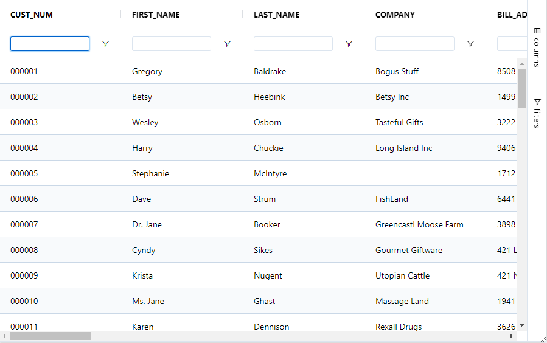

Floating Filters are an additional row under the column headers where the user will be able to see and optionally edit the filters associated with each column.



Floating filters are activated by setting the property floatingFilter = true on the column 

```BBj
grid!.setData(rs!)
grid!.getColumn("CDNUMBER").setFloatingFilter(1)
```

To have floating filters on for all columns by default, you should set `FloatingFilter` on the `GxDefaultColumnDefinition`. You can then disable floating filters on a per-column basis by setting `FloatingFilter = 0` on an individual column.

```BBj
grid!.getOptions().getDefaultColumnDefinition().setFloatingFilter(1)
grid!.setData(rs!)
grid!.getColumn("CDNUMBER").setFloatingFilter(0)
```

:::info
Floating filters depend on and co-ordinate with the main column filters. They do not have their own state, but rather display the state of the main filter and set state on the main filter if they are editable. For this reason, there is no API for getting or setting state of the floating filters.
:::