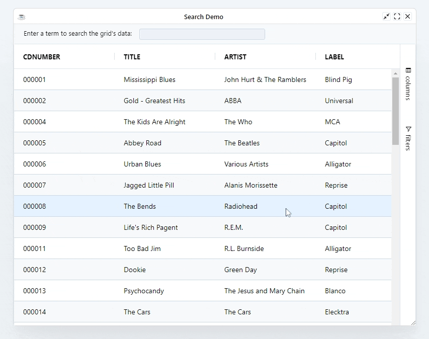

In addition to the column specific filtering, a 'quick filter' can also be applied.

The quick filter text will check all words provided against the full row. For example if the text provided is "Tony Ireland", the quick filter will only include rows with both "Tony" AND "Ireland" in them.

```BBj
grid!.setQuickFilter("new filter text")
```

:::info
Quick Filter is a case-insensitive filter which is applied on the client (grid) data, not the ResultSet.
:::

## Example: Quick Filter

```BBj
use ::BBjGridExWidget/BBjGridExWidget.bbj::BBjGridExWidget
use com.basiscomponents.db.ResultSet
use com.basiscomponents.bc.SqlQueryBC

declare auto BBjTopLevelWindow wnd!

wnd! = BBjAPI().openSysGui("X0").addWindow(10,10,800,600,"Search Demo")
wnd!.setCallback(BBjAPI.ON_CLOSE,"byebye")

st! = wnd!.addStaticText(200,20,10,220,25,"Enter a term to search the grid's data:")
ed! = wnd!.addEditBox(250,250,10,250,22,"")
ed!.setCallback(BBjAPI.ON_EDIT_MODIFY,"onSearchEntry")

gosub main
process_events

main:
  declare SqlQueryBC sbc!
  declare ResultSet rs!
  declare BBjGridExWidget grid!

  sbc! = new SqlQueryBC(BBjAPI().getJDBCConnection("CDStore"))
  rs! = sbc!.retrieve("SELECT  * FROM CDINVENTORY")

  grid! = new BBjGridExWidget(wnd!,100,0,40,800,560)
  grid!.setData(rs!)
return

onSearchEntry:
  search! = ed!.getText()
  grid!.setQuickFilter(search!)
return

byebye:
bye
```


