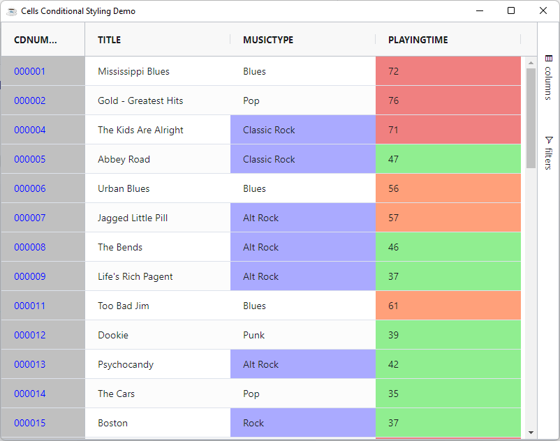

Cell customizations is done a the column level via the column object. You can mix and match any of the following mechanisms:

* **Cell Style**: Providing a CSS style for the cells.
* **Cell Class**: Providing a CSS class for the cells.
* **Cell Class Rules**: Providing rules for applying CSS classes.

Each of these approaches are presented in the following sections.

## Cell Style

The cell style is nothing more than map of css values.

```bbj
use com.google.gson.JsonObject
use ::BBjGridExWidget/GxColumns.bbj::GxColumn

grid!.setData(rs!)

declare GxColumn column!
column! = grid!.getColumn("CDNUMBER")

declare JsonObject cellStyle!
cellStyle! = column!.getCellStyle()
cellStyle!.addProperty("color","red")
```

## Cell Class

Provides a class for the cells in this column. 

```bbj
use java.util.ArrayList
use ::BBjGridExWidget/GxColumns.bbj::GxColumn

grid!.setData(rs!)

declare GxColumn column!
column! = grid!.getColumn("CDNUMBER")

declare ArrayList cellClass!
cellClass! = column!.getCellClass()
cellClass!.add("myCustomClassName")

grid!.addStyle(".myCustomClassName" , "{""background"": ""lightgreen !important""}")
```

:::info
You can add and remove style from the grid using the following two methods where the selector can be any valid css selector:

* `BBjGridExWidget.addStyle(BBjString selector$, BBjString rules!)`: To add a new style
* `BBjGridExWidget.removeStyle(BBjString selector$)`: To remove a style
:::

## Cell Class Rules

You can define rules which can be applied to include certain CSS classes via via column option `CellClassRules`. These rules are provided as a map where the keys are the class names and the values are expressions that if evaluated to true.

:::tip
An expression is evaluated by the grid by executing the string as if it were a Javascript expression. 
:::

When working with expressions keep the following points in mind:

* If the expression has the word `return` in it, then we will assume it is a multi-line expression and will not wrap it.
* If the expression does not have the word `return` in it, then we will insert the `return` statement and the `;` for you.
* If the expression has many lines, then you will need to provide the `;` at the end of each line and also provide the `return` 
statement.

Expressions have access to several predefined variables:

| **Variable** 	| **Description**                                               	|
|:--------------:	|:---------------------------------------------------------------	|
|  colDef           	|  The column definition associated with the column for this cell                                      	|
|  x           	|  Mapped from cell value                                       	|
|  value       	|  Same as x                                                    	|
|  data        	|  Mapped from the `DataRow`                                      	|
|  ctx         	|  The grid client context                                      	|
|  rowIndex      	|  The row index                                               	|


The following snippet shows `CellClassRules` usage to change the background color of the cell when the value is smaller than 6.

### Cells Conditional Styling

The following is a sample which shows how to use the `CellClassRules` to do cells conditional styling

```bbj showLineNumbers
use ::BBjGridExWidget/BBjGridExWidget.bbj::BBjGridExWidget
use com.basiscomponents.db.ResultSet
use com.basiscomponents.bc.SqlQueryBC
use com.google.gson.JsonObject

declare auto BBjTopLevelWindow wnd!

wnd! = BBjAPI().openSysGui("X0").addWindow(10,10,800,600,"Cells Conditional Styling Demo")
wnd!.setCallback(BBjAPI.ON_CLOSE,"byebye")
wnd!.setCallback(BBjAPI.ON_RESIZE,"resize")

gosub main
process_events

main:
  declare SqlQueryBC sbc!
  declare ResultSet rs!
  declare BBjGridExWidget grid!

  sbc! = new SqlQueryBC(BBjAPI().getJDBCConnection("CDStore"))
  rs! = sbc!.retrieve("SELECT CDNUMBER, TITLE, MUSICTYPE, PLAYINGTIME from CDINVENTORY")

  grid! = new BBjGridExWidget(wnd!,100,0,0,800,600)
  grid!.setData(rs!,"CDNUMBER")
  grid!.setFitToGrid()

  grid!.setColumnBackColor("CDNUMBER",BBjAPI().makeColor("LTGRAY"))
  grid!.setColumnForeColor("CDNUMBER",BBjAPI().makeColor("BLUE"))
  grid!.pinColumn("CDNUMBER","left")
  grid!.setColumnWidth("CDNUMBER",120)

  generRules! = new JsonObject()
  generRules!.addProperty("gener-rock","x.includes('Rock')")
  grid!.getColumn("MUSICTYPE").setCellClassRules(generRules!)
  grid!.addStyle(".gener-rock", "{""background"": ""#aaaaff""}")

  timesRules! = new JsonObject()
  timesRules!.addProperty("time-normal","x >= 10 && x <= 50")
  timesRules!.addProperty("time-long","x >= 50 && x <= 70")
  timesRules!.addProperty("time-tooLong","x > 70")

  grid!.getColumn("PLAYINGTIME").setCellClassRules(timesRules!)
  grid!.addStyle(".time-normal" , "{""background"": ""lightgreen""}")
  grid!.addStyle(".time-long" , "{""background"": ""lightsalmon""}")
  grid!.addStyle(".time-tooLong" , "{""background"": ""lightcoral""}")
return

resize:
  ev! = BBjAPI().getLastEvent()
  w=ev!.getWidth()
  h=ev!.getHeight()
  grid!.setSize(w,h)
return

byebye:
bye
```



## Refresh of Styles

If you refresh a cell, or a cell is updated due to editing, the `CellStyle`, `CellClass` and `CellClassRules` are all applied again. This has the following effect:

* **CellStyle**: All new styles are applied. If a new style is the same as an old style, the new style overwrites the old style. If a new style is not present, the old style is left (the grid will NOT remove styles).
* **CellClass**: All new classes are applied. Old classes are not removed so be aware that classes will accumulate. If you want to remove old classes, then use CellClassRules.
* **CellClassRules**: Rules that return true will have the class applied the second time. Rules tha return false will have the class removed second time.
