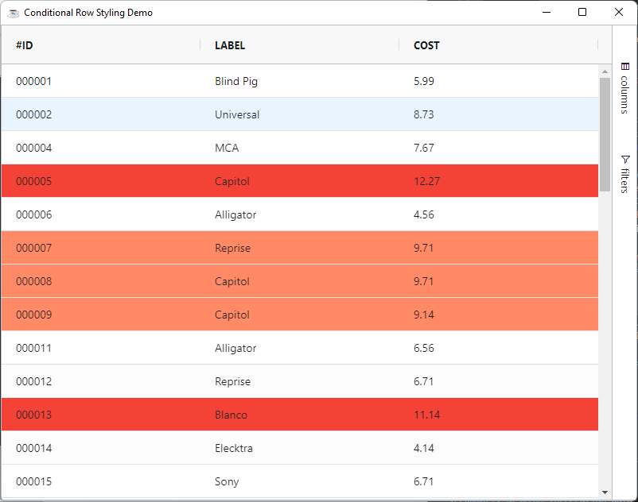
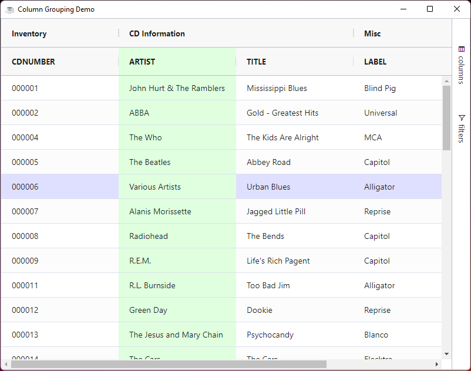

Row customization can be achieved in the following ways:

* **Row Style**: Providing a CSS style for the rows.
* **Row Class**: Providing a CSS class for the rows.
* **Row Class Rules**: Providing rules for applying CSS classes.

## Row Style

You can add CSS styles to each row in the following way:

```bbj
use com.google.gson.JsonObject

declare JsonObject rowStyle!
rowStyle! = grid!.getOptions().getRowStyle()
rowStyle!.addProperty("color","green")

grid!.setData(rs!)
```

## Row Class

You can add CSS classes to each row using the grid option `GxOptions::RowClass`

```bbj
use java.util.ArrayList

declare ArrayList rowClass!
rowClass! = grid!.getOptions().getRowClass()
rowClass!.add("myCustomClassName")

grid!.addStyle(".myCustomClassName" , "{""background"": ""lightgreen !important""}")
```

:::info
You can add and remove style from the grid using the following two methods where the selector can be any valid css selector:

* `BBjGridExWidget.addStyle(BBjString selector$, BBjString rules!)`: To add a new style
* `BBjGridExWidget.removeStyle(BBjString selector$)`: To remove a style
:::


## Row Class Rules

You can define rules which can be applied to include certain CSS classes via the grid option `RowClassRules`. These rules are provided as a JSON object where the keys are class names and the values are expressions that if evaluated to true, the class gets used.

:::tip
An expression is evaluated by the grid by executing the string as if it were a Javascript expression. 
:::

When working with expressions keep the following points in mind:

* If the expression has the word `return` in it, then we will assume it is a multi-line expression and will not wrap it.
* If the expression does not have the word `return` in it, then we will insert the `return` statement and the `;` for you.
* If the expression has many lines, then you will need to provide the `;` at the end of each line and also provide the `return` 
statement.

Expressions have access to several predefined variables:

| **Variable** 	| **Description**                                               	|
|:--------------:	|:---------------------------------------------------------------	|
|  data        	|  Mapped from the `DataRow`                                      	|
|  rowIndex      	|  The row index                                               	|
|  ctx         	|  The grid client context                                      	|


### Row Conditional Styling

The following sample shows how to use `RowClassRules` to do a row conditional
styling.

In the sample the following can be noted:

* When the price is greater or equal to `9` and less than `11`, the `cost-warning` css class name will be applied
* When the price is greater than `11`, the `cost-danger` css class name will be applied
* Styles are injected using the `BBjGridExWidget.addStyle` method

```bbj showLineNumbers
use ::BBjGridExWidget/BBjGridExWidget.bbj::BBjGridExWidget
use ::BBjGridExWidget/GxColumns.bbj::GxColumn
use com.basiscomponents.db.ResultSet
use com.basiscomponents.bc.SqlQueryBC
use com.google.gson.JsonObject

declare auto BBjTopLevelWindow wnd!

wnd! = BBjAPI().openSysGui("X0").addWindow(10,10,800,600,"Conditional Row Styling Demo")
wnd!.setCallback(BBjAPI.ON_CLOSE,"byebye")
wnd!.setCallback(BBjAPI.ON_RESIZE,"resize")

gosub main
process_events

main:
  declare SqlQueryBC sbc!
  declare ResultSet rs!
  declare BBjGridExWidget grid!

  sbc! = new SqlQueryBC(BBjAPI().getJDBCConnection("CDStore"))
  rs! = sbc!.retrieve("SELECT CDNUMBER as '#ID', LABEL, COST FROM CDINVENTORY")

  grid! = new BBjGridExWidget(wnd!,100,0,0,800,600)

  constRules! = grid!.getOptions().getRowClassRules()
  constRules!.addProperty("cost-warning","data.COST >= 9 && data.COST < 11")
  constRules!.addProperty("cost-danger","data.COST > 11")

  grid!.setData(rs!)
  grid!.setFitToGrid()
  grid!.addStyle(".cost-warning" , "{""background"": ""#ff8a65 !important""}")
  grid!.addStyle(".cost-danger" , "{""background"": ""#f44336 !important""}")
return

resize:
  ev! = BBjAPI().getLastEvent()
  w = ev!.getWidth()
  h = ev!.getHeight()
  grid!.setSize(w,h)
return

byebye:
bye
```



## Refresh of Styles

If you refresh a row, or a cell is updated due to editing, the `RowStyle`, `RowClass` and `RowClassRules` are all applied again. This has the following effect:

* **RowStyle**: All new styles are applied. If a new style is the same as an old style, the new style overwrites the old style.
* **RowClass**: All new classes are applied. Old classes are not removed so be aware that classes will accumulate. If you want to remove old classes, then use `RowClassRules`.
* **RowClassRules**: Rules that return true will have the class applied the second time. Rules tha return false will have the class removed second time.

## Highlighting Rows and Columns

The grid can highlight both Rows and Columns as the mouse hovers over them.

:::info
* Highlighting Rows is on by default. To turn it off, set the grid option `SuppressRowHoverHighlight=0`.
* Highlighting Columns is off by default. To turn it on, set the grid option `ColumnHoverHighlight=1`.
:::

:::info
Rows highlight by default as this is a common requirement. Column highlighting is less common and as such needs to be opted it.

Row Highlighting works by the grid adding the CSS class `ag-row-hover` to the row's getting hovered. The grid cannot depend on using CSS `:hover` selector as this will not highlight the entire row if Columns are pinned.

Column Highlighting works by the grid adding the CSS class `ag-column-hover` to all cells to be highlighted.
:::

The example below demonstrates the following:

* CSS class `ag-row-hover` has background color added to it, so when you hover over a cell, the row will be highlighted.
* CSS class `ag-column-hover` has background color added to it, so when you hover over a cell or a header, the column will be highlighted. If you hover over a header group, all columns in the group will be highlighted.

```bbj showLineNumbers
use ::BBjGridExWidget/BBjGridExWidget.bbj::BBjGridExWidget
use com.basiscomponents.db.ResultSet
use com.basiscomponents.bc.SqlQueryBC
use com.google.gson.JsonObject

declare auto BBjTopLevelWindow wnd!

wnd! = BBjAPI().openSysGui("X0").addWindow(10,10,800,600,"Column Grouping Demo")
wnd!.setCallback(BBjAPI.ON_CLOSE,"byebye")

gosub main
process_events

main:
  declare SqlQueryBC sbc!
  declare ResultSet rs!
  declare BBjGridExWidget grid!

  sbc! = new SqlQueryBC(BBjAPI().getJDBCConnection("CDStore"))
  rs! = sbc!.retrieve("SELECT  CDNUMBER , ARTIST, TITLE, LABEL, PLAYINGTIME FROM CDINVENTORY")
  
  grid! = new BBjGridExWidget(wnd!,100,0,0,800,600)
  // highlight-next-line
  grid!.getOptions().setColumnHoverHighlight(1)
  grid!.setData(rs!)

  group! = new BBjVector()
  group!.addItem("CDNUMBER")
  grid!.addColumnGroup("group1" , "Inventory", group! )

  group! = new BBjVector()
  group!.addItem("ARTIST")
  group!.addItem("TITLE")
  grid!.addColumnGroup("group2" , "CD Information", group!)

  group! = new BBjVector()
  group!.addItem("LABEL")
  group!.addItem("PLAYINGTIME")
  grid!.addColumnGroup("group3" , "Misc" , group!)
    
  grid!.addStyle(".ag-row-hover","{""background"": ""#dfdfff !important;""}")
  grid!.addStyle(".ag-column-hover","{""background"": ""#dfffdf !important;""}")
return

byebye:
bye
```

