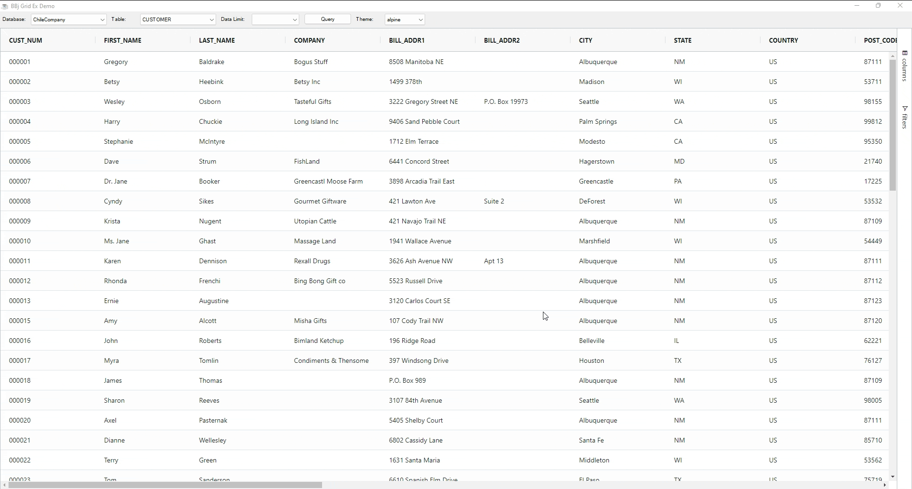
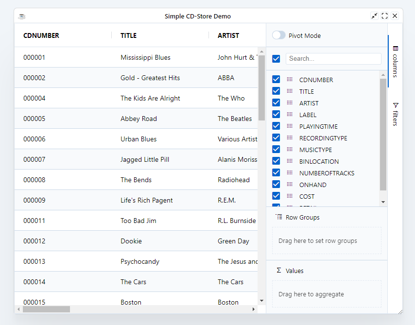

The grid is styled with CSS, and a theme is simply a CSS class that applies styles to the grid. Most users choose a provided theme and then customize it to meet their needs

## Provided Themes

The grid comes with several provided themes which act as a great starting point for any application-specific customizations.

| **Theme Name**       	| **Description**                                                                                                                                                                                                                                                                                                                                                                                                                             	|
|----------------------	|---------------------------------------------------------------------------------------------------------------------------------------------------------------------------------------------------------------------------------------------------------------------------------------------------------------------------------------------------------------------------------------------------------------------------------------------	|
|       `GRID_THEME_ALPINE` ,    `GRID_THEME_ALPINE_DARK`            	| Modern-looking themes with high contrast, and generous padding. This is the recommended grid theme and an excellent choice for most applications.                                                                                                                                                                                                                                                                                           	|
| `GRID_THEME_BALHAM` , `GRID_THEME_BALHAM_DARK`	| Themes for professional data-heavy applications. Balham was the recommended theme before Alpine was developed. It is still an excellent choice for applications that need to fit more data onto each page.                                                                                                                                                                                                                                  	|
| `GRID_THEME_MATERIAL`   	| A theme designed according to the Google Material Language Specs. This theme looks great for simple applications with lots of white space, and is the obvious choice if the rest of your application follows the Google Material Design spec. However, the Material spec doesn't cater for advanced grid features such as grouped columns and tool panels. If your application uses these features, consider using `GRID_THEME_ALPINE` instead. 	|



:::info
In the **DWC** client, The grid has a default theme which is based on the `GRID_THEME_ALPINE` and designed according to the DWC specs. This 
Theme fit well with the other DWC components. That also means if you have a theme built with the BBjThemeEditor then the grid will adapt with
no extra efforts.
:::




## Applying a Theme to an App

To apply a specific theme use the `BBjGridExWidget.setTheme(BBjString theme$)` method. The theme should be one of the 
predefined themes:

* `BBjGridExWidget.GRID_THEME_ALPINE()`
* `BBjGridExWidget.GRID_THEME_ALPINE_DARK()`
* `BBjGridExWidget.GRID_THEME_BALHAM()`
* `BBjGridExWidget.GRID_THEME_BALHAM_DARK()`
* `BBjGridExWidget.GRID_THEME_MATERIAL()`

```bbj
  grid!.setTheme(BBjGridExWidget.GRID_THEME_MATERIAL())
```