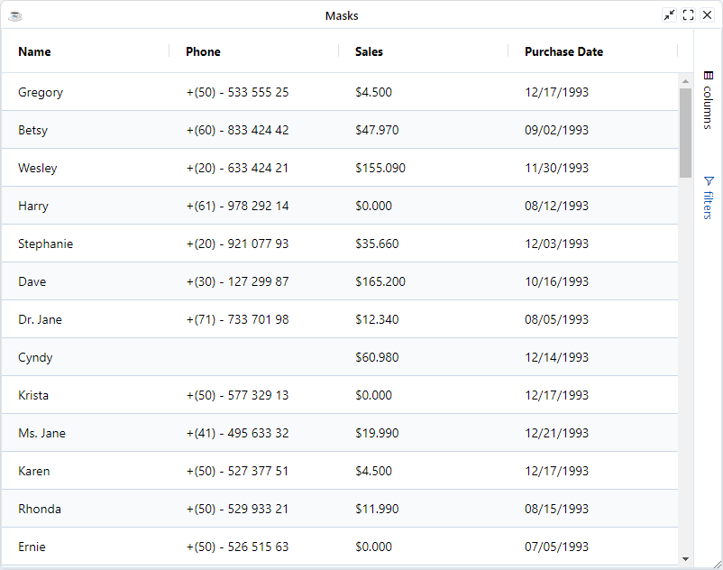

BBjGridExWidget supports the BBj [String](https://documentation.basis.cloud/BASISHelp/WebHelp/commands/str_function.htm), [Number](https://documentation.basis.cloud/BASISHelp/WebHelp/usr/Language_Concepts/numeric_output.htm) and [Date](https://documentation.basis.cloud/BASISHelp/WebHelp/commands/bbj-commands/date_function_bbj.htm) Masks. You can set the mask for a given column using the [`BBjGridExWidget::setColumnMask`](https://bbj-plugins.github.io/BBjGridExWidget/javadoc/BBjGridExWidget/BBjGridExWidget.html#setColumnMask).

:::info
The **BBjGridExWidget applies masks using Javascript** with [`bbj-masks`](https://github.com/BasisHub/bbj-masks) library.
:::

## Default Columns Masks

By default , the grid will apply a default bbj mask based on the column type. The following table shows which mask is used based on the column SQL type Type

| **Mask**          	| **SQL Type**                	|
|--------------------	|-----------------------------	|
| `%Yd-%Mz-%Dz`	| `DATE`	|
| `%Hz:%mz:%sz`	| `TIME`, `TIME_WITH_TIMEZONE`	|
| `%Yd-%Mz-%Dz %Hz:%mz:%sz`	| `TIMESTAMP`, `TIMESTAMP_WITH_TIMEZONE`	|


## BBjGridExWidget::setColumnMask

[`BBjGridExWidget::setColumnMask`](https://bbj-plugins.github.io/BBjGridExWidget/javadoc/BBjGridExWidget/BBjGridExWidget.html#setColumnMask) will set the mask of a given column in all supported components (filter, cell renderer, cell editor and the value formatter expression).

In case the column has no value formatter expression, then the method will create one based on the column's SQL Type. That's why it is important to call this method after [`BBjGridExWidget::setData`](../data/overview#the-bbjgridexwidgetsetdata-method)

```BBj showLineNumbers
use ::BBjGridExWidget/BBjGridExWidget.bbj::BBjGridExWidget
use com.basiscomponents.db.ResultSet
use com.basiscomponents.bc.SqlQueryBC

wnd! = BBjAPI().openSysGui("X0").addWindow(10, 10, 800, 600, "BBj Masks")
wnd!.setCallback(BBjAPI.ON_CLOSE,"byebye")

gosub main
process_events

main:
  declare SqlQueryBC sbc!
  declare ResultSet rs!
  declare BBjGridExWidget grid!

  sbc! = new SqlQueryBC(BBjAPI().getJDBCConnection("ChileCompany"))
  rs! = sbc!.retrieve("SELECT FIRST_NAME as 'Name', PHONE as 'Phone', SALES_YTD as 'Sales', LAST_PURCH_DATE as 'Purchase Date' FROM CUSTOMER")

  grid! = new BBjGridExWidget(wnd!, 100, 0, 0, 800, 600)
  grid!.setData(rs!)
  grid!.setFitToGrid()

  grid!.setColumnMask("Phone", "+(00) - 000 000 000 00")
  grid!.setColumnMask("Sales", "$ -#,##0.000")
  grid!.setColumnMask("Purchase Date", "%Mz/%Dz/%Yl")
return

byebye:
bye
```



## Configure Masks Before `setData`

When constructing the columns before [`BBjGridExWidget::setData`](../data/overview#the-bbjgridexwidgetsetdata-method) is invoked, you can configure the columns masks using the [`GxColumn::setMask`](https://bbj-plugins.github.io/BBjGridExWidget/javadoc/GxColumns/GxDefaultColumnDefinition.html#setMask). in this case the `setData` method won't override the default type mask.

```BBj showLineNumbers
use ::BBjGridExWidget/BBjGridExWidget.bbj::BBjGridExWidget
use com.basiscomponents.db.ResultSet
use com.basiscomponents.bc.SqlQueryBC
use java.sql.Types

wnd! = BBjAPI().openSysGui("X0").addWindow(10, 10, 800, 600, "BBj Masks")
wnd!.setCallback(BBjAPI.ON_CLOSE,"byebye")

gosub main
process_events

main:
  declare SqlQueryBC sbc!
  declare ResultSet rs!
  declare BBjGridExWidget grid!

  sbc! = new SqlQueryBC(BBjAPI().getJDBCConnection("ChileCompany"))
  rs! = sbc!.retrieve("SELECT FIRST_NAME, PHONE, SALES_YTD, LAST_PURCH_DATE FROM CUSTOMER")

  grid! = new BBjGridExWidget(wnd!, 100, 0, 0, 800, 600)

  name!  = grid!.addColumn("FIRST_NAME", "Name", Types.VARCHAR)

  phone! = grid!.addColumn("PHONE", "Phone", Types.VARCHAR)
  phone!.setMask("+(00) - 000 000 000 00")

  sales! = grid!.addColumn("SALES_YTD", "Sales", Types.NUMERIC)
  sales!.setMask("$ -#,##0.000")

  date!  = grid!.addColumn("LAST_PURCH_DATE", "Purchase Date", Types.DATE)
  date!.setMask("%Mz/%Dz/%Yl")

  grid!.setData(rs!)
  grid!.setFitToGrid()
return

byebye:
bye
```

## Update Masks After Rendering

You can update any column mask after rendering by setting the mask property on the column or by calling the `setColumnMask` method.
To reflect the changes in the grid, you should invoke the method [`BBjGridExWidget.updateColumns()`](https://bbj-plugins.github.io/BBjGridExWidget/javadoc/BBjGridExWidget/BBjGridExWidget.html#updateColumns)

```BBj
date!  = grid!.getColumn("LAST_PURCH_DATE")
date!.setMask("%Mz-%Dz-%Yl")
grid!.updateColumns()
```