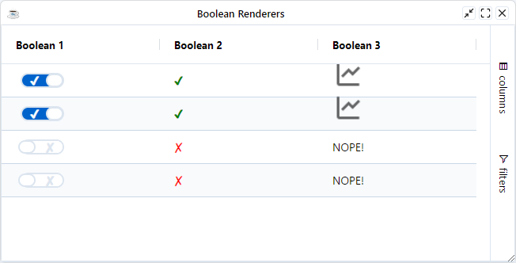
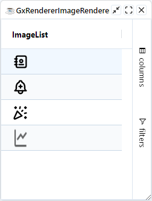
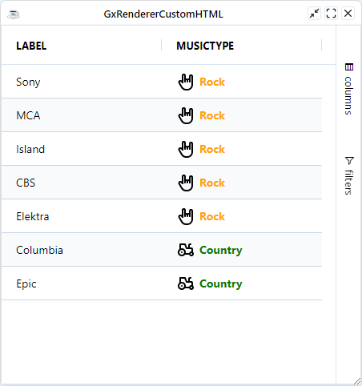

By default the grid renders values into the cells as strings. If you want something more complex you use a cell renderer.

:::tip
If you have no requirements for custom cells, then you should use no cell renderer. Having no custom cell renderers will result in the fastest possible grid, as even the simplest cell renderer will result in some extra div's in the DOM

If you just want to do simple formatting of the data (eg currency or date formatting) then you can use [Value Formatters](./value-formatter.md)
:::

## Provided Cell Renderers

The BBjGridExWidget provides the following cell renderer:


| **Renderer**                	| **Description**                                                                                                                                                                       	|
|-----------------------------	|---------------------------------------------------------------------------------------------------------------------------------------------------------------------------------------	|
| [`GxRendererBoolean`](https://bbj-plugins.github.io/BBjGridExWidget/javadoc/GxRenderers/GxRendererBoolean.html)           	| The class represents a boolean cell renderer and it is attacheD directly to columns with SQL type `BOOLEAN` or `BIT`                                                                   	|
| [`GxRendererImageRenderer`](https://bbj-plugins.github.io/BBjGridExWidget/javadoc/GxRenderers/GxRendererImageRenderer.html)     	| The renderer can be used to display a list of images based on the cells values using a json object                                                                                    	|
| [`GxRendererCustomHTML`](https://bbj-plugins.github.io/BBjGridExWidget/javadoc/GxRenderers/GxRendererCustomHTML.html)        	| The class can render a custom html using [`lodash`](https://lodash.com/docs/4.17.15#template) string templates.                                                                                                                     	|

<!-- | [`GxRendererGroupCellRenderer`](https://bbj-plugins.github.io/BBjGridExWidget/javadoc/GxRenderers/GxRendererGroupCellRenderer.html) 	| If you are grouping in the grid, then you will need to provide a group cell renderer as the group cell renderer is what provides the user with the expand and collapse functionality. 	| -->


## Sample: GxRendererBoolean

In the sample below, The following can be noticed:

* `Boolean 1` renderer uses the special string `SWITCH_RENDERER` to render boolean as a switch control.
* `Boolean 2` uses HTML entities to render the boolean value
* `Boolean 3` uses an HTML image to render `true` values and a plain string to render `false` values

```BBj showLineNumbers
use ::BBjGridExWidget/BBjGridExWidget.bbj::BBjGridExWidget
use ::BBjGridExWidget/GxRenderers.bbj::GxRendererBoolean
use com.basiscomponents.db.ResultSet
use com.basiscomponents.db.DataRow
use java.sql.Types

wnd! = BBjAPI().openSysGui("X0").addWindow(10,10,650,300,"Boolean Renderers")
wnd!.setCallback(BBjAPI.ON_CLOSE,"byebye")

gosub main
process_events

main:
  declare ResultSet rs!
  declare BBjGridExWidget grid!

  rs! = new ResultSet()
  for i = 1 to 4
    value! = rnd(2)

    dr! = new DataRow()
    dr!.setFieldValue("Boolean 1", Types.BOOLEAN, value!)
    dr!.setFieldValue("Boolean 2", Types.BOOLEAN, value!)
    dr!.setFieldValue("Boolean 3", Types.BOOLEAN, value!)

    rs!.addItem(dr!)
  next

  grid! = new BBjGridExWidget(wnd!,100,0,0,650,300)
  grid!.setData(rs!)

  rem This is the default renderer's values.
  boolean1! = grid!.getColumn("Boolean 1")
  boolean1!.getCellRenderer().setTrueValue(GxRendererBoolean.SWITCH_RENDERER())
  boolean1!.getCellRenderer().setFalseValue(GxRendererBoolean.SWITCH_RENDERER())

  boolean2! = grid!.getColumn("Boolean 2")
  boolean2!.getCellRenderer().setTrueValue("<b style='color: green'>&#10004;</b>")
  boolean2!.getCellRenderer().setFalseValue("<b style='color: red'>&#x2717;</b>")

  boolean3! = grid!.getColumn("Boolean 3")
  iconImage! = BBjGridExWidget.imageToBase64("BBjGridExWidget/demo/assets/images/sampleicon.png")
  boolean3!.getCellRenderer().setTrueValue(String.format("" , iconImage!))
  boolean3!.getCellRenderer().setFalseValue("NOPE!")
return

byebye:
bye
```



## Sample: GxRendererImageRenderer

The example below shows how to use the [`GxRendererImageRenderer`](https://bbj-plugins.github.io/BBjGridExWidget/javadoc/GxRenderers/GxRendererImageRenderer.html)

```BBj showLineNumbers
use ::BBjGridExWidget/BBjGridExWidget.bbj::BBjGridExWidget
use ::BBjGridExWidget/GxRenderers.bbj::GxRendererImageRenderer
use com.basiscomponents.db.ResultSet
use com.basiscomponents.db.DataRow
use com.google.gson.JsonObject
use java.sql.Types

sysGui! = BBjAPI().openSysGui("X0")

wnd! = sysGui!.addWindow(10,10,250,300,"GxRendererImageRenderer")
wnd!.setCallback(BBjAPI.ON_CLOSE,"byebye")

gosub main
process_events

main:
  declare ResultSet rs!
  declare BBjGridExWidget grid!

  rs! = new ResultSet()
  for i = 1 to 4
    value! = rnd(2)

    dr! = new DataRow()
    dr!.setFieldValue("ImageList", Types.VARCHAR, "image_" + str(i))
    rs!.addItem(dr!)
  next

  grid! = new BBjGridExWidget(wnd!,100,0,0,250,300)
  grid!.setData(rs!)

  icon! = BBjGridExWidget.imageToBase64("BBjGridExWidget/demo/assets/images/sampleicon.png")
  base$ = "https://raw.githubusercontent.com/tabler/tabler-icons/master/icons/"

  jsonIcons! = new JsonObject()
  jsonIcons!.addProperty("image_1", base$ + "address-book.svg")
  jsonIcons!.addProperty("image_2", base$ + "bell-plus.svg")
  jsonIcons!.addProperty("image_3", base$ + "confetti.svg")
  jsonIcons!.addProperty("image_4", icon!)

  imageListColumn! = grid!.getColumn("ImageList")
  imageListColumn!.setCellRenderer(new GxRendererImageRenderer(jsonIcons!))
return

byebye:
bye
```



:::info With Sprite Image

The BBjGridExWidget also provides a helper method [`BBjGridExWidget.setColumnImageList`](https://bbj-plugins.github.io/BBjGridExWidget/javadoc/BBjGridExWidget/BBjGridExWidget.html#setColumnImageList) which will create a `GxRendererImageRenderer` for the passed sprite image.

<details>
<summary>Sample</summary>
<div>

```BBj showLineNumbers
use ::BBjGridExWidget/BBjGridExWidget.bbj::BBjGridExWidget
use ::BBjGridExWidget/GxRenderers.bbj::GxRendererImageRenderer
use com.basiscomponents.db.ResultSet
use com.basiscomponents.db.DataRow
use com.google.gson.JsonObject
use java.sql.Types

sysGui! = BBjAPI().openSysGui("X0")

wnd! = sysGui!.addWindow(10,10,250,300,"Sprite")
wnd!.setCallback(BBjAPI.ON_CLOSE,"byebye")

gosub main
process_events

main:
  declare ResultSet rs!
  declare BBjGridExWidget grid!

  rs! = new ResultSet()
  for i = 1 to 4
    value! = rnd(2)

    dr! = new DataRow()
    dr!.setFieldValue("ImageList", Types.VARCHAR, str(i - 1))
    rs!.addItem(dr!)
  next

  grid! = new BBjGridExWidget(wnd!,100,0,0,250,300)
  grid!.setData(rs!)

  path$ = "BBjGridExWidget/demo/assets/images/imagelist.png"
  sprite! = sysGui!.getImageManager().loadImageFromFile(path$)

  imageList! = grid!.getColumn("ImageList")
  grid!.setColumnImageList(imageList!.getField(), sprite!)
return

byebye:
bye
```
</div>
</details>

:::


## Sample: GxRendererCustomHTML

The GxRendererCustomHTML can render a custom HTML using [`lodash`](https://lodash.com/docs/4.17.15#template) string templates. Inside the template you will have access to the `params` object which contains the following properties:

| **Property** 	| **Description**                                               	|
|--------------	|:---------------------------------------------------------------	|
|  value       	|  Mapped from cell value.                                                   	|
|  valueFormatted       	|  The formatted value if a [value formatter](./value-formatter) was used.                                                   	|
|  data        	|  Mapped from the `DataRow`.                                      	|
|  getValue    	|  The value after it is processed by the [value getter](./value-getters). 	|
|  rowIndex         	|  The current row index in the grid (Different than the ResultSet rowIndex).|

In the sample below, The following can be noticed:

* To execute Javascript code in the template , wrap it with `<%` and `%>`
* To print the result of javascript code, wrap it with `<%=` and `%>`
* To print HTML, embed the HTML directly in the template

```BBj showLineNumbers
use ::BBjGridExWidget/BBjGridExWidget.bbj::BBjGridExWidget
use ::BBjGridExWidget/GxRenderers.bbj::GxRendererCustomHTML
use com.basiscomponents.db.ResultSet
use com.basiscomponents.bc.SqlQueryBC

declare auto BBjTopLevelWindow wnd!
wnd! = BBjAPI().openSysGui("X0").addWindow(10, 10, 450, 450, "GxRendererCustomHTML")
wnd!.setCallback(BBjAPI.ON_CLOSE,"byebye")

gosub main
process_events

main:
  declare SqlQueryBC sbc!
  declare ResultSet rs!
  declare BBjGridExWidget grid!

  sbc! = new SqlQueryBC(BBjAPI().getJDBCConnection("CDStore"))
  rs! = sbc!.retrieve("SELECT LABEL, MUSICTYPE FROM CDINVENTORY WHERE MUSICTYPE IN ('Rock', 'Country')")

  grid! = new BBjGridExWidget(wnd!, 100, 0, 0, 450, 450)
  grid!.setData(rs!)

  tpl! = ""
  tpl! = tpl! + "<% const isRock = params.value == 'Rock' %>"
  tpl! = tpl! + "<% const base = 'https://raw.githubusercontent.com/tabler/tabler-icons/master/icons/' %>"
  tpl! = tpl! + "<div style='display: flex; align-items: center; gap: 5px'>"
  tpl! = tpl! + " .svg' />"
  tpl! = tpl! + " <span style='font-weight: bolder;color: <%= isRock ? 'orange': 'green' %>'>"
  tpl! = tpl! + "   <%= params.value %>"
  tpl! = tpl! + " <span>"
  tpl! = tpl! + "<div>"

  musicType! = grid!.getColumn("MUSICTYPE")
  musicType!.setCellRenderer(new GxRendererCustomHTML(tpl!))
return

byebye:
bye
```


