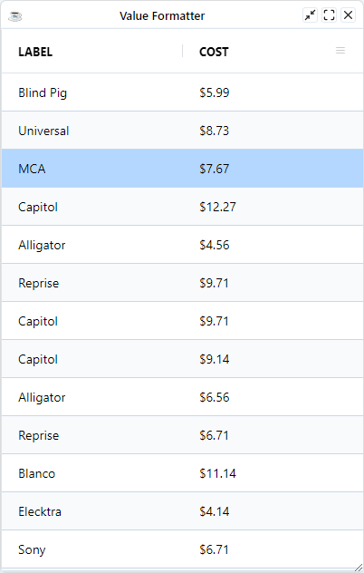
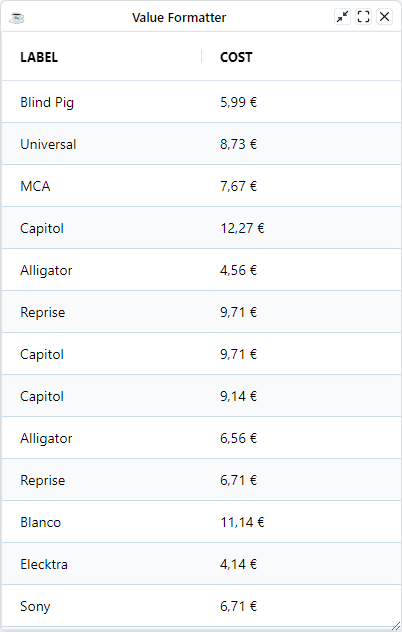

Value formatters allow you to format values for display. This is useful when data is one type (e.g. numeric) but needs to be converted for human reading (e.g. putting in currency symbols and number formatting).

## Configuring Value Formatters

An `ValueFormatterExpression` is arbitrary **JavaScript** code/expression that gets called to format the value before it is displayed.

When working with expressions keep the following points in mind:

* If the expression has the word `return` in it, then we will assume it is a multi-line expression and will not wrap it.
* If the expression does not have the word `return` in it, then we will insert the `return` statement and the `;` for you.
* If the expression has many lines, then you will need to provide the `;` at the end of each line and also provide the `return` statement.

Expressions have access to several predefined variables:

| **Variable** 	| **Description**                                               	|
|:--------------:	|:---------------------------------------------------------------	|
|  x           	|  Mapped from cell value                                       	|
|  value       	|  Same as x                                                    	|
|  data        	|  Mapped from the `DataRow`                                      	|

For instance 

```bbj
column!.setValueFormatterExpression("'(' + x + ')')
```

## Provided Formatters

The BBjGridExWidget uses the columns's [SQL types](https://github.com/JetBrains/jdk8u_jdk/blob/master/src/share/classes/java/sql/Types.java) provided by the ResultSet to auto-attach the correct value formatter for each column.  For instance, When the column's SQL type is `java.sql.Types.NUMERIC`, the grid will attach the  [`GxExpressionNumbersFormatter`](https://bbj-plugins.github.io/BBjGridExWidget/javadoc/GxFilters/GxFilterNumber.html) expression and so on for other types. 

### Types - Expressions Mapping

The following shows which value formatter expression is used for each column type:

| **Expression**          	| **SQL Type**                	|
|--------------------	|-----------------------------	|
| [GxExpressionNumbersFormatter](https://bbj-plugins.github.io/BBjGridExWidget/javadoc/GxExpressions/GxExpressionNumbersFormatter.html)  	| `BIGINT`, `TINYINT`, `SMALLINT`, `INTEGER`, `DECIMAL`, `DOUBLE`, `FLOAT`, `REAL`, `NUMERIC` 	|
| [GxExpressionDateTimesFormatter](https://bbj-plugins.github.io/BBjGridExWidget/javadoc/GxExpressions/GxExpressionDateTimesFormatter.html)  	| `DATE`, `TIME`, `TIME_WITH_TIMEZONE`,`TIMESTAMP`, `TIMESTAMP_WITH_TIMEZONE`	|
| [GxExpressionStringsFormatter](https://bbj-plugins.github.io/BBjGridExWidget/javadoc/GxExpressions/GxExpressionStringsFormatter.html) 	| `CHAR`, `VARCHAR`, `NVARCHAR`, `NCHAR`, `LONGVARCHAR`, `LONGNVARCHAR`	|

:::tip
Beside the previous expressions, the grid provides also a [GxExpressionBytesFormatter](https://bbj-plugins.github.io/BBjGridExWidget/javadoc/GxExpressions/GxExpressionBytesFormatter.html). The Expression defines a grid expression to format bytes to one of the following measuring terms: `['KB', 'MB', 'GB', 'TB', 'PB', 'EB', 'ZB', 'YB']` 
:::


### Configure Provided Formatters

You can access the attached value formatter expression using the `BBjGridExWidget.getValueFormatterExpression`
The method will return the attached expression if any, `null()` otherwise.

:::caution
Expression are attached after calling `setData`. For more information @see [`The BBjGridExWidget::setData method`](../data/overview#the-bbjgridexwidgetsetdata-method)
:::

```bbj showLineNumbers
use ::BBjGridExWidget/BBjGridExWidget.bbj::BBjGridExWidget
use com.basiscomponents.db.ResultSet
use com.basiscomponents.bc.SqlQueryBC

declare auto BBjTopLevelWindow wnd!
wnd! = BBjAPI().openSysGui("X0").addWindow(10, 10, 400, 600, "Value Formatter")
wnd!.setCallback(BBjAPI.ON_CLOSE,"byebye")

gosub main
process_events

main:
  declare SqlQueryBC sbc!
  declare ResultSet rs!
  declare BBjGridExWidget grid!

  sbc! = new SqlQueryBC(BBjAPI().getJDBCConnection("CDStore"))
  rs! = sbc!.retrieve("SELECT LABEL, COST FROM CDINVENTORY")

  grid! = new BBjGridExWidget(wnd!, 100, 0, 0, 800, 600)
  grid!.setData(rs!)

  cost! = grid!.getColumn("COST")
  cost!.getValueFormatterExpression().setMask("$#,##0.00")
return

byebye:
bye
```



### Sample: Custom Formatter

The grid exposes the [`GxExpressionInterface`](https://bbj-plugins.github.io/BBjGridExWidget/javadoc/GxExpressions/GxExpressionInterface.html) and the [`GxExpressionAbstract`](https://bbj-plugins.github.io/BBjGridExWidget/javadoc/GxExpressions/GxExpressionAbstract.html) for creating custom expressions.

In the example below, the following can be noticed:

* The expression extends [`GxExpressionAbstract`](https://bbj-plugins.github.io/BBjGridExWidget/javadoc/GxExpressions/GxExpressionAbstract.html) to allow the configuration of the expression
* The expression will take the provided Currency and Locale and build the Javascript code
* The Javascript code uses the [`Intl`](https://developer.mozilla.org/en-US/docs/Web/JavaScript/Reference/Global_Objects/Intl/NumberFormat/NumberFormat#options) API to handle number formatting


```bbj showLineNumbers
use ::BBjGridExWidget/BBjGridExWidget.bbj::BBjGridExWidget
use ::BBjGridExWidget/GxExpressions.bbj::GxExpressionAbstract
use com.basiscomponents.db.ResultSet
use com.basiscomponents.bc.SqlQueryBC

// highlight-start
class public PriceFormatterExp extends GxExpressionAbstract

  rem /**
  rem  * Possible values are the ISO 4217 currency codes, such as "USD" for the US dollar, "EUR"
  rem  * for the euro, or "CNY" for the Chinese.
  rem  *
  rem  * @see https://www.six-group.com/en/products-services/financial-information/data-standards.html#scrollTo=currency-codes
  rem  */
  field public BBjString Currency$ = "USD"

  rem A valid locale. for instance "de-DE" for germany.
  field public BBjString Locale$ = "en-US"

  rem /**
  rem  * {@inheritDoc}
  rem  */
  method public String toString()
    exp! = ""
    exp! = exp! + "const Currency$ = '" + #Currency$ + "';"
    exp! = exp! + "const Locale$ = '" + #Locale$ + "';"
    exp! = exp! + "const formatter = new Intl.NumberFormat(Locale$, {style: 'currency', currency: Currency$});"
    exp! = exp! + "return formatter.format(value);"
    methodret exp!
  methodend

classend
// highlight-end

wnd! = BBjAPI().openSysGui("X0").addWindow(10, 10, 400, 600, "Value Formatter")
wnd!.setCallback(BBjAPI.ON_CLOSE,"byebye")

gosub main
process_events

main:
  declare SqlQueryBC sbc!
  declare ResultSet rs!
  declare BBjGridExWidget grid!

  sbc! = new SqlQueryBC(BBjAPI().getJDBCConnection("CDStore"))
  rs! = sbc!.retrieve("SELECT LABEL, COST FROM CDINVENTORY")

  grid! = new BBjGridExWidget(wnd!, 100, 0, 0, 800, 600)
  grid!.setData(rs!)

  cost! = grid!.getColumn("COST")

  // highlight-start
  exp! = new PriceFormatterExp()
  exp!.setCurrency("EUR")
  exp!.setLocale("de-DE")

  cost!.setValueFormatterExpression(exp!)
  // highlight-end
return

byebye:
bye
```

