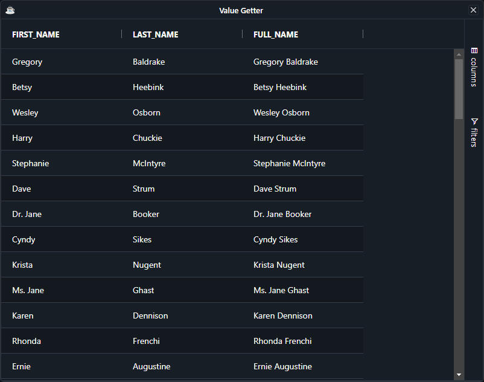

Normally columns are configured from the ResultSet, so the column knows what field to take values from in the data. Instead of providing field it is possible to provide value getter expression instead.

:::tip
Use value getters when retrieving the data requires more logic, including executing your own expressions (similar to what a spreadsheet would do).
:::

## Configuring Value Getters

An `ValueGetterExpression` is arbitrary **JavaScript** code/expression that gets called allowing values to be pulled from somewhere else.

When working with expressions keep the following points in mind:

* If the expression has the word `return` in it, then we will assume it is a multi-line expression and will not wrap it.
* If the expression does not have the word `return` in it, then we will insert the `return` statement and the `;` for you.
* If the expression has many lines, then you will need to provide the `;` at the end of each line and also provide the `return` statement.

Expressions have access to several predefined variables:

| **Variable** 	| **Description**                                               	|
|:--------------:	|:---------------------------------------------------------------	|
|  data        	|  Mapped from the `DataRow`                                      	|
|  ctx         	|  The grid client context                                      	|

For instance 

```bbj
column!.setValueGetterExpression("data.FIRST_NAME + ' ' + data.LAST_NAME")
```

## Example Value Getters

The following example uses the value getter expression to compute the value of the `FULL_NAME` column
from `FIRST_NAME` and `LAST_NAME` column

```bbj showLineNumbers
use ::BBjGridExWidget/BBjGridExWidget.bbj::BBjGridExWidget
use ::BBjGridExWidget/GxColumns.bbj::GxColumn
use com.basiscomponents.db.ResultSet
use com.basiscomponents.bc.SqlQueryBC

declare auto BBjTopLevelWindow wnd!
wnd! = BBjAPI().openSysGui("X0").addWindow(10,10,800,600,"Value Getter", $00090002$)
wnd!.setCallback(BBjAPI.ON_CLOSE,"byebye")

gosub main
process_events

main:
  declare SqlQueryBC sbc!
  declare ResultSet rs!
  declare BBjGridExWidget grid!
  declare GxColumn fullNameColumn!

  sbc! = new SqlQueryBC(BBjAPI().getJDBCConnection("ChileCompany"))
  rs! = sbc!.retrieve("SELECT FIRST_NAME, LAST_NAME FROM CUSTOMER")
  
  grid! = new BBjGridExWidget(wnd!,100,0,0,800,600)
  grid!.setData(rs!)
  
  fullNameColumn! = grid!.addColumn("FULL_NAME")
  fullNameColumn!.setValueGetterExpression("data.FIRST_NAME + ' ' + data.LAST_NAME")
return

byebye:
bye
```

