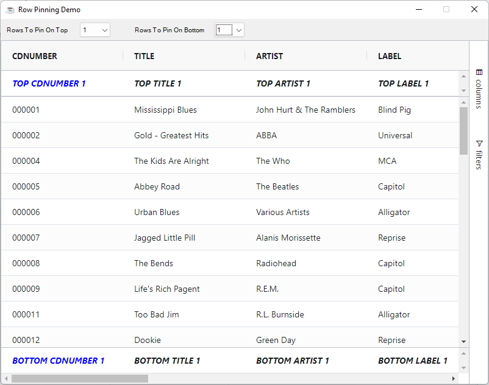

Pinned rows appear either above or below the normal rows of a table. This feature in other grids is also known as **Frozen Rows** or **Floating Rows**.

To put pinned rows into your grid, call `setPinnedTopRows` or `setPinnedBottomRows` in the same way as you would set normal data. 

* `BBjGridExWidget:setPinnedTopRows`: Set a result set of pinned rows on top
* `BBjGridExWidget:setPinnedBottomRows`: Set a result set of pinned rows on bottom

## Cell Editing

Cell editing can take place as normal on pinned rows.

## Cell Rendering

Cell rendering can take place as normal on pinned rows.

## Example

The example below shows pinned rows. Select the number of rows you want to pin at the top and the bottom using the selection above the grid.

In this example we're using [`GxRendererCustomHTML`](https://bbj-plugins.github.io/BBjGridExWidget/javadoc/GxRenderers/GxRendererCustomHTML.html) to render custom pinned row values for ALL columns (color blue and italics respectively).

```BBj showLineNumbers
use ::BBjGridExWidget/BBjGridExWidget.bbj::BBjGridExWidget
use ::BBjGridExWidget/GxRenderers.bbj::GxRendererCustomHTML
use com.basiscomponents.db.ResultSet
use com.basiscomponents.bc.SqlQueryBC

declare auto BBjTopLevelWindow wnd!
declare auto BBjListButton currencies!

wnd! = BBjAPI().openSysGui("X0").addWindow(10,10,800,600,"Row Pinning")
wnd!.setCallback(BBjAPI.ON_CLOSE,"byebye")

items$ = ""
for i=0 to 3
  items$ = items$ + str(I) + $0A$
next i

wnd!.addStaticText(200,10,12,120,50,"Rows To Pin On Top")
numberOfTopPinnedRows! = wnd!.addListButton(201,130,6,50,250,"")
numberOfTopPinnedRows!.insertItems(0,items$)
numberOfTopPinnedRows!.selectIndex(0)
numberOfTopPinnedRows!.setCallback(BBjAPI.ON_LIST_SELECT,"onNumberOfTopPinnedRowsChange")

wnd!.addStaticText(202,220,12,130,50,"Rows To Pin On Bottom")
numberOfBottomPinnedRows! = wnd!.addListButton(203,350,6,50,250,"")
numberOfBottomPinnedRows!.insertItems(0,items$)
numberOfBottomPinnedRows!.selectIndex(0)
numberOfBottomPinnedRows!.setCallback(BBjAPI.ON_LIST_SELECT,"onNumberOfBottomPinnedRowsChange")

gosub main
process_events

main:
  declare SqlQueryBC sbc!
  declare ResultSet rs!
  declare BBjGridExWidget grid!

  sbc! = new SqlQueryBC(BBjAPI().getJDBCConnection("CDStore"))
  rs! = sbc!.retrieve("SELECT * FROM CDINVENTORY")

  grid! = new BBjGridExWidget(wnd!,100,0,35,800,566)

  renderer! = new GxRendererCustomHTML("<% "+
: "var position = params.node.rowPinned;"+
: "if(!position) print(params.value);"+
: "else {"+
: " var content = position.toUpperCase() + ' ' + params.column.colId + ' ' + (params.rowIndex + 1);"+
: " var isCDNumber = params.column.colId == 'CDNUMBER';"+
: " var style = 'font-weight: bold;font-style: italic';"+
: " style += isCDNumber ? ';color: blue;' : ''; "+
: " print('<div class=""ag-cell-wrapper"" style=""' + style + '"">' + content + '</div>')"+
: "}" +
: "%>")
  grid!.getOptions().getDefaultColumnDefinition().setCellRenderer(renderer!)

  grid!.setData(rs!)
return

onNumberOfTopPinnedRowsChange:
  amount! = num(numberOfTopPinnedRows!.getItemAt(numberOfTopPinnedRows!.getSelectedIndex()))
  pinnedTopData! = new ResultSet()
  if amount! > 0
    clone! = rs!.get(0).clone()
    clone!.clear()
    FOR index! = 1 TO amount!
      pinnedTopData!.add(clone!)
    NEXT index!
  fi

  grid!.setPinnedTopRows(pinnedTopData!)
return

onNumberOfBottomPinnedRowsChange:
  amount! = num(numberOfBottomPinnedRows!.getItemAt(numberOfBottomPinnedRows!.getSelectedIndex()))
  pinnedBottomData! = new ResultSet()
  if amount! > 0
    clone! = rs!.get(0).clone()
    clone!.clear()
    FOR index! = 1 TO amount!
      pinnedBottomData!.add(clone!)
    NEXT index!
  fi

  grid!.setPinnedBottomRows(pinnedBottomData!)
return

byebye:
bye
```

