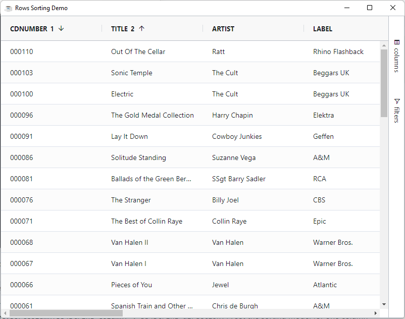

This page describes how to get your grid data sorting.

## Enable Sorting

Enable sorting for columns by setting the sortable column definition attribute. Then sort a column by clicking on the column header.
To enable/disable sorting for all columns, set sorting in the [default column definition](../api/columns-interface#avoid-duplication-of-column-definitions).

```bbj
grid!.getOptions().getDefaultColumnDefinition().setSortable(0)
```

:::tip
The row sorting is enabled by default on all columns
:::

## Multi Column Sorting

It is possible to sort by multiple columns. The default action for multiple column sorting is for the user to hold down <kbd>Shift</kbd> while clicking the column header. To change the default action to use the <kbd>Ctrl</kbd> key (or `Command` key on Apple) set the grid option `UseCtrlForMultiSort`

```bbj
grid!.getOptions().setUseCtrlForMultiSort(1)
```

## Sorting Animation

To enable/disable animation of the rows after sorting, set grid option `AnimateRows=true`. By d

```bbj
grid!.getOptions().setAnimateRows(1)
```

:::tip
The row animation is disabled by default
:::

## Sorting Order

By default, the sorting order is as follows:

**ascending** -> **descending** -> **none**.

In other words, when you click a column that is not sorted, it will sort ascending. The next click will make it sort descending. Another click will remove the sort.

## Sorting API

Sorting can be controlled via the Sorting API via the following methods:

* `BBjGridExWidget.setSortModel(GxClientSortModel model!)`: set the sorting for one or more columns at once
* `BBjGridExWidget.sortColumn(BBjString column!, BBjString direction!)`: set the sorting model for one column

The following example apply sorting for the `CDNUMBER` and the `TITLE` at once.

```bbj showLineNumbers
use ::BBjGridExWidget/BBjGridExWidget.bbj::BBjGridExWidget
use ::BBjGridExWidget/GxClientModels.bbj::GxClientSortModel
use ::BBjGridExWidget/GxColumns.bbj::GxColumn
use com.basiscomponents.db.ResultSet
use com.basiscomponents.bc.SqlQueryBC

declare auto BBjTopLevelWindow wnd!
declare BBjGridExWidget grid!

wnd! = BBjAPI().openSysGui("X0").addWindow(10,10,800,600,"Rows Sorting Demo")
wnd!.setCallback(BBjAPI.ON_CLOSE,"byebye")

gosub main
process_events

main:
  declare SqlQueryBC sbc!
  declare ResultSet rs!

  sbc! = new SqlQueryBC(BBjAPI().getJDBCConnection("CDStore"))
  rs! = sbc!.retrieve("SELECT  * FROM CDINVENTORY")
  
  grid! = new BBjGridExWidget(wnd!,100,0,0,800,600)
  grid!.setData(rs!)
  
  model! = new GxClientSortModel()
  model!.add("CDNUMBER", GxColumn.SORT_DESC())
  model!.add("TITLE", GxColumn.SORT_ASC())
  
  grid!.setSortModel(model!)
return

byebye:
bye
```


import Tabs from '@theme/Tabs';
import TabItem from '@theme/TabItem';

:::info
To Query the sorting state ([`::BBjGridExWidget/GxState.bbj::GxState`](https://bbj-plugins.github.io/BBjGridExWidget/javadoc/BBjGridExWidget/GxState.html)) in the grid use the `BBjGridExWidget::getState()` method. The state contains all properties related to the grid state including the sorting model

<Tabs>
<TabItem value="grid-state" label="grid-state.bbj">

```bbj showLineNumbers
use ::BBjGridExWidget/GxState.bbj::GxState

declare GxState state! 
state! = grid!.getState()

rem returns a parsable JSON string
? state!.toString()
```

</TabItem>

<TabItem value="grid-state-json" label="grid-state.json">

```json
{
   "columns":[
      {
         "colId":"CDNUMBER",
         "width":200,
         "hide":false,
         "pinned":null,
         "sort":"asc",
         "sortIndex":1,
         "aggFunc":null,
         "rowGroup":false,
         "rowGroupIndex":null,
         "pivot":false,
         "pivotIndex":null,
         "flex":null
      },
      {
         "colId":"ARTIST",
         "width":200,
         "hide":false,
         "pinned":null,
         "sort":"desc",
         "sortIndex":0,
         "aggFunc":null,
         "rowGroup":false,
         "rowGroupIndex":null,
         "pivot":false,
         "pivotIndex":null,
         "flex":null
      },
      {
         "colId":"TITLE",
         "width":200,
         "hide":false,
         "pinned":null,
         "sort":null,
         "sortIndex":null,
         "aggFunc":null,
         "rowGroup":false,
         "rowGroupIndex":null,
         "pivot":false,
         "pivotIndex":null,
         "flex":null
      },
      ... 
   ],
   "groups":[
      ...
    ...
   ],
   "filters":{
      ...
   }
}
```

</TabItem>

</Tabs>
:::


## Accented sort

By default sorting doesn't take into consideration locale specific characters, if you need to make your sort locale specific you can configure this by setting the grid option `AccentedSort = true`

```bbj
grid!.getOptions().setAccentedSort(1)
```

:::caution
Using this feature is more expensive, if you need to sort a very large amount of data, you might find that this causes the sort to be noticeably slower.
:::