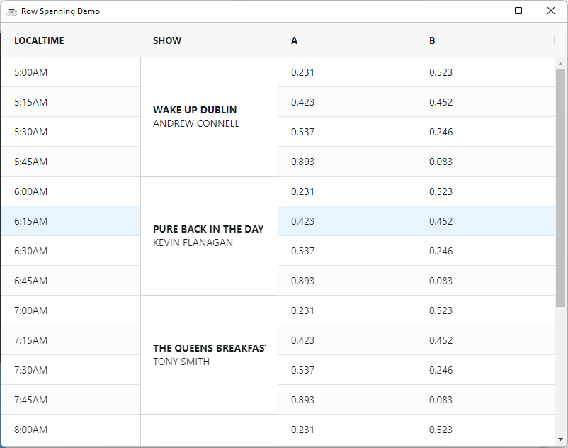

By default, each cell will take up the height of one row. You can change this behaviour to allow cells to span multiple rows. This feature is similar to `cell merging` in Excel or `row spanning` in HTML tables.

## Configuring Row Spanning

To allow row spanning, the grid must have grid option `SuppressRowTransform=1`. Row spanning is then configured at the 
column level. To have a cell span more than one row, you need to set the `RowSpanExpression` , the expression must return how many rows to span.

:::info
The option `SuppressRowTransform=1` is used to stop the grid positioning rows using CSS transform and instead the grid will 
use CSS top. The reason row span will not work with CSS transform is that CSS transform creates a stacking context which 
constrains CSS `z-index` from placing cells on top of other cells in another row. 

Having cells extend into other rows is necessary for row span which means it will not work when using CSS transform. 
The downside to not using transform is performance; row animation (after sort or filter) will be slower.
:::

### RowSpanExpression

An `RowSpanExpression` is arbitrary **JavaScript** code/expression that applies application-defined rules to check how many rows to span. The expression must return a number value to indicate the number of rows to span.

When working with expressions keep the following points in mind:

* If the expression has the word `return` in it, then we will assume it is a multi-line expression and will not wrap it.
* If the expression does not have the word `return` in it, then we will insert the `return` statement and the `;` for you.
* If the expression has many lines, then you will need to provide the `;` at the end of each line and also provide the `return` statement.

Expressions have access to several predefined variables:

| **Variable** 	| **Description**                                               	|
|:--------------:	|:---------------------------------------------------------------	|
|  x           	|  Mapped from cell value                                       	|
|  value       	|  Same as x                                                    	|
|  data        	|  Mapped from the `DataRow`                                      	|
|  column      	|  Current column                                               	|
|  columnGroup 	|  Current column group                                         	|
|  getValue    	|  The value after it is processed by the `ValueGetterExpression` 	|
|  ctx         	|  The grid client context                                      	|

For instance 

```BBj
column!.setRowSpanExpression("data.SHOW ? 4 : 1")
```

## Row Spanning Example

Row spanning will typically be used for creating reports with BBjGridExWidet. 
Below is something that would be more typical of the row spanning feature. 

The following can be noted from the example:

* We disable soring , sidebar and menus to prevent the user from ruining the spanning.
* Column `Show` row spans by 4 rows when it has content.
* Column `Show` uses CSS class rules to specify background and border.
* Column `Show` has a custom cell renderer `(GxRendererCustomHTML)` to make use of the extra space.

:::info
[`GxRendererCustomHTML`](https://bbj-plugins.github.io/BBjGridExWidget/javadoc/GxRenderers/GxRendererCustomHTML.html) accepts a template. 
This is a [lodash template](https://lodash.com/docs/4.17.15#template). It starts with `<%` and ends with `%>`. 
To force the template to execute and print directly what is inside it, we add the `=` sign 
to the start tag `<%=`.  Inside the template you can use only Javascript and embedded HTML and CSS.

DO NOT confuse lodash templates syntax with JSP. They are different things.

:::

import Tabs from '@theme/Tabs';
import TabItem from '@theme/TabItem';

<Tabs>
<TabItem value="bbj" label="row-span.bbj">

```BBj showLineNumbers
use ::BBjGridExWidget/BBjGridExWidget.bbj::BBjGridExWidget
use ::BBjGridExWidget/Demo/assets/Utilities.bbj::GxDemoUtilities
use ::BBjGridExWidget/GxRenderers.bbj::GxRendererCustomHTML
use com.basiscomponents.db.ResultSet
use com.basiscomponents.bc.SqlQueryBC
use com.google.gson.JsonObject

declare auto BBjTopLevelWindow wnd!

wnd! = BBjAPI().openSysGui("X0").addWindow(10,10,800,600,"Row Spanning Demo")
wnd!.setCallback(BBjAPI.ON_CLOSE,"byebye")
wnd!.setCallback(BBjAPI.ON_RESIZE,"resize")

gosub main
process_events

main:
  declare ResultSet rs!
  declare BBjGridExWidget grid!

  rs! = ResultSet.fromJson(GxDemoUtilities.readAssetsAsString("data/row-span.json"))
  grid! = new BBjGridExWidget(wnd!,100,0,0,800,600)

  grid!.getOptions().setSuppressRowTransform(1)

  grid!.getSidebar().setHiddenByDefault(1)
  defaultColDef! = grid!.getOptions().getDefaultColumnDefinition()
  defaultColDef!.setSortable(0)
  defaultColDef!.setSuppressMenu(1)

  grid!.setData(rs!)
  grid!.setFitToGrid()

  showColumn! = grid!.getColumn("SHOW")
  showColumn!.setRowSpanExpression("data.SHOW ? 4 : 1")
  renderingTemplate! = ""+
: "<% if(params.value) { %>"+  
:  "<div style='display: flex; flex-direction: column;align-items: baseline;'>" +
:     "<div class='show-name' style='font-weight: bold'>" +
:          "<%= params.value.NAME %>"+
:     "</div>" +
:     "<div class='show-presenter' style='font-weight: italic'>" +
:        "<%= params.value.PRESENTER %>"+
:     "</div>" +
:  "</div>"+
: "<% } %>"
  showColumn!.setCellRenderer(new GxRendererCustomHTML(renderingTemplate!))

  cellStyleRules! = showColumn!.getCellClassRules()
  cellStyleRules!.addProperty("show-cell","value !== undefined")

  showCellStyle! = new JsonObject()
  showCellStyle!.addProperty("background","white")
  showCellStyle!.addProperty("border","1px solid lightgrey !important")
  showCellStyle!.addProperty("border-top","none !important")

  grid!.addStyle(".show-cell", showCellStyle!)
return

resize:
  ev! = BBjAPI().getLastEvent()
  w=ev!.getWidth()
  h=ev!.getHeight()
  grid!.setSize(w,h)
  grid!.setFitToGrid()
return

byebye:
bye
```

</TabItem>

<TabItem value="data" label="data/row-span.json">

```json
[
  {
    "LOCALTIME": "5:00AM",
    "SHOW": {
      "NAME": "WAKE UP DUBLIN",
      "PRESENTER": "ANDREW CONNELL"
    },
    "A": 0.231,
    "B": 0.523
  },
  {
    "LOCALTIME": "5:15AM",
    "A": 0.423,
    "B": 0.452
  },
  {
    "LOCALTIME": "5:30AM",
    "A": 0.537,
    "B": 0.246
  },
  {
    "LOCALTIME": "5:45AM",
    "A": 0.893,
    "B": 0.083
  },
  {
    "LOCALTIME": "6:00AM",
    "SHOW": {
      "NAME": "PURE BACK IN THE DAY",
      "PRESENTER": "KEVIN FLANAGAN"
    },
    "A": 0.231,
    "B": 0.523
  },
  {
    "LOCALTIME": "6:15AM",
    "A": 0.423,
    "B": 0.452
  },
  {
    "LOCALTIME": "6:30AM",
    "A": 0.537,
    "B": 0.246
  },
  {
    "LOCALTIME": "6:45AM",
    "A": 0.893,
    "B": 0.083
  },
  {
    "LOCALTIME": "7:00AM",
    "SHOW": {
      "NAME": "THE QUEENS BREAKFAST",
      "PRESENTER": "TONY SMITH"
    },
    "A": 0.231,
    "B": 0.523
  },
  {
    "LOCALTIME": "7:15AM",
    "A": 0.423,
    "B": 0.452
  },
  {
    "LOCALTIME": "7:30AM",
    "A": 0.537,
    "B": 0.246
  },
  {
    "LOCALTIME": "7:45AM",
    "A": 0.893,
    "B": 0.083
  },
  {
    "LOCALTIME": "8:00AM",
    "SHOW": {
      "NAME": "COSMETIC SURGERY",
      "PRESENTER": "NIALL CROSBY"
    },
    "A": 0.231,
    "B": 0.523
  },
  {
    "LOCALTIME": "8:15AM",
    "A": 0.423,
    "B": 0.452
  },
  {
    "LOCALTIME": "8:30AM",
    "A": 0.537,
    "B": 0.246
  },
  {
    "LOCALTIME": "8:45AM",
    "A": 0.893,
    "B": 0.083
  },
  {
    "LOCALTIME": "8:00AM",
    "SHOW": {
      "NAME": "BRICKFIELD PARK SESSIONS",
      "PRESENTER": "BRICKER MCGEE"
    },
    "A": 0.231,
    "B": 0.523
  },
  {
    "LOCALTIME": "8:15AM",
    "A": 0.423,
    "B": 0.452
  },
  {
    "LOCALTIME": "8:30AM",
    "A": 0.537,
    "B": 0.246
  },
  {
    "LOCALTIME": "8:45AM",
    "A": 0.893,
    "B": 0.083
  }
]
```

</TabItem>
</Tabs>



