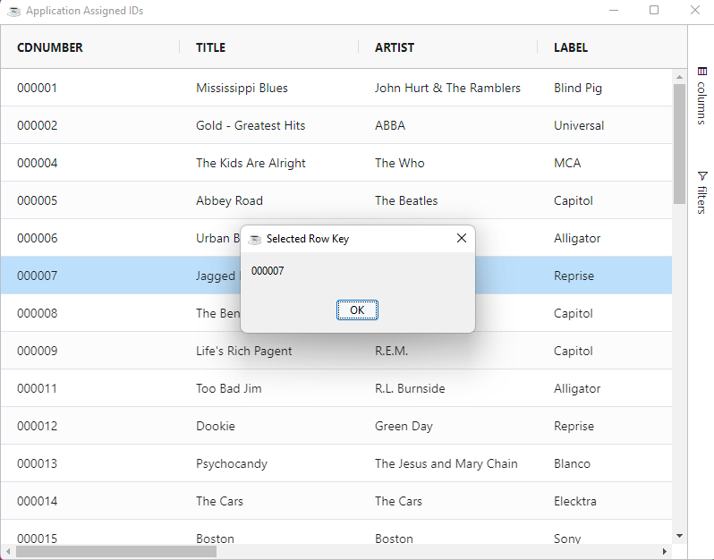

This section explains how the grid assigns row IDs and shows how applications can supply custom row IDs.

Each grid row has a unique row ID which is used by the grid to identify rows, e.g. for identifying what rows are currently selected. These row IDs can be Grid Assigned or Application Assigned.

## Grid Assigned IDs

Row IDs are generated by the grid when data is supplied to the grid. The grid uses an auto-generated ID based on the DataRow
content. 

The row ID/Key of the DataRow can be retrieved using the [`DataRow::getRowKey`](https://basishub.github.io/components/javadoc/com/basiscomponents/db/DataRow.html#getRowKey()) method

```bbj
use com.basiscomponents.db.DataRow

declare DataRow row!
key$ = row!.getRowKey()
```
:::caution
The row ID changes for a row when the content is changed.
:::

```bbj showLineNumbers
use ::BBjGridExWidget/BBjGridExWidget.bbj::BBjGridExWidget
use ::BBjGridExWidget/GxClientEvents.bbj::GxClientEventsRowSelection
use ::BBjGridExWidget/GxClientModels.bbj::GxClientRowModel
use com.basiscomponents.db.ResultSet
use com.basiscomponents.bc.SqlQueryBC

declare auto BBjTopLevelWindow wnd!

wnd! = BBjAPI().openSysGui("X0").addWindow(10,10,800,600,"Grid Assigned IDs")
wnd!.setCallback(BBjAPI.ON_CLOSE,"byebye")

gosub main
process_events

main:

  declare SqlQueryBC sbc!
  declare ResultSet rs!
  declare BBjGridExWidget grid!

  sbc! = new SqlQueryBC(BBjAPI().getJDBCConnection("CDStore"))
  rs! = sbc!.retrieve("SELECT  * FROM CDINVENTORY")
  grid! = new BBjGridExWidget(wnd!,100,0,0,800,600)
  grid!.setCallback(grid!.ON_GRID_ROW_SELECT(),"onSelectionEvent")
  grid!.setData(rs!)
return

onSelectionEvent:
  declare auto GxClientEventsRowSelection payload!
  declare auto BBjVector rows!
  declare auto GxClientRowModel rowModel!

  ev! = BBjAPI().getLastEvent()
  payload! = ev!.getObject()
  rows! =  payload!.getSelectedRows()
  rowModel! = rows!.getItem(0)
  
  let x= msgbox(rowModel!.getId(), 0, "Selected Row Key")
return

byebye:
bye
```


## Application Assigned IDs

When the Application assigns Row IDs, this provides a common Row ID across the grid and the Application. This has advantages such as preserving the row ID when updating the DataRows.

Setting Row IDs is done using the `BBjGridExWidget::setData` method, When passing the ResultSet , pass the name of the column to use as
a row ID.

```bbj
 void setData(ResultSet rs!, BBjString indexdBy$)
```

The following sample show how to use the `CDNUMBER` in the CD Store database as a row id.

```bbj showLineNumbers
use ::BBjGridExWidget/BBjGridExWidget.bbj::BBjGridExWidget
use ::BBjGridExWidget/GxClientEvents.bbj::GxClientEventsRowSelection
use ::BBjGridExWidget/GxClientModels.bbj::GxClientRowModel
use com.basiscomponents.db.ResultSet
use com.basiscomponents.bc.SqlQueryBC

declare auto BBjTopLevelWindow wnd!

wnd! = BBjAPI().openSysGui("X0").addWindow(10,10,800,600,"Grid Assigned IDs")
wnd!.setCallback(BBjAPI.ON_CLOSE,"byebye")

gosub main
process_events

main:

  declare SqlQueryBC sbc!
  declare ResultSet rs!
  declare BBjGridExWidget grid!

  sbc! = new SqlQueryBC(BBjAPI().getJDBCConnection("CDStore"))
  rs! = sbc!.retrieve("SELECT  * FROM CDINVENTORY")
  grid! = new BBjGridExWidget(wnd!,100,0,0,800,600)
  grid!.setCallback(grid!.ON_GRID_ROW_SELECT(),"onSelectionEvent")
  // highlight-next-line
  grid!.setData(rs!, "CDNUMBER")
return

onSelectionEvent:
  declare auto GxClientEventsRowSelection payload!
  declare auto BBjVector rows!
  declare auto GxClientRowModel rowModel!

  ev! = BBjAPI().getLastEvent()
  payload! = ev!.getObject()
  rows! =  payload!.getSelectedRows()
  rowModel! = rows!.getItem(0)
  
  let x= msgbox(rowModel!.getId(), 0, "Selected Row Key")
return

byebye:
bye
```

