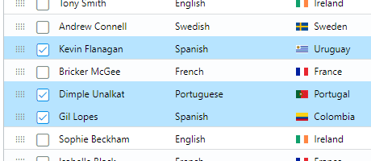
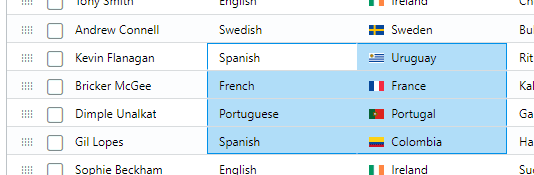

Users can select rows, ranges or use a simple text selection from inside the grid.

## Row Selection

[Row Selection](./row-selection) selects rows, i.e. data entries from the provided data set.

## Range Selection

Range Selection selects ranges of cells, i.e. a rectangular block of cells.

