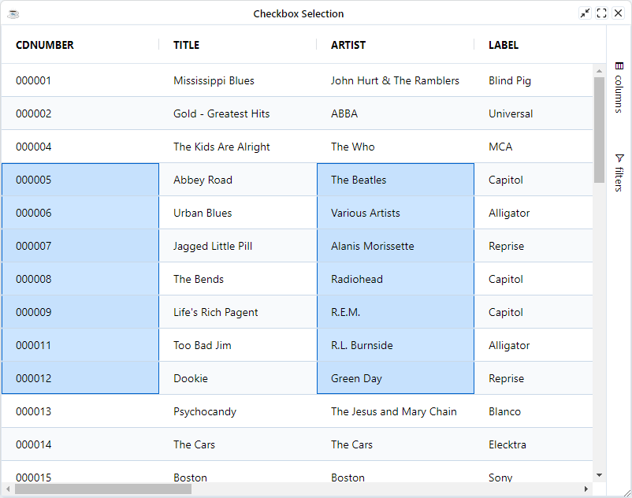
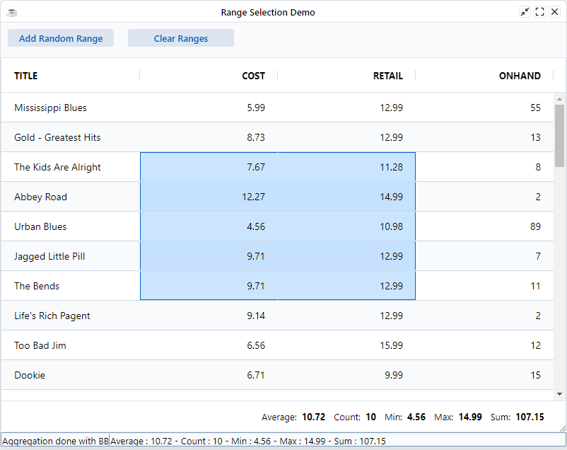

Range selection allows Excel-like range selection of cells. Range selections are useful for visually highlighting data, copying data to the Clipboard, or for doing aggregations using the Status Bar.

## Selecting Ranges

Range Selection is enabled using the following grid option `EnableRangeSelection=true`. When enabled, ranges can be selected in the following ways:

* **Mouse Drag**: Click the mouse down on a cell and drag and release the mouse over another cell. A range will be created between the two cells and clear any existing ranges.
* **Ctrl & Mouse Drag**: Holding <kbd>Ctrl</kbd> key while creating a range using mouse drag outside an existing range will create a new range selection and keep any existing ranges.
* **Shift & Click**: Clicking on one cell to focus that cell, then holding down <kbd>Shift</kbd> while clicking another cell, will create a range between both cells.
* **Shift & Arrow Keys**: Focusing a cell and then holding down <kbd>Shift</kbd> and using the arrow keys will create a range starting from the focused cell.
* **Ctrl & Shift & Arrow Keys**: Focusing a cell and then holding down <kbd>Ctrl</kbd> + <kbd>Shift</kbd> and using the arrow keys will create a range starting from the focused cell to the last cell in the direction of the Arrow pressed.


## Range Deselection

It is possible to deselect part of existing ranges in the following ways:

* **Ctrl & Mouse Drag**: Holding <kbd>Ctrl</kbd> and dragging a range starting within an existing range will cause any cells covered by the new range to be deselected.
* **Ctrl & Click**: Holding <kbd>Ctrl</kbd> and clicking a cell will deselect just that cell.

Note that deselecting part of a range can split the range into multiple ranges, since individual ranges have the limitation of being rectangular.

The example below demonstrates simple range selection. Ranges can be selected in all the ways described above.

```BBj showLineNumbers
use ::BBjGridExWidget/BBjGridExWidget.bbj::BBjGridExWidget
use ::BBjGridExWidget/GxClientModels.bbj::GxClientRowModel
use com.basiscomponents.db.ResultSet
use com.basiscomponents.bc.SqlQueryBC

declare auto BBjTopLevelWindow wnd!

wnd! = BBjAPI().openSysGui("X0").addWindow(10,10,800,600,"Checkbox Selection")
wnd!.setCallback(BBjAPI.ON_CLOSE,"byebye")

gosub main
process_events

main:
  declare SqlQueryBC sbc!
  declare ResultSet rs!
  declare BBjGridExWidget grid!

  sbc! = new SqlQueryBC(BBjAPI().getJDBCConnection("CDStore"))
  rs! = sbc!.retrieve("SELECT * FROM CDINVENTORY")

  grid! = new BBjGridExWidget(wnd!,100,0,0,800,600)
  grid!.getOptions().setEnableRangeSelection(1)
  grid!.getOptions().setSuppressRowClickSelection(1)

  grid!.setData(rs!)
return

byebye:
bye
```




## Suppress Multi Range Selection

By default multiple ranges can be selected. To restrict range selection to a single range, even if the <kbd>Ctrl</kbd> key is held down, enable the following grid options: `SuppressMultiRangeSelection=true`.

```BBj
grid!.getOptions().setSuppressMultiRangeSelection(1)
```

## Range Selection Changed Event

The `BBjGridExWidget::ON_GRID_RANGE_SELECTION_CHANGED` is fired when a the grid's range selection is changed.

```BBj
grid!.setCallback(grid!.ON_GRID_RANGE_SELECTION_CHANGED(), "handleChanged")
```

## Range Selection API

The following methods are available on the `BBjGridExWidget` class for managing range selection.

| **Method**                                                                	| **Description**                                                                                                                                                                  	|
|---------------------------------------------------------------------------	|----------------------------------------------------------------------------------------------------------------------------------------------------------------------------------	|
| [getRangeSelections()](https://bbj-plugins.github.io/BBjGridExWidget/javadoc/BBjGridExWidget/BBjGridExWidget.html#getRangeSelections)                                                      	| This will return back a BBjVector of [`GxClientRangeSelectionModel`](https://bbj-plugins.github.io/BBjGridExWidget/javadoc/GxClientModels/GxClientRangeSelectionModel.html) objects 	|
| [addRangeSelection(GxClientAddRangeSelectionModel model!)](https://bbj-plugins.github.io/BBjGridExWidget/javadoc/GxClientModels/GxClientAddRangeSelectionModel.html)                  	| Add new range selection                                                                                                                                                          	|
| [addRangeSelection(BBjString columns! , BBjNumber start! , BBjNumber end!)](https://bbj-plugins.github.io/BBjGridExWidget/javadoc/BBjGridExWidget/BBjGridExWidget.html#addRangeSelection) 	| Add new range selection                                                                                                                                                          	|
| [clearRangeSelection()](https://bbj-plugins.github.io/BBjGridExWidget/javadoc/BBjGridExWidget/BBjGridExWidget.html#clearRangeSelection)                                                     	| Clears the selected range.                                                                                                                                                       	|

## Example: Advanced Range Selection

The example below demonstrates a more complex range selection scenario. The example listens for the `ON_GRID_RANGE_SELECTION_CHANGED` and 
re-create the BBjGridExWidget statusbar in BBj.

```BBj showLineNumbers
use ::BBjGridExWidget/BBjGridExWidget.bbj::BBjGridExWidget
use ::BBjGridExWidget/GxStatusBar.bbj::GxStatusBarAggregationComponent
use ::BBjGridExWidget/GxClientModels.bbj::GxClientRangeSelectionModel
use ::BBjGridExWidget/GxClientModels.bbj::GxClientColumnModel
use ::BBjGridExWidget/GxClientModels.bbj::GxClientAddRangeSelectionModel
use ::BBjGridExWidget/Demo/assets/Utilities.bbj::GxDemoUtilities
use com.basiscomponents.db.ResultSet
use com.basiscomponents.bc.SqlQueryBC
use java.sql.Types
use java.util.ArrayList
use java.util.Collections
use java.util.Random

? 'HIDE'

GxDemoUtilities.nagAboutLicense()

declare auto BBjTopLevelWindow wnd!

wnd! = BBjAPI().openSysGui("X0").addWindow(10,10,800,600,"Range Selection Demo")
wnd!.setCallback(BBjAPI.ON_CLOSE,"byebye")
wnd!.setCallback(BBjAPI.ON_RESIZE,"resize")

aggTemplate! = "Average : %s - Count : %s - Min : %s - Max : %s - Sum : %s"

statusbar! = wnd!.addStatusBar(98,$8000$)
vector! = bbjapi().makeVector()
vector!.add(150)
vector!.add(65535)
statusbar!.setSegments(vector!)
statusbar!.setTextAt(0, "Aggregation done with BBj")
statusbar!.setAlignmentAt(0,statusbar!.LEFT)
statusbar!.setTextAt(1, String.format(aggTemplate!,0,0,0,0,0))
statusbar!.setAlignmentAt(1,statusbar!.LEFT)

onRandomRange! = wnd!.addButton(99,10,10,150,25,"Add Random Range")
onRandomRange!.setCallback(BBjAPI.ON_BUTTON_PUSH,"onRandomRange")

clearRange! = wnd!.addButton(100,180,10,150,25,"Clear Ranges")
clearRange!.setCallback(BBjAPI.ON_BUTTON_PUSH,"onClearRange")

gosub main
process_events

rem /**
rem  * Retrieve the data from the database and configure the grid
rem  */
main:
  declare BBjGridExWidget grid!
  declare SqlQueryBC sbc!
  declare ResultSet rs!

  sbc! = new SqlQueryBC(BBjAPI().getJDBCConnection("CDStore"))
  rs! = sbc!.retrieve("SELECT TITLE , COST , RETAIL , ONHAND FROM CDINVENTORY")

  grid! = new BBjGridExWidget(wnd!,101, 0 , 50 , 800 , 530)

  REM   Set to true to enable Range Selection
  grid!.getOptions().setEnableRangeSelection(1)

  REM   Allow users to move between cells using arrow keys instead of rows
  grid!.getOptions().setNavigationBehavior(grid!.GRID_NAVIGATION_BEHAVIOUR_NEXT_CELL())

  REM   Disable row selection on row click
  grid!.getOptions().setSuppressRowClickSelection(1)

  REM  Attach the aggregation component to the grid's built-in statusbar.
  REM  The component provides aggregations on the selected range.
  grid!.getStatusbar().addComponent(new GxStatusBarAggregationComponent("right"))

  REM  Here we add a range selection to the grid by defining the columns which are included
  REM  in the range and the start and end row's index/id
  grid!.addRangeSelection("COST,RETAIL" , 2, 6)

  REM listen to the grid range selection event so we can build our own statusbar in BBj
  grid!.setCallback(grid!.ON_GRID_RANGE_SELECTION_CHANGED(),"onRangeSelectionChange")

  grid!.setFitToGrid()
  grid!.getSidebar().setHiddenByDefault(1)

  grid!.setData(rs!)

  REM  align columns of type number to the right to get better presentation
  grid!.getColumn("COST").setAlignment(BBjGridExWidget.GRID_ALIGN_RIGHT() , 1)
  grid!.getColumn("RETAIL").setAlignment(BBjGridExWidget.GRID_ALIGN_RIGHT() , 1)
  grid!.getColumn("ONHAND").setAlignment(BBjGridExWidget.GRID_ALIGN_RIGHT() , 1)
return

onRangeSelectionChange:
  declare auto GxClientRangeSelectionModel currentRange!
  declare auto GxClientColumnModel column!

  REM vector of ranges
  ranges! = grid!.getRangeSelections()

  IF (ranges!.size() = 0) THEN
      statusbar!.setTextAt(1, String.format(aggTemplate!,0,0,0,0,0))
      return
  FI

  rangesLength! = ranges!.size() - 1
  sum!          = 0
  count!        = 0
  min!          = 0
  max!          = 0
  average!      = 0
  values!       = new ArrayList()

  rem we start by looping over all ranges
  FOR rangeIndex! = 0 TO rangesLength!

      currentRange!   = ranges!.get(rangeIndex!)

      rows!           = currentRange!.getRows()
      rowsLength!     = rows!.size() - 1

      columns!        = currentRange!.getColumns()
      columnsLength!  = columns!.size() - 1

      count!          = count! + (columns!.size() * rows!.size())

      FOR rowIndex! = 0 TO rowsLength!
          FOR columnsIndex! = 0 TO columnsLength!

              column! = columns!.get(columnsIndex!)
              type!   = column!.getType()

              SWITCH (type!)
                  CASE Types.BIGINT
                  CASE Types.BIT
                  CASE Types.DECIMAL
                  CASE Types.DOUBLE
                  CASE Types.FLOAT
                  CASE Types.INTEGER
                  CASE Types.NUMERIC
                  CASE Types.NUMERIC
                  CASE Types.TINYINT
                      row!   = rows!.get(rowIndex!).asDataRow()
                      value! = num(row!.getField(column!.getName()).getValue())
                      sum!   = sum! + value!

                      values!.add(value!)
                      BREAK
                  CASE DEFAULT
                      BREAK
              SWEND

          NEXT columnsIndex!
      NEXT rowIndex!

  NEXT rangeIndex!

  IF (values!.size() > 0) THEN
      min!      = Collections.min(values!)
      max!      = Collections.max(values!)
      average!  = sum! / values!.size()
  FI

  statusbar!.setTextAt(1, String.format(aggTemplate!, round(average!), count!, round(min!), round(max!), round(sum!)))
return

rem /**
rem  * Add a random add range model
rem  */
onRandomRange:
    declare GxClientAddRangeSelectionModel addModel!

    REM  list of columns which can be included in the range
    columns! = new ArrayList()
    columns!.add("COST")
    columns!.add("RETAIL")
    columns!.add("ONHAND")

    REM number of columns include with the random generated range
    numberOfColumns! = rnd(3)

    rand! = new Random()
    rangeColumns! = new ArrayList()

    FOR index = 0 TO numberOfColumns!
     randomIndex! = rand!.nextInt(columns!.size())
     rangeColumns!.add(columns!.get(randomIndex!))
     columns!.remove(randomIndex!)
    NEXT index

    addModel! =  new GxClientAddRangeSelectionModel()
    addModel!.setColumns(rangeColumns!)
    addModel!.setStart(str(rnd(10)))
    addModel!.setEnd(str(rnd(10)))

    grid!.clearRangeSelection()
    grid!.addRangeSelection(addModel!)
return

rem /**
rem  * We clear all range selections
rem  */
onClearRange:
    grid!.clearRangeSelection()
return

resize:
  ev! = BBjAPI().getLastEvent()
  w=ev!.getWidth()
  h=ev!.getHeight()
  grid!.setSize(w,h - 50)
return

byebye:
bye
```

