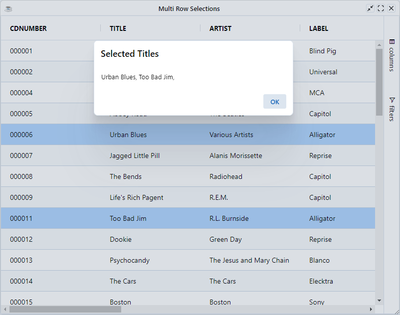
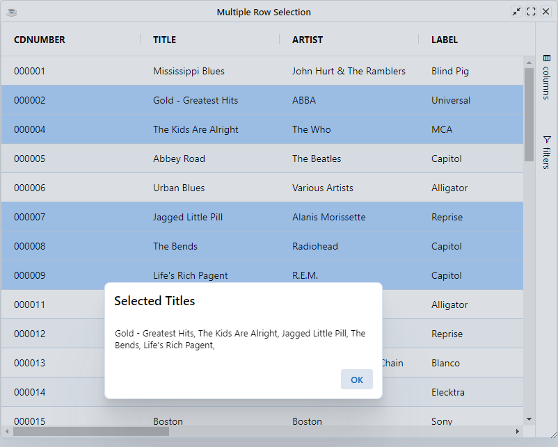
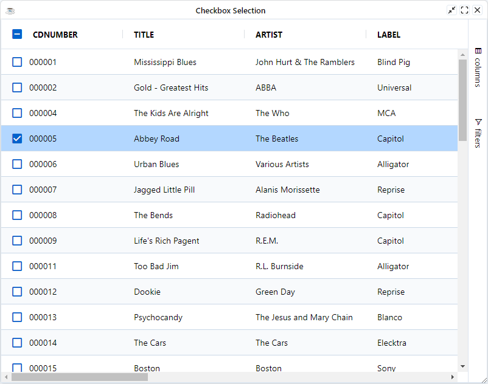
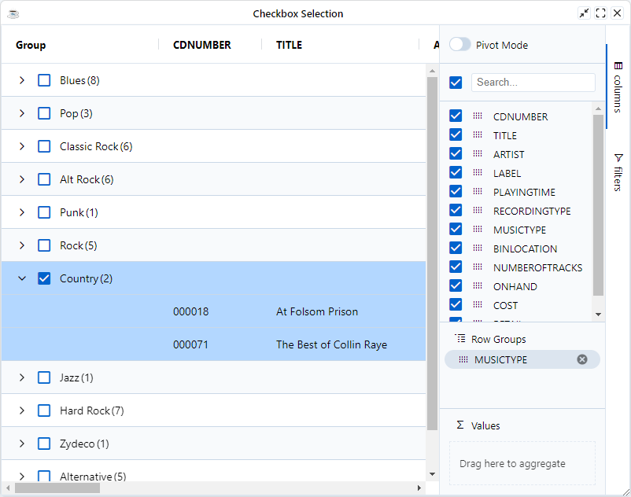

Select a row by clicking on it. Selecting a row will remove any previous selection unless you hold down <kbd>Ctrl</kbd> while clicking. Selecting a row and holding down <kbd>Shift</kbd> while clicking a second row will select the range.

Configure row selection with the following grid options:

* `MultipleSelection`: When `false` the `single` selection mod will be enabled such that when you select a row, any previously selected row gets unselected. When `true` allows multiple rows to be selected. By default the `single` selection mode is enabled

* `RowMultiSelectWithClick`: Set to `true` to allow multiple rows to be selected with clicks. For example, if you click to select one row and then click to select another row, the first row will stay selected as well. Clicking a selected row in this mode will deselect the row. This is useful for touch devices where <kbd>Ctrl</kbd> and <kbd>Shift</kbd> clicking is not an option.

* `SuppressRowDeselection`: Set to true to prevent rows from being deselected if you hold down <kbd>Ctrl</kbd> and click the row (i.e. once a row is selected, it remains selected until another row is selected in its place). By default the grid allows deselection of rows.

* `SuppressRowClickSelection`: If `true`, rows won't be selected when clicked. Use, for example, when you want checkbox selection, and don't want to also select the row when the row is clicked.


To get/set the selected rows in the grid, use the following API methods, All methods are accessible directly from the `BBjGridExWidget` class:


| **Method**                                            	| **Description**                                                                                                                                                                                                 	|
|-------------------------------------------------------	|-----------------------------------------------------------------------------------------------------------------------------------------------------------------------------------------------------------------	|
| `setSelectedRow(BBjNumber index!)`   	| Select a row by its index in the ResultSet.                                                                                                                                                                     	|
| `setSelectedRow(BBjString key!)`     	| Select a row by its key.                                                                                                                                                                                        	|
| `setSelectedRows(BBjVector rows!)`   	| Select a vector or rows. The vector can contains a mix of row indices and row keys.                                                                                                                             	|
| `selectAll(BBjNumber filteredOnly!)` 	| Select all rows. When `filteredOnly` is true , then only the filtered rows by selected.                                                                                                                         	|
| `selectAll()`                        	| Alias for `selectAll(1)`.                                                                                                                                                                      	|
| `deselectAll()`                     	| Deselect all rows.                                                                                                                                                                                              	|
| `getSelectedRow()`                     	| Get the selected row in the grid or `null()` if there is no selected row. The method returns a [`GxClientRowModel`](https://bbj-plugins.github.io/BBjGridExWidget/javadoc/GxClientModels/GxClientRowModel.html) 	|
| `getSelectedRows()`                    	| Get a BBjVector of the selected rows in the grid. Each vector item is an instance of `GxClientRowModel`                                                                                                         	|


## Example:  Multiple Row Selection

The example below shows multiple row selection.

```BBj
use ::BBjGridExWidget/BBjGridExWidget.bbj::BBjGridExWidget
use ::BBjGridExWidget/GxClientModels.bbj::GxClientRowModel
use com.basiscomponents.db.ResultSet
use com.basiscomponents.bc.SqlQueryBC

declare auto BBjTopLevelWindow wnd!

wnd! = BBjAPI().openSysGui("X0").addWindow(10,10,800,600,"Multi Row Selections")
wnd!.setCallback(BBjAPI.ON_CLOSE,"byebye")

gosub main
process_events

main:
  declare SqlQueryBC sbc!
  declare ResultSet rs!
  declare BBjGridExWidget grid!

  sbc! = new SqlQueryBC(BBjAPI().getJDBCConnection("CDStore"))
  rs! = sbc!.retrieve("SELECT * FROM CDINVENTORY")

  grid! = new BBjGridExWidget(wnd!,100,0,0,800,600)
  grid!.getOptions().setMultipleSelection(1)
  grid!.setCallback(grid!.ON_GRID_ROW_SELECT(),"handleSelection")

  grid!.setData(rs!)
return

handleSelection:
  declare auto BBjVector rows!
  declare auto GxClientRowModel row!

  ev! = BBjAPI().getLastEvent()
  ev! = ev!.getObject()
  
  selectedAsText$ = ""
  rows! =  ev!.getSelectedRows()

  it! = rows!.iterator()
  while it!.hasNext()
      row! = it!.next()
      selectedAsText$ = selectedAsText$ + str(row!.asDataRow().getFieldAsString("TITLE")) + ", "
  wend

  let x=MSGBOX(selectedAsText$, 0, "Selected Titles")
return

byebye:
bye
```




## Example: Multi Select With Click

The example below shows multi-select with click. Clicking multiple rows will select a range of rows without the need for <kbd>Ctrl</kbd> or <kbd>Shift</kbd> keys. Clicking a selected row will deselect it. This is useful for touch devices where <kbd>Ctrl</kbd> and <kbd>Shift</kbd> clicks are not available.

* `MultipleSelection` is set to enable multiple row selection with clicks.
* Clicking multiple rows will select multiple rows without needing to press <kbd>Ctrl</kbd> or <kbd>Shift</kbd> keys.
* Clicking a selected row will deselect that row.


```BBj showLineNumbers
use ::BBjGridExWidget/BBjGridExWidget.bbj::BBjGridExWidget
use ::BBjGridExWidget/GxClientModels.bbj::GxClientRowModel
use com.basiscomponents.db.ResultSet
use com.basiscomponents.bc.SqlQueryBC

declare auto BBjTopLevelWindow wnd!

wnd! = BBjAPI().openSysGui("X0").addWindow(10,10,800,600,"Multiple Row Selection")
wnd!.setCallback(BBjAPI.ON_CLOSE,"byebye")

gosub main
process_events

main:
  declare SqlQueryBC sbc!
  declare ResultSet rs!
  declare BBjGridExWidget grid!

  sbc! = new SqlQueryBC(BBjAPI().getJDBCConnection("CDStore"))
  rs! = sbc!.retrieve("SELECT * FROM CDINVENTORY")

  grid! = new BBjGridExWidget(wnd!,100,0,0,800,600)
  grid!.getOptions().setMultipleSelection(1)
  grid!.getOptions().setRowMultiSelectWithClick(1)

  grid!.setData(rs!)

  selected! = new BBjVector()
  selected!.addItem(1)
  selected!.addItem(2)
  selected!.addItem(5)
  selected!.addItem(6)

rem mix indices and keys in the vector
  selected!.addItem(rs!.getItem(7).getRowKey())

  grid!.setSelectedRows(selected!)
  grid!.setCallback(grid!.ON_GRID_ROW_SELECT(),"handleSelection")
return

handleSelection:
  declare auto BBjVector rows!
  declare auto GxClientRowModel row!

  ev! = BBjAPI().getLastEvent()
  ev! = ev!.getObject()
  
  selectedAsText$ = ""
  rows! =  ev!.getSelectedRows()

  it! = rows!.iterator()
  while it!.hasNext()
      row! = it!.next()
      selectedAsText$ = selectedAsText$ + str(row!.asDataRow().getFieldAsString("TITLE")) + ", "
  wend

  let x=MSGBOX(selectedAsText$, 0, "Selected Titles")
return

byebye:
bye
```



## Checkbox Selection

Checkbox selection can be used in two places: row selection and group selection.

To include checkbox selection for a column, set the options `ShowSelectionCheckbox` to `true`. The checkbox will enabled 
then for the first column in the grid. columns order does matter here. If the user changes the columns order , the checkbox will
always be on the first column.

By default the grid won't include a checkbox at the columns's header. To include the checkbox in column's header set the grid option `ShowHeaderSelectionCheckbox`

```BBj showLineNumbers
use ::BBjGridExWidget/BBjGridExWidget.bbj::BBjGridExWidget
use ::BBjGridExWidget/GxClientModels.bbj::GxClientRowModel
use com.basiscomponents.db.ResultSet
use com.basiscomponents.bc.SqlQueryBC

declare auto BBjTopLevelWindow wnd!

wnd! = BBjAPI().openSysGui("X0").addWindow(10,10,800,600,"Checkbox Selection")
wnd!.setCallback(BBjAPI.ON_CLOSE,"byebye")

gosub main
process_events

main:
  declare SqlQueryBC sbc!
  declare ResultSet rs!
  declare BBjGridExWidget grid!

  sbc! = new SqlQueryBC(BBjAPI().getJDBCConnection("CDStore"))
  rs! = sbc!.retrieve("SELECT * FROM CDINVENTORY")

  grid! = new BBjGridExWidget(wnd!,100,0,0,800,600)
  grid!.getOptions().setShowSelectionCheckbox(1)
  grid!.getOptions().setShowHeaderSelectionCheckbox(1)
  grid!.setData(rs!)
return

byebye:
bye
```



### Group Selection

To enable checkbox selection for groups, set the grid option `ShowGroupSelectionCheckbox` to `true`.

When doing grouping, you control what selecting a group means. This is controlled with the two grid options `GroupSelectsChildren` and `GroupSelectsFiltered`.


* `GroupSelectsChildren`: When true, selecting a group will have the impact of selecting all its children. The group will then display `selected` when all children are selected, `unselected` when none are selected and `intermediate` when children have a mix of selected and unselected. 

* `GroupSelectsFiltered`: When true only filtered children of the group will be selected / unselected. This means you can apply a filter, then try to select a group, and the group will end up in the intermediate state as only as subset of the children will be selected.

```BBj showLineNumbers
use ::BBjGridExWidget/BBjGridExWidget.bbj::BBjGridExWidget
use ::BBjGridExWidget/GxClientModels.bbj::GxClientRowModel
use com.basiscomponents.db.ResultSet
use com.basiscomponents.bc.SqlQueryBC

declare auto BBjTopLevelWindow wnd!

wnd! = BBjAPI().openSysGui("X0").addWindow(10,10,800,600,"Checkbox Selection")
wnd!.setCallback(BBjAPI.ON_CLOSE,"byebye")

gosub main
process_events

main:
  declare SqlQueryBC sbc!
  declare ResultSet rs!
  declare BBjGridExWidget grid!

  sbc! = new SqlQueryBC(BBjAPI().getJDBCConnection("CDStore"))
  rs! = sbc!.retrieve("SELECT * FROM CDINVENTORY")

  grid! = new BBjGridExWidget(wnd!,100,0,0,800,600)
  
  options! = grid!.getOptions()
  options!.setMultipleSelection(1)
  options!.setShowSelectionCheckbox(1)
  options!.setShowHeaderSelectionCheckbox(1)
  options!.setShowGroupSelectionCheckbox(1)
  options!.setGroupSelectsChildren(1)

  grid!.setData(rs!)
return

byebye:
bye
```

